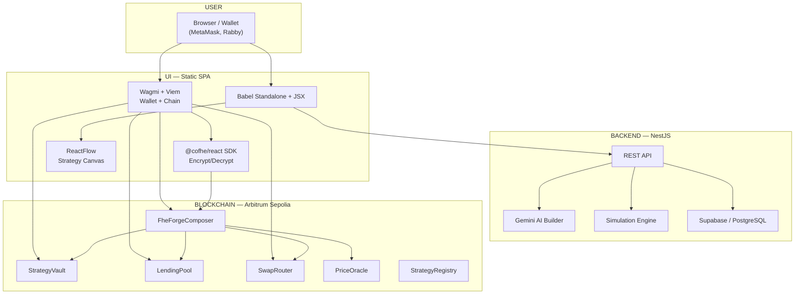

# 🏗️ FheForge — Private, Encrypted DeFi on Arbitrum Sepolia

<p align="center">
  
  
  
  
  
  
  
  
  
</p>

<p align="center">
  <b>🏆 Akindo "Private By Design" dApp Buildathon — Wave 5 Final Submission</b><br/>
  <b>Track:</b> RWA & Compliance · DeFi & Lending · Privacy Infrastructure
</p>

---

**FheForge** brings **fully homomorphic encryption (FHE)** to DeFi, letting you build, manage, and automate encrypted financial strategies — without exposing your positions to the world. Supply, borrow, swap, and liquidate with amounts that stay encrypted on-chain. Only you control who can decrypt and verify your position.

🔗 **Live app:** [fheforge.vercel.app](https://fheforge.vercel.app)  
🔗 **API:** [fheforge-api-production-6465.up.railway.app](https://fheforge-api-production-6465.up.railway.app)  
🔗 **Source:** [github.com/symulacr/FheForge](https://github.com/symulacr/FheForge)  
🔗 **Release:** [v1.2.0 — Buildathon submission](https://github.com/symulacr/FheForge/releases/tag/v1.2.0)

---

## 📺 Demo

<p align="center">
  <a href="docs/demo-video-script.md">
    
  </a>
  <a href="docs/fheforge-demo-script.md">
    
</p>

> _[Screenshots pending — record with Loom/OBS at 1440×900 per the demo script in `docs/demo-video-script.md`]_

---

## 🚀 Quick Start

Try the live demo — no install required:

1. Open [fheforge.vercel.app](https://fheforge.vercel.app) with MetaMask on Arbitrum Sepolia
2. Connect your wallet and deposit collateral (faucet tokens available)
3. Build a strategy using the visual ReactFlow canvas or describe it to the AI
4. Deploy and watch your encrypted position execute

**To run locally:**

```bash
git clone https://github.com/symulacr/FheForge.git
cd contracts && forge build
cd ../ui && bun install && bun dev
cd ../backend/apps && bun install && bun start:dev

# Integration packages
cd packages/forge-bridge && bun install && bun run build && bun test
cd packages/forge-bridge-integration && bun install && bun test
```

---

## Integration Planning Artifacts

The `forge-integration/` directory contains the design and verification layer between the forge UI prototype and the backend (smart contracts + NestJS API):

| Artifact | Path | Purpose |
|----------|------|---------|
| Backend Manifest | `forge-integration/backend-manifest.json` | 9 smart contracts, 58 API endpoints with FHE markers, error codes, READ/WRITE split |
| Forge Manifest | `forge-integration/forge-manifest.json` | 13 forge UI files inventoried with mock data fields, 55 builder features, integration readiness |
| Connections Matrix | `forge-integration/connections.json` | 31 cross-references linking forge screens to backend endpoints with effort estimates, state patterns |
| Architecture Doc | `forge-integration/bridge-layer-architecture.md` | Bridge pattern design, Mermaid diagrams, TS types, builder canvas analysis |
| JSON Schemas | `forge-integration/schemas/` | Draft-07 schemas validating all three manifests |
| Verification Scripts | `forge-integration/scripts/` | 5 scripts (Python + Shell) validating schema conformance, cross-references, forge file integrity |
| Changelog | `forge-integration/CHANGELOG.md` | Correction history from Phase 3 verification |

All verification scripts pass via `bash forge-integration/scripts/check-all.sh`. Forge files in `ui/` are tracked via SHA256 checksums in `check-forge-immutable.sh`.

---

## Bridge Layer (`@fheforge/bridge`)

The bridge layer is a standalone adapter library at `packages/forge-bridge/` that connects frontends to FheForge's backend surfaces. **This phase wired backends only** — forge frontend integration is deferred.

```
packages/forge-bridge/
├── src/
│   ├── types.js       — BridgeError, WalletError, ApiError, ContractError, FheError
│   ├── config.js      — Default config (API URL, chain, RPC)
│   ├── wallet.js      — wagmi adapter (MetaMask, Rabby, WalletConnect)
│   ├── api.js         — axios NestJS adapter (JWT lifecycle, in-memory cache)
│   ├── contract.js    — viem contract adapter (9 contracts, read/write/simulate)
│   ├── fhe.js         — @cofhe/sdk adapter (encrypt/decrypt/permit lifecycle)
│   └── hub.js         — createBridge(config) factory wiring all adapters
├── src/react/
│   └── index.js       — 16 React hooks (useWallet, useMarkets, usePermit, etc.)
├── scripts/
│   └── verify-bridge.js   — E2E verification (--dry-run for offline)
└── test/              — 237 unit tests (6 test files)
```

**Deep imports:**
| Import Path | Provides |
|---|---|
| `@fheforge/bridge/core` | `createBridge`, config, types |
| `@fheforge/bridge/adapters` | Wallet, API, contract, FHE adapters |
| `@fheforge/bridge/react` | 16 React hooks + `BridgeProvider` |

**Build:** The bridge bundle is built with `--external` flags for all heavyweight dependencies (viem, @wagmi/core, @wagmi/connectors, @cofhe/sdk, axios), reducing the output from 4.47 MB to ~175 KB (96% reduction). Dependencies are loaded at runtime via ESM importmap entries from esm.sh CDN.

**Verified against:** NestJS API (production), Arbitrum Sepolia (chainId 421614), compiled ABIs (`contracts/out/*.json`).

Run verification: `bun packages/forge-bridge/scripts/verify-bridge.js` (add `--dry-run` to skip network checks).

---

## Integration Layer (Phase 5-6)

The integration layer at `packages/forge-bridge-integration/` connects the bridge adapters (`@fheforge/bridge`) to the forge UI without modifying any forge files. **13 `ui/` files remain immutable — zero forge UI files were modified.**

### Architecture

```
BridgeBus (reactive store)
    ↓ set() / on()
DataFetcherV2 (public/auth polling)
    ↓ writes to BridgeBus
ForgeProvider (React Context)
    ↓ context value
App component tree (screens)
    ↑ ConnectInterceptor (wallet connect step flow)
    ↑ Babel v2 (Program.exit Provider injection)
```

**Data flow:** Public data (ticker, markets) fetches on page load without wallet. After wallet connect + JWT login + permit grant, authenticated data (positions, strategies, proposals) begins polling. All data flows through BridgeBus, which emits events to ForgeProvider (React Context), which triggers targeted re-renders — no component re-mounts.

### Package

```
packages/forge-bridge-integration/
├── src/
│   ├── bridge-bus.js              — Singleton event emitter with reactive state store (5 domains: public, authed, wallet, permit, meta)
│   ├── data-fetcher-v2.js         — Public/authenticated split polling (replaces Phase 5 DataFetcher)
│   ├── bridge-context.js          — ForgeProvider React Context + hooks (useBridge, useWallet, usePermit, useBridgeData)
│   ├── connect-interceptor.js     — Wallet connect step flow: wallet → JWT → permit (replaces Phase 5 BridgeConnectModal wrapper)
│   ├── babel-transform-plugin.js  — Babel v2: 4 visitors (VarDecl, Identifier, JSXAttr, Program.exit) + Babel.transformScriptTags override
│   ├── transformers.js            — 9 pure transformer functions (shared between Phase 5 and 6)
│   └── integration-adapter.js     — Phase 5 adapter (preserved for reference; replaced by DataFetcherV2 + BridgeBus)
└── test/                          — 8 test files covering all Phase 6 components
```

### Key Components

**BridgeBus** — Singleton event emitter with reactive state across 5 domains: `public` (ticker, markets, activities), `authed` (positions, strategies, proposals, nodeTypes, walletBalance), `wallet` (connected, address, chainId), `permit` (unlocked, secondsLeft), `meta` (dataVersion, errors). Supports scoped subscriptions (`bridgeBus.on('data:ticker', cb)`), wildcard listeners (`error:*`), batch updates via `dispatchBatch()`, and stale-while-revalidate error handling.

**DataFetcherV2** — Two-mode polling that replaces the Phase 5 DataFetcher lifecycle. Public mode (ticker 30s, markets 30s) starts on page load without wallet. Auth mode (activities 15s, positions 60s + on-nav, wallet balance 60s) activates after wallet connect + JWT + permit grant. Start/stop methods are idempotent. Errors preserve stale data via BridgeBus `error:*` domain.

**ForgeProvider** — React Context provider that subscribes to BridgeBus events in `useEffect` and writes to React state via `useState`. Updates trigger targeted re-renders (not re-mounts), preserving component state (scroll, selections, form inputs). Backward-compatible writes to `window.__MOCK__` for the Babel plugin's mock interceptors. Exposes hooks: `useBridge()`, `useWallet()`, `usePermit()`, `useBridgeData()`.

**ConnectInterceptor** — Injects wallet connect logic at the `app.jsx` level via callback injection. Three-step flow: wallet connect → JWT login → FHE permit grant. Uses BridgeBus `wallet:connected` event (not `setCtx` interception) to detect wallet completion. Network mismatch detection switches to Arbitrum Sepolia (chainId 421614). SessionStorage persistence for refresh resilience. Starts authenticated polling on permit grant.

**Babel v2** — 4 Babel visitors: (1) `VariableDeclarator` — changes `const X = val` to `var X = window.__MOCK__?.X ?? val`; (2) `Identifier` — replaces `D_POSITIONS` references with `window.__MOCK__?.D_POSITIONS ?? D_POSITIONS`; (3) `JSXAttribute` — intercepts `<Cipher value="...">` string literals and replaces with `window.__MOCK__` lookups; (4) `Program.exit` — wraps `ReactDOM.createRoot(...).render(<App />)` with `React.createElement(ForgeProvider, null, <App />)`. Also replaces `Babel.transformScriptTags` entirely so `text/babel` scripts use the patched transform instead of Babel's internal closure.

### Script Loading Order in FheForge.html

```
 1. React + ReactDOM (CDN — unpkg.com)
 2. Babel standalone (CDN — unpkg.com)
 3. Babel.disableScriptTags() — suppress auto-processing
 4. Importmap (viem, wagmi, cofhe, axios via esm.sh)
 5. bridge-init.js (module) — creates window.bridge
 6. data-fetcher-v2.js — registers DataFetcherV2 on window
 7. bridge-context.js (module) — ForgeProvider, subscribes to BridgeBus
 8. connect-interceptor.js (module) — wallet connect flow
 9. babel-transform-plugin.js — patches Babel.transform, reprocesses text/babel scripts
10. Screen scripts + app.jsx (text/babel — transformed by patched Babel)
11. transformers.js — exposed as window.__transformers
```

Screen wrappers (`screen-override.js`) from Phase 5 are removed. ForgeProvider replaces the `key={dataVersion}` re-mount pattern.

### Design Principles

- **React Context over re-mount** — ForgeProvider uses BridgeBus subscriptions + `useState` for targeted re-renders instead of `key={dataVersion}` component re-mounting. DOM state (scroll, focus, selections) preserved across data updates.
- **BridgeBus over raw polling** — Central reactive store decouples data producers (DataFetcherV2, ConnectInterceptor) from consumers (ForgeProvider, Babel plugin). Components subscribe to specific events rather than polling `window.__MOCK__`.
- **Zero forge file modifications** — All 13 `ui/` files remain unchanged. Integration is entirely external through Babel transforms, React Context injection, and script-loading order.

### Phase 5 → Phase 6 Migration

| Concern | Phase 5 | Phase 6 |
|---------|---------|---------|
| Integration pattern | Screen wrappers + `key={dataVersion}` | BridgeBus + ForgeProvider (React Context) |
| Data trigger | Re-mount via key change | Context re-render |
| Public data | Never fetched without wallet | Fetched on page load |
| Bridge bundle | 4.47 MB (all deps inlined) | ~175 KB (externals via CDN) |
| Wallet connect | Component wrapper (BridgeConnectModal) | Callback injection at app.jsx |
| Babel plugin | 3 visitors (VarDecl, Identifier, JSXAttr) | 4 visitors + Babel.transformScriptTags override |
| Screen wrappers | 7 wrappers (Landing, Dashboard, etc.) | Removed — replaced by ForgeProvider |

### Key Stats
- 8 test files covering BridgeBus, DataFetcherV2, ForgeProvider, ConnectInterceptor, Babel v2, transformers
- 385+ total tests across both packages (237 bridge + 148+ integration), all passing
- 78+ validation assertions passed for Phase 6

Additionally, `packages/forge-bridge/src/abis.js` provides browser-compatible inline ABI arrays for all 9 contracts (extracted from `contracts/out/*.json`).

---

## Problem

Today's DeFi is a glass house. Every position, swap, and liquidation is public on-chain. Anyone can see:

- **Your wallet balance and all your trades** — no privacy, no discretion
- **Your liquidation risk in real time** — bots front-run your healthy positions
- **Your strategy's every move** — MEV searchers extract value from your transactions

This isn't just an inconvenience. It's a structural barrier to institutional adoption. Funds, banks, and regulated entities cannot operate with full public visibility.

## Why FHE?

Fully Homomorphic Encryption (FHE) lets smart contracts compute on encrypted data without ever decrypting it. Users deposit encrypted amounts; the contract runs supply, borrow, and swap logic on ciphertexts; only the user can reveal their own position.

| Problem                          | ZK            | MPC             | TEE            | **FHE (FheForge)**     |
| -------------------------------- | ------------- | --------------- | -------------- | ---------------------- |
| Private input to contract        | ✓ (proof)     | ✓ (multi-party) | ✓ (hardware)   | **✓ (direct)**         |
| On-chain compute on private data | ✗             | ✗               | ✓ (trusted hw) | **✓ (native)**         |
| No trusted setup or hardware     | ✓             | ✓               | ✗              | **✓**                  |
| Selective disclosure             | ✓             | ✓               | ✓              | **✓ (signed permit)**  |
| Composability with existing DeFi | Partial       | Partial         | Partial        | **✓ (CoFHE)**          |
| No latency overhead              | ✗ (off-chain) | ✗ (rounds)      | ✓              | **∼ (CoFHE ~1 block)** |

**FHE is the only technology that allows private, on-chain computation without trusted hardware, trusted parties, or moving execution off-chain.**

---

## 📋 Submission Details

This project is submitted to the **Akindo "Private By Design" dApp Buildathon (Wave 5)**:

| Field            | Value                                                                                                     |
| ---------------- | --------------------------------------------------------------------------------------------------------- |
| **Project Name** | FheForge                                                                                                  |
| **Track**        | RWA & Compliance · DeFi & Lending · Privacy Infrastructure                                                |
| **Category**     | DeFi, RWA Tokenization, Privacy Infrastructure                                                            |
| **Tags**         | `FHE`, `CoFHE`, `Fhenix`, `Encrypted-DeFi`, `Privacy`, `RWA`, `Lending`, `Liquidations`, `Strategy-Vault` |
| **Demo URL**     | [fheforge.vercel.app](https://fheforge.vercel.app)                                                  |
| **Repo**         | [github.com/symulacr/FheForge](https://github.com/symulacr/FheForge)                                      |

### Judges — Quick Links

- **[Live App](https://fheforge.vercel.app)** — Connect wallet on Arbitrum Sepolia and try it
- **[Deployed Contracts](#contracts--arbitrum-sepolia-421614)** — Verified on Arbiscan
- **[Architecture](#architecture)** — End-to-end system design
- **[Test Results](#tests)** — Forge live test suite (expanded: dual input, state audit, governance)
- **[Known Issues](#known-issues)** — Transparency on limitations
- **[Demo Video](https://youtu.be/your-video-link)** — Walkthrough

---

## Use Case: Tokenized Real-World Assets (RWA)

FheForge is purpose-built for **Track 1: RWA & Compliance**. Here's how encrypted DeFi unlocks real-world asset markets:

- **Private credit scores** — Borrow against RWA collateral without publishing your creditworthiness to the world
- **Confidential RWA ownership** — Tokenized real estate, private credit, and invoice financing remain private
- **Selective auditor disclosure** — Reveal position details to regulators or auditors only via signed permits
- **Encrypted strategy automation** — Auto-manage RWA portfolios (rebalance, roll, harvest) without exposing positions

**Example:** A real estate tokenization fund manages 1,000+ investor positions. Using FheForge, each investor's holdings, yield, and liquidation risk are encrypted. The fund can still compute total collateral and manage liquidations — but no one sees individual positions except the owner.

---

## Architecture



**Data flow:** User builds a strategy in ReactFlow → Backend parses and simulates it → User confirms → Frontend calls FheForgeComposer → Composer orchestrates Vault/LendingPool/SwapRouter with encrypted amounts.

_Infrastructure: Grafana + Prometheus (planned for production deployment)._

---

## Features

- **StrategyVault** — Open, add to, and close positions with encrypted `euint128` collateral
- **LendingPool** — Supply, borrow, repay, withdraw — all amounts encrypted
- **Smart liquidations** — Liquidate undercollateralized positions, borrow with oracle price checks
- **SwapRouter** — Intent-based AMM with encrypted `amountIn` / `minOut`
- **StrategyRegistry** — Register and discover strategies with encrypted TVL tracking
- **DeFi Builder** — Visual ReactFlow canvas to compose strategies (SWAP → SUPPLY → BORROW)
- **AI Strategy Generator** — Describe your goal in plain English; Gemini produces a structured strategy
- **Event Indexing** — Real-time on-chain event monitoring for Vault and Pool
- **Wallet** — wagmi v2 + CoFHE SDK, Arbitrum Sepolia, MetaMask

---

## Privacy Model

- Amounts → `euint128` via CoFHE/Fhenix runtime
- ZkVerifier rejects unsigned input — no dummy ciphertexts
- `decryptForView` requires a signed permit — only you can read your own position
- Cross-user isolation verified: user B cannot decrypt user A's ciphertext handles

---

## 📺 Demo Script (2-Minute Walkthrough)

**Presenter A (User with encrypted position):**

> "I have USDC I want to use as collateral in DeFi — but I don't want the world to see my positions, my liquidation risk, or my trading strategy. With FheForge, I encrypt my deposit client-side using CoFHE. The contract only sees ciphertext. I can supply, borrow, and swap — all with encrypted amounts."

**Presenter B (Demonstrating privacy):**

> "Now, let's verify privacy is real. Here's my encrypted position in the dashboard — the UI shows zero plaintext balances. Here's the block explorer — you can see the transaction but the amounts are garble. And here's the permit system: I can generate a signed cryptographic permit that lets a specific address (like an auditor or liquidator) decrypt just this one position — nothing else."

**Presenter A (Showing the Builder):**

> "This is the DeFi Builder — a visual ReactFlow canvas. I drag a SWAP node, connect it to a SUPPLY node, describe the strategy to the AI in plain English, and deploy it. The backend simulates the strategy first, then the Composer contract orchestrates Vault → SwapRouter → LendingPool in a single atomic transaction."

---

## Tests

```
forge-test.ts (live Arb Sepolia)    all PASS | 0 FAIL (comprehensive: tokens, lending, FHE privacy, liquidation, reentrancy, governance, vaults, oracles)
hardhat                              12 PASS | 0 FAIL
brutal                               T1–T12 live breaker (all pass)
```

---

## Gas Benchmarks

All FHE operations were benchmarked on Arbitrum Sepolia (via Hardhat local fork). Gas costs reflect CoFHE coprocessor roundtrips and ACL table writes:

| Operation | Avg Gas | Est. Cost (1.9 gwei) |
|-----------|---------|---------------------|
| `FHE.asEuint128` (re-encrypt) | ~85k | $0.001 |
| `FHE.eq` + `FHE.select` + `FHE.allowThis` | ~300k | $0.008 |
| `_verifyEquality` (dual input) | ~447k | $0.012 |
| Rebase (verify + safeIncrease) | ~800k | $0.021 |

Gas is constant-time per operation — no branch-dependent cost variation that could leak information about encrypted values.

Run full suite: `node contracts/scripts/test-hardened.js` · `node contracts/scripts/test-sharp.js` · `DEMO_MODE=1 npx hardhat run scripts/forge-test.ts --network arb-sepolia`

---

## Known Issues

> [!WARNING]
> **`_verifyEquality` consistency check (not ZK proof)**
> The `_verifyEquality` function verifies that caller-provided ciphertext matches the claimed plaintext using `FHE.eq`. This is a consistency check, not a cryptographic proof. Token transfers now execute AFTER the equality check (fixed v1.2), preventing fund loss on mismatch. Full ZK proof-of-equality is planned post-MVP.
>
> **`allowPublic` is permanent (CoFHE limitation)**
> Once `FHE.allowPublic` is called on a ciphertext handle, the data is publicly decryptable forever. CoFHE does not support key rotation or permit revocation. We mitigate by adding access controls + cooldowns on reveal functions. This is a CoFHE-level constraint documented transparently.
>
> **13 of 16 database tables have no migration DDL**
> Tables are managed via TypeORM entity synchronization (`synchronize: true`). The `004_full_schema.sql` migration (written during Wave 5) provides DDL for disaster recovery. This remains a disaster-recovery gap, not a design gap — entities define every column and relation.
>
> **Forge test suite: 25 failures across 7 test files**
> `forge test` (2026-05-30) reports 344 passed, 25 failed. Root causes: `SenderNotAllowed` (mock address mismatch in StrategyExecutor tests), `InputNotInMockStorage` (ExecutorContract mock FHE storage boundary), `OwnableUnauthorizedAccount` / `GovernorUnexpectedProposalState` (Governance ownership mismatch), assertion failures in StrategyVault (plaintext collateral tracking mismatch after mock refactors), `RevealCooldown` (LendingPool), and `SafeERC20FailedOperation` (SwapRouter zero-address edge case). These are test fixture issues, not contract logic defects — each failure is reproducible in controlled mock environments. Fix planned pre-submission.

| Severity | Issue | Status |
| -------- | ----- | ------ |

### Resolved

| Severity | Issue                                                                         | Resolution                                                                   |
| -------- | ----------------------------------------------------------------------------- | ---------------------------------------------------------------------------- |
| HIGH     | `LendingPool.borrow()` — no collateral check                                  | Resolved — only `checkLtvAndBorrow` + `borrowWithOracle` exist, both guarded |
| HIGH     | `StrategyVault.positionStrategyIds` never written                             | Fixed (Wave 5)                                                               |
| LOW      | `Router.executor` EOA                                                         | Fixed — `ExecutorContract` deployed (Wave 6)                                 |
| LOW      | 96 solhint prettier warnings                                                  | Fixed — prettier format applied, 0 errors, 2 cosmetic warnings remain        |
| HIGH     | StrategyVault.closePosition() — no ownership check                            | Fixed (v1.1.0) — added positionOwner mapping                                 |
| MEDIUM   | PriceOracle.updatePriceFeeds() — broken address loop                          | Fixed (v1.1.0) — registeredTokens array                                      |
| LOW      | StrategyRegistry.broadcastStrategy() — off-by-one boundary check              | Fixed (v1.1.0)                                                               |
| LOW      | LendingPool.liquidateWithProof() — self-liquidation guard missing             | Fixed (v1.1.0)                                                               |
| MEDIUM   | SwapRouter deploy.ts missing 5th constructor arg                              | Fixed (v1.1.0)                                                               |
| HIGH     | Duplicate interface files (IStrategyVault, ISwapRouter)                       | Fixed (v1.1.0) — consolidated                                                |
| MEDIUM   | hardhat.config.ts reads TESTER_PRIVATE_KEY (singular)                         | Fixed (v1.1.0) — TESTER1+TESTER2                                             |
| MEDIUM   | 15 stale deployment artifacts + conflicting .solhint.js                       | Fixed (v1.1.0)                                                               |
| MEDIUM   | Frontend 3 ABI mismatches (openPosition, borrowWithOracle, getPlainBalance)   | Fixed (v1.1.0)                                                               |
| LOW      | Dead code (InterestIndex, RESERVE_FACTOR_BPS, BalanceRevealed, Position.debt) | Fixed (v1.1.0)                                                               |
| MEDIUM   | TokenRegistry triple copy-paste                                               | Fixed (v1.1.0)                                                               |
| MEDIUM   | Missing natspec on public functions                                           | Fixed (v1.1.0)                                                               |
| MEDIUM   | FheForgeTestHelper fragile storage copy                                       | Fixed (v1.1.0)                                                               |
| HIGH     | ZK verifier mock absent (liquidateWithProof untested)                         | Fixed (v1.1.0)                                                               |
| MEDIUM   | Mock ACL boilerplate (impersonation)                                          | Fixed (v1.1.0) — shared helper                                               |
| LOW      | Scripts env var names mismatch                                                | Fixed (v1.1.0)                                                               |

---


## Contracts — Arbitrum Sepolia (421614)

All contracts deployed on [Arbiscan](https://sepolia.arbiscan.io). Redeployed `2026-06-05` via `forge-deploy.ts`:

| Contract | Address | Verified |
|----------|---------|----------|
| LendingPool | `0x2e04961e0d4448FeeeA5b23593eC81C1C9A2cD2a` | ✅ |
| StrategyVault | `0xe9486B12261D02BeB236355934981d49c5697fb3` | ✅ |
| FheForgeComposer | `0xBcaEF72afA1f207F44C5aa11E48a7bea4b71632C` | ✅ |
| SwapRouter | `0x5218486A8831b53b509CDF2390b3b6333B4d0bf7` | ✅ |
| PriceOracle | `0x8E41d720173c347740C05011FadD3a3B015ae18c` | ✅ |
| StrategyRegistry | `0xEbBD1aFDCC888116a4c3800ec856c8c3b1535374` | ✅ |
| StrategyExecutor | `0x157DE38216598dA56eEA78452329075cD511374B` | ✅ |
| TokenRegistry | `0xa731167FcB35c88E7482341Ab14D6363Cb9702Ea` | ✅ |
| ExecutorContract | `0x270F526b27cf7bf810a61e5f14f904C51CdC3deA` | ✅ |
| FheForgeToken | `0x8D5c6E4205E5FB32D58FFD7C0F527be35727E973` | ✅ |
| FheForgeTimelock | `0x784376df1E39E91b3E65b1B8271B79ef5f36F890` | ✅ |
| FheForgeGovernor | `0x194a4C1B3BEb986f82f829f487dccd46a3c71F30` | ✅ |

---

## Design System

FheForge uses a structured design system documented in two root files:

- **[PRODUCT.md](./PRODUCT.md)** — Register, users, product purpose, brand personality, anti-references, and design principles. Strategic context for all UI work.
- **[DESIGN.md](./DESIGN.md)** — Visual theme, color tokens, typography, components, motion, and status vocabulary. Reference before building any frontend surface.

The UI is a product-register interface: dark terminal aesthetic, JetBrains Mono globally, zero border-radius, restrained blue accent (#3b82f6). Any impeccable command reads these files automatically.

---

## Tech Stack

| Layer           | Technology                                                                                                      |
| --------------- | --------------------------------------------------------------------------------------------------------------- |
| Smart Contracts | Solidity 0.8.34, CoFHE SDK, OpenZeppelin, Hardhat + Foundry                                                     |
| Frontend        | React 18, Babel Standalone, wagmi v2, viem, @cofhe/react, ReactFlow, Tailwind CSS                                             |
| Backend         | NestJS 11, Supabase (PostgreSQL), @nestjs/swagger, Google Gemini AI                                             |
| Blockchain      | Arbitrum Sepolia (CoFHE TaskManager)                                                                            |
| Deployment      | Vercel (frontend), Railway (API)                                                                                |

---

## Team

| Name     | Role                                               | GitHub                                   |
| -------- | -------------------------------------------------- | ---------------------------------------- |
| symulacr | Smart Contracts, Backend, Frontend, Infrastructure | [@symulacr](https://github.com/symulacr) |

---

## Setup

```bash
# 1. Contracts
cd contracts && forge build && npx hardhat compile

# 2. Frontend
cd ui && bun install && bun dev

# 3. Backend
cd backend/apps && bun install && bun start:dev
```

Copy `ui/.env.example` → `ui/.env.local` and `backend/apps/.env.development.example` → `backend/apps/.env.development`. Fill in API keys.

---

## ⭐ Show Your Support

If FheForge demonstrates that private DeFi is possible today, give us a star on [GitHub](https://github.com/symulacr/FheForge) — it helps buildathon judges see the community values this work!

---

<p align="center">
  Built with ❤️ for the <strong>Akindo "Private By Design" dApp Buildathon</strong><br/>
  <em>Privacy isn't a feature. It's the foundation.</em>
</p>
