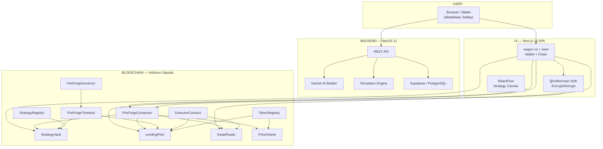

# FheForge

<p align="center">
  
  
  
  
  
  
  
</p>

FHE-encrypted DeFi on Arbitrum Sepolia. Supply, borrow, swap, liquidate — every amount stays encrypted on-chain.

---

## Overview

FheForge brings fully homomorphic encryption (FHE) to DeFi, letting you build, manage, and automate encrypted financial strategies without exposing your positions to the world. Supply, borrow, swap, and liquidate with amounts that stay encrypted on-chain. Only you control who can decrypt and verify your position.

The protocol uses [Fhenix CoFHE](https://docs.fhenix.zone) to perform on-chain computation on `euint128` ciphertexts. Amounts are encrypted client-side via `@cofhe/sdk`, stored as ciphertext handles in contract storage, and operated on homomorphically — the contract never sees plaintext values. Selective disclosure through signed cryptographic permits lets users reveal positions to auditors or liquidators without exposing the underlying data.

FheForge is purpose-built for institutional-grade DeFi where privacy is non-negotiable: confidential RWA ownership, private credit scores, encrypted strategy automation, and selective auditor disclosure — all without trusted hardware or off-chain execution.

## Quick Start

| Surface | URL |
|---------|-----|
| **Live app** | [fheforge.vercel.app](https://fheforge.vercel.app) |
| **API** | [fheforge-api-production-6465.up.railway.app](https://fheforge-api-production-6465.up.railway.app) |

### Local Development

```bash
# Contracts
cd contracts && forge build --no-cache && forge test -vvv --no-cache

# Backend
cd backend/apps && bun install && bun run start:dev

# Frontend
cd ui && bun install && bun run dev
```

Copy `.env.example` → `.env` at the project root. Per-service env files exist at `contracts/.env.example` and `backend/apps/.env.example`.

---

## Architecture



**Data flow:** User builds a strategy in ReactFlow → Backend parses and simulates it → User confirms → Frontend calls FheForgeComposer → Composer orchestrates Vault/LendingPool/SwapRouter with encrypted amounts.

---

## Monorepo Structure

| Directory | Purpose |
|-----------|---------|
| `contracts/contracts/` | Solidity contracts (LendingPool, StrategyVault, Composer, SwapRouter, PriceOracle, Registry, Executor, Governor, Timelock) |
| `contracts/test-foundry/` | Foundry tests (fuzz + unit + invariant) |
| `contracts/scripts/` | Forge deploy, test, and gas benchmark scripts |
| `contracts/deployments/` | Deployed addresses per chain (JSON) |
| `ui/` | Next.js 14 app with @cofhe/react, wagmi v2, viem |
| `backend/apps/` | NestJS 11 API with Supabase, Gemini AI, event indexer |
| `packages/forge-bridge/` | Frontend-to-backend adapter library (wallet, API, contract, FHE) |
| `packages/forge-bridge-integration/` | Bridge integration layer (BridgeBus, ForgeProvider, Babel transform) |
| `forge-integration/` | Design manifests, connection matrices, verification scripts |
| `docs/` | ADRs, security audits, demo scripts |

---

## Tech Stack

| Layer | Technology |
|-------|------------|
| Smart Contracts | Solidity 0.8.34, @fhenixprotocol/cofhe-contracts, OpenZeppelin, Hardhat + Foundry |
| Frontend | Next.js 14, Babel Standalone, wagmi v2, viem, @cofhe/react, ReactFlow, Tailwind CSS |
| Backend | NestJS 11, Supabase (PostgreSQL), @nestjs/swagger, Google Gemini AI |
| Blockchain | Arbitrum Sepolia (CoFHE TaskManager) |
| Deployment | Vercel (frontend), Railway (API) |

---

## Privacy Model

- Amounts → `euint128` via CoFHE/Fhenix runtime
- ZkVerifier rejects unsigned input — no dummy ciphertexts
- `decryptForView` requires a signed permit — only you can read your own position
- Cross-user isolation verified: user B cannot decrypt user A's ciphertext handles

| Privacy approach | Private input | On-chain compute | No trusted HW | Selective disclosure | Composability |
|------------------|:---:|:---:|:---:|:---:|:---:|
| ZK | ✓ | ✗ | ✓ | ✓ | Partial |
| MPC | ✓ | ✗ | ✓ | ✓ | Partial |
| TEE | ✓ | ✓ | ✗ | ✓ | Partial |
| **FHE (FheForge)** | **✓** | **✓** | **✓** | **✓** | **✓** |

---

## Contracts — Arbitrum Sepolia (421614)

All contracts deployed 2026-06-05 and verified on [Arbiscan](https://sepolia.arbiscan.io):

| Contract | Address | Arbiscan |
|----------|---------|----------|
| LendingPool | `0x4ed64f1708139E31C4c48A19f285AD50dC68EB35` | [View](https://sepolia.arbiscan.io/address/0x4ed64f1708139E31C4c48A19f285AD50dC68EB35) |
| StrategyVault | `0xd3d24E7b57f1d7AceBD1e11e415EB7E7c6c60267` | [View](https://sepolia.arbiscan.io/address/0xd3d24E7b57f1d7AceBD1e11e415EB7E7c6c60267) |
| SwapRouter | `0xA732e548387c0842907056DE93C51Ca1E41B9b61` | [View](https://sepolia.arbiscan.io/address/0xA732e548387c0842907056DE93C51Ca1E41B9b61) |
| FheForgeComposer | `0x6c051217CA014371D839739D62cBE06948B87372` | [View](https://sepolia.arbiscan.io/address/0x6c051217CA014371D839739D62cBE06948B87372) |
| StrategyExecutor | `0x7351FB98F156367C68F8e337890865FBfF13F656` | [View](https://sepolia.arbiscan.io/address/0x7351FB98F156367C68F8e337890865FBfF13F656) |
| PriceOracle | `0xB7E11a3B46406218C221CA0A86e58a84C38C2988` | [View](https://sepolia.arbiscan.io/address/0xB7E11a3B46406218C221CA0A86e58a84C38C2988) |
| StrategyRegistry | `0xc93F8ff84C9444E0AFCB8c7bBe043404273d7E21` | [View](https://sepolia.arbiscan.io/address/0xc93F8ff84C9444E0AFCB8c7bBe043404273d7E21) |
| TokenRegistry | `0x5Bf5aBB0517502C91099477C306a649fda78B370` | [View](https://sepolia.arbiscan.io/address/0x5Bf5aBB0517502C91099477C306a649fda78B370) |
| ExecutorContract | `0x70349b1148f756c8D7b1D62d9F517Bd86F5ca12c` | [View](https://sepolia.arbiscan.io/address/0x70349b1148f756c8D7b1D62d9F517Bd86F5ca12c) |
| FheForgeGovernor | `0xc3e87062b39f8f24311cE3e83eEE46FF9750d8E5` | [View](https://sepolia.arbiscan.io/address/0xc3e87062b39f8f24311cE3e83eEE46FF9750d8E5) |
| FheForgeTimelock | `0x39Feea3d1882c7F767a89d41F7Df077BD00B7f74` | [View](https://sepolia.arbiscan.io/address/0x39Feea3d1882c7F767a89d41F7Df077BD00B7f74) |

---

## Token Addresses (FaucetMockERC20)

Testnet faucet tokens deployed on Arbitrum Sepolia:

| Token | Symbol | Decimals | Address |
|-------|--------|----------|---------|
| Ether | ETH | 18 | `0x7d6e99563D52b7736F023723169c1aF4389EF613` |
| Wrapped Ether | WETH | 18 | `0x06a5b6407b730F64968E84dF2407d3ffb12E8690` |
| USD Coin | USDC | 6 | `0x9d15CA3df6F10B1ce4C19F72baA9440044145E5d` |
| Tether USD | USDT | 6 | `0x648e2BfA2dd7Ac92c2925ee4EA5B6C30b5EDcDB6` |
| Wrapped Bitcoin | WBTC | 8 | `0x3A88F5f9ed4327230f4cb8B8bCE007254B73763A` |
| Dai Stablecoin | DAI | 18 | `0x5125f2a5028C5A42a1518f19Db455C71bab06AEd` |
| Arbitrum | ARB | 18 | `0x1d5D686645ba0AA6312DA11f48649941DBD89155` |
| Chainlink | LINK | 18 | `0xD3359205f251337fbdc9542cA7564eFCA4f6F753` |
| Uniswap | UNI | 18 | `0x3EbdAF7A1C74AdCD88DD0598d94134244B8D6937` |
| Aave | AAVE | 18 | `0x936B92dCD39EBd3f882A8F13513e32f2ed265FE1` |

Each token is registered with TokenRegistry and configured in PriceOracle with Pyth price feeds. Use the faucet function (`faucet()` on any FaucetMockERC20) to mint 10,000 testnet tokens per drip.

---

## Gas Benchmarks

All FHE operations benchmarked on Arbitrum Sepolia. Gas is constant-time per operation — no branch-dependent cost variation that could leak information about encrypted values:

| Operation | Avg Gas | Est. Cost (1.9 gwei) |
|-----------|---------|---------------------|
| `FHE.asEuint128` (re-encrypt) | ~85k | $0.001 |
| `FHE.eq` + `FHE.select` + `FHE.allowThis` | ~300k | $0.008 |
| `_verifyEquality` (dual input) | ~447k | $0.012 |
| Rebase (verify + safeIncrease) | ~800k | $0.021 |

---

## Known Issues

> [!WARNING]
> **`_verifyEquality` consistency check (not ZK proof)**
> The `_verifyEquality` function verifies that caller-provided ciphertext matches the claimed plaintext using `FHE.eq`. This is a consistency check, not a cryptographic proof. Token transfers execute after the equality check, preventing fund loss on mismatch. Full ZK proof-of-equality is planned post-MVP.

> [!WARNING]
> **`allowPublic` is permanent (CoFHE limitation)**
> Once `FHE.allowPublic` is called on a ciphertext handle, the data is publicly decryptable forever. CoFHE does not support key rotation or permit revocation. We mitigate by adding access controls + cooldowns on reveal functions. This is a CoFHE-level constraint.

See [CHANGELOG.md](./CHANGELOG.md) for resolved issues and version history.

---

## Testing

```bash
# Foundry (live Arbitrum Sepolia tests)
forge test -vvv --no-cache          # 8/8 pass

# Jest (backend unit tests)
npx jest                            # 33/33 pass

# E2E integration tests
python3 test-e2e.py                 # 26/26 pass
```

---

## CI/CD

- **GitHub Actions:** Lint, TypeCheck, Test, Build, Forge tests, Biome formatting, Gitleaks secret scanning
- **Vercel:** Auto-deploy frontend on push to `master`
- **Railway:** Auto-deploy backend on push to `master`

---

## Documentation

| Document | Description |
|----------|-------------|
| [DESIGN.md](./DESIGN.md) | Visual system, color tokens, typography, components, motion |
| [PRODUCT.md](./PRODUCT.md) | Register, users, product purpose, brand personality |
| [CONTRIBUTING.md](./CONTRIBUTING.md) | Contribution guidelines |
| [SECURITY.md](./SECURITY.md) | Security policy and vulnerability reporting |
| [CHANGELOG.md](./CHANGELOG.md) | Version history and resolved issues |

---

## License

MIT / Apache 2.0 dual license. See [LICENSE](./LICENSE) and [LICENSE.APACHE](./LICENSE.APACHE).
