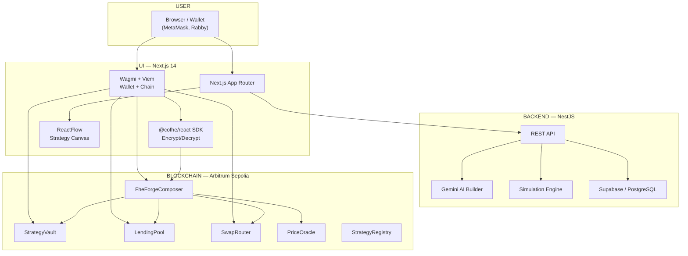

# 🏗️ FheForge — Private, Encrypted DeFi on Arbitrum Sepolia

<p align="center">
  
  
  
  
  
  
  
  
  
</p>

<p align="center">
  <b>🏆 Akindo "Private By Design" dApp Buildathon — Wave 4 Submission</b><br/>
  <b>Track:</b> RWA & Compliance · DeFi & Lending · Privacy Infrastructure
</p>

---

**FheForge** brings **fully homomorphic encryption (FHE)** to DeFi, letting you build, manage, and automate encrypted financial strategies — without exposing your positions to the world. Supply, borrow, swap, and liquidate with amounts that stay encrypted on-chain. Only you control who can decrypt and verify your position.

🔗 **Live app:** [ui-chi-ashy.vercel.app](https://ui-chi-ashy.vercel.app)  
🔗 **API:** [fheforge-api-production.up.railway.app](https://fheforge-api-production.up.railway.app)  
🔗 **Source:** [github.com/symulacr/FheForge](https://github.com/symulacr/FheForge)  
🔗 **Release:** [v1.2.0 — Buildathon submission](https://github.com/symulacr/FheForge/releases/tag/v1.2.0)

---

## 📺 Demo

<p align="center">
  <a href="docs/demo-video-script.md">
    
  </a>
  <a href="https://youtu.be/your-video-link">
    
  </a>
</p>

> _[Screenshots pending — record with Loom/OBS at 1440×900 per the demo script in `docs/demo-video-script.md`]_

---

## 🚀 Quick Start

Try the live demo — no install required:

1. Open [ui-chi-ashy.vercel.app](https://ui-chi-ashy.vercel.app) with MetaMask on Arbitrum Sepolia
2. Connect your wallet and deposit collateral (faucet tokens available)
3. Build a strategy using the visual ReactFlow canvas or describe it to the AI
4. Deploy and watch your encrypted position execute

**To run locally:**

```bash
git clone https://github.com/symulacr/FheForge.git
cd contracts && npm install && node scripts/test-hardened.js
cd ../ui && bun install && bun dev
cd ../backend/apps && bun install && bun start:dev
```

---

## Problem

Today's DeFi is a glass house. Every position, swap, and liquidation is public on-chain. Anyone can see:

- **Your wallet balance and all your trades** — no privacy, no discretion
- **Your liquidation risk in real time** — bots front-run your healthy positions
- **Your strategy's every move** — MEV searchers extract value from your transactions

This isn't just an inconvenience. It's a structural barrier to institutional adoption. Funds, banks, and regulated entities cannot operate with full public visibility.

## Why FHE?

Fully Homomorphic Encryption (FHE) lets smart contracts compute on encrypted data without ever decrypting it. Users deposit encrypted amounts; the contract runs supply, borrow, and swap logic on ciphertexts; only the user can reveal their own position.

| Problem                          | ZK            | MPC             | TEE            | **FHE (FheForge)**     |
| -------------------------------- | ------------- | --------------- | -------------- | ---------------------- |
| Private input to contract        | ✓ (proof)     | ✓ (multi-party) | ✓ (hardware)   | **✓ (direct)**         |
| On-chain compute on private data | ✗             | ✗               | ✓ (trusted hw) | **✓ (native)**         |
| No trusted setup or hardware     | ✓             | ✓               | ✗              | **✓**                  |
| Selective disclosure             | ✓             | ✓               | ✓              | **✓ (signed permit)**  |
| Composability with existing DeFi | Partial       | Partial         | Partial        | **✓ (CoFHE)**          |
| No latency overhead              | ✗ (off-chain) | ✗ (rounds)      | ✓              | **∼ (CoFHE ~1 block)** |

**FHE is the only technology that allows private, on-chain computation without trusted hardware, trusted parties, or moving execution off-chain.**

---

## 📋 Submission Details

This project is submitted to the **Akindo "Private By Design" dApp Buildathon (Wave 4)**:

| Field            | Value                                                                                                     |
| ---------------- | --------------------------------------------------------------------------------------------------------- |
| **Project Name** | FheForge                                                                                                  |
| **Track**        | RWA & Compliance · DeFi & Lending · Privacy Infrastructure                                                |
| **Category**     | DeFi, RWA Tokenization, Privacy Infrastructure                                                            |
| **Tags**         | `FHE`, `CoFHE`, `Fhenix`, `Encrypted-DeFi`, `Privacy`, `RWA`, `Lending`, `Liquidations`, `Strategy-Vault` |
| **Demo URL**     | [ui-chi-ashy.vercel.app](https://ui-chi-ashy.vercel.app)                                                  |
| **Repo**         | [github.com/symulacr/FheForge](https://github.com/symulacr/FheForge)                                      |

### Judges — Quick Links

- **[Live App](https://ui-chi-ashy.vercel.app)** — Connect wallet on Arbitrum Sepolia and try it
- **[Deployed Contracts](#contracts--arbitrum-sepolia-421614)** — Verified on Arbiscan
- **[Architecture](#architecture)** — End-to-end system design
- **[Test Results](#tests)** — Forge live test suite (expanded: dual input, state audit, governance)
- **[Known Issues](#known-issues)** — Transparency on limitations
- **[Demo Video](https://youtu.be/your-video-link)** — Walkthrough

---

## Use Case: Tokenized Real-World Assets (RWA)

FheForge is purpose-built for **Track 1: RWA & Compliance**. Here's how encrypted DeFi unlocks real-world asset markets:

- **Private credit scores** — Borrow against RWA collateral without publishing your creditworthiness to the world
- **Confidential RWA ownership** — Tokenized real estate, private credit, and invoice financing remain private
- **Selective auditor disclosure** — Reveal position details to regulators or auditors only via signed permits
- **Encrypted strategy automation** — Auto-manage RWA portfolios (rebalance, roll, harvest) without exposing positions

**Example:** A real estate tokenization fund manages 1,000+ investor positions. Using FheForge, each investor's holdings, yield, and liquidation risk are encrypted. The fund can still compute total collateral and manage liquidations — but no one sees individual positions except the owner.

---

## Architecture



**Data flow:** User builds a strategy in ReactFlow → Backend parses and simulates it → User confirms → Frontend calls FheForgeComposer → Composer orchestrates Vault/LendingPool/SwapRouter with encrypted amounts.

_Infrastructure: Grafana + Prometheus (planned for production deployment)._

---

## Contracts — Arbitrum Sepolia (421614)

| Contract         | Address                                      |
| ---------------- | -------------------------------------------- |
| StrategyRegistry | `0xC1256f738f1bF9D08F8168eE48e34d4E929DDE9C` |
| LendingPool      | `0x6903df3E8f45497C3097A16E534787D6Fc9F58eF` |
| PriceOracle      | `0xFB8fb4232f70bF41750515F54861b0698938ceDe` |
| SwapRouter       | `0x1136E5eF8bB8E189aE83894eCB2F0c67E3097Ea1` |
| ExecutorContract | `0x80EF32CE77f5DC7aA92d200f36357cd83ef8407D` |
| StrategyVault    | `0xf3cB0A1b02128C630C2bca9b50151FbC350f6AFC` |
| FheForgeComposer | `0x65dB0572076f14b838327F5C2513f32b927Ec36E` |
| TokenRegistry    | `0x7aF5d7E762D895C917EA3c9e72Ca134176A32AD3` |
| StrategyExecutor | `0x9eCC8c61F65EBB652d3DfA3A32Eac08487CC1e00` |

---

## Features

- **StrategyVault** — Open, add to, and close positions with encrypted `euint128` collateral
- **LendingPool** — Supply, borrow, repay, withdraw — all amounts encrypted
- **Smart liquidations** — Liquidate undercollateralized positions, borrow with oracle price checks
- **SwapRouter** — Intent-based AMM with encrypted `amountIn` / `minOut`
- **StrategyRegistry** — Register and discover strategies with encrypted TVL tracking
- **DeFi Builder** — Visual ReactFlow canvas to compose strategies (SWAP → SUPPLY → BORROW)
- **AI Strategy Generator** — Describe your goal in plain English; Gemini produces a structured strategy
- **Event Indexing** — Real-time on-chain event monitoring for Vault and Pool
- **Wallet** — wagmi v2 + CoFHE SDK, Arbitrum Sepolia, MetaMask

---

## Privacy Model

- Amounts → `euint128` via CoFHE/Fhenix runtime
- ZkVerifier rejects unsigned input — no dummy ciphertexts
- `decryptForView` requires a signed permit — only you can read your own position
- Cross-user isolation verified: user B cannot decrypt user A's ciphertext handles

---

## 📺 Demo Script (2-Minute Walkthrough)

**Presenter A (User with encrypted position):**

> "I have USDC I want to use as collateral in DeFi — but I don't want the world to see my positions, my liquidation risk, or my trading strategy. With FheForge, I encrypt my deposit client-side using CoFHE. The contract only sees ciphertext. I can supply, borrow, and swap — all with encrypted amounts."

**Presenter B (Demonstrating privacy):**

> "Now, let's verify privacy is real. Here's my encrypted position in the dashboard — the UI shows zero plaintext balances. Here's the block explorer — you can see the transaction but the amounts are garble. And here's the permit system: I can generate a signed cryptographic permit that lets a specific address (like an auditor or liquidator) decrypt just this one position — nothing else."

**Presenter A (Showing the Builder):**

> "This is the DeFi Builder — a visual ReactFlow canvas. I drag a SWAP node, connect it to a SUPPLY node, describe the strategy to the AI in plain English, and deploy it. The backend simulates the strategy first, then the Composer contract orchestrates Vault → SwapRouter → LendingPool in a single atomic transaction."

---

## Tests

```
forge-test.ts (live Arb Sepolia)    all PASS | 0 FAIL (comprehensive: tokens, lending, FHE privacy, liquidation, reentrancy, governance, vaults, oracles)
hardhat                              12 PASS | 0 FAIL
brutal                               T1–T12 live breaker (all pass)
```

Run full suite: `node contracts/scripts/test-hardened.js` · `node contracts/scripts/test-sharp.js` · `DEMO_MODE=1 npx hardhat run scripts/forge-test.ts --network arb-sepolia`

---

## Known Issues

| Severity | Issue                                                                                                                                                                                                                                                                                                                                                                                                                                                                                                                                                                                                                                                                                                                                                                    | Status                      |
| -------- | ------------------------------------------------------------------------------------------------------------------------------------------------------------------------------------------------------------------------------------------------------------------------------------------------------------------------------------------------------------------------------------------------------------------------------------------------------------------------------------------------------------------------------------------------------------------------------------------------------------------------------------------------------------------------------------------------------------------------------------------------------------------------ | --------------------------- |
| MED      | Dual plain+encrypted input skew — functions accept both a plaintext `amount` and an encrypted `InEuint128 encAmount`. While `_verifyEquality` checks `FHE.eq(incoming, claimedPlain)`, this verification itself operates on the same plaintext provided by the caller. A malicious caller could provide a valid plaintext for the equality check while the real encrypted value differs — the on-chain equality check is consistent within the transaction but does not prove that the user's intent matches the plaintext. Full trustless enforcement requires a CoFHE ZK proof of equality linking the two inputs, planned for post-MVP. Mitigation: the encrypted value is what persists in state, so any skew only affects the current transaction's plaintext flow. | Known — documented in @dev  |
| LOW      | 2 solhint warnings (struct packing). Cosmetic only.                                                                                                                                                                                                                                                                                                                                                                                                                                                                                                                                                                                                                                                                                                                      | Deferred                    |
| INFO     | Webpack build warnings (ox/viem dynamic imports, circular dependencies). Third-party — does not affect functionality.                                                                                                                                                                                                                                                                                                                                                                                                                                                                                                                                                                                                                                                    | Monitored — library updates |

_Additional protocol-level limitations are tracked internally and will be addressed in future waves._

### Resolved

| Severity | Issue                                                                         | Resolution                                                                   |
| -------- | ----------------------------------------------------------------------------- | ---------------------------------------------------------------------------- |
| HIGH     | `LendingPool.borrow()` — no collateral check                                  | Resolved — only `checkLtvAndBorrow` + `borrowWithOracle` exist, both guarded |
| HIGH     | `StrategyVault.positionStrategyIds` never written                             | Fixed (Wave 5)                                                               |
| LOW      | `Router.executor` EOA                                                         | Fixed — `ExecutorContract` deployed (Wave 6)                                 |
| LOW      | 96 solhint prettier warnings                                                  | Fixed — prettier format applied, 0 errors, 2 cosmetic warnings remain        |
| HIGH     | StrategyVault.closePosition() — no ownership check                            | Fixed (v1.1.0) — added positionOwner mapping                                 |
| MEDIUM   | PriceOracle.updatePriceFeeds() — broken address loop                          | Fixed (v1.1.0) — registeredTokens array                                      |
| LOW      | StrategyRegistry.broadcastStrategy() — off-by-one boundary check              | Fixed (v1.1.0)                                                               |
| LOW      | LendingPool.liquidateWithProof() — self-liquidation guard missing             | Fixed (v1.1.0)                                                               |
| MEDIUM   | SwapRouter deploy.ts missing 5th constructor arg                              | Fixed (v1.1.0)                                                               |
| HIGH     | Duplicate interface files (IStrategyVault, ISwapRouter)                       | Fixed (v1.1.0) — consolidated                                                |
| MEDIUM   | hardhat.config.ts reads TESTER_PRIVATE_KEY (singular)                         | Fixed (v1.1.0) — TESTER1+TESTER2                                             |
| MEDIUM   | 15 stale deployment artifacts + conflicting .solhint.js                       | Fixed (v1.1.0)                                                               |
| MEDIUM   | Frontend 3 ABI mismatches (openPosition, borrowWithOracle, getPlainBalance)   | Fixed (v1.1.0)                                                               |
| LOW      | Dead code (InterestIndex, RESERVE_FACTOR_BPS, BalanceRevealed, Position.debt) | Fixed (v1.1.0)                                                               |
| MEDIUM   | TokenRegistry triple copy-paste                                               | Fixed (v1.1.0)                                                               |
| MEDIUM   | Missing natspec on public functions                                           | Fixed (v1.1.0)                                                               |
| MEDIUM   | FheForgeTestHelper fragile storage copy                                       | Fixed (v1.1.0)                                                               |
| HIGH     | ZK verifier mock absent (liquidateWithProof untested)                         | Fixed (v1.1.0)                                                               |
| MEDIUM   | Mock ACL boilerplate (impersonation)                                          | Fixed (v1.1.0) — shared helper                                               |
| LOW      | Scripts env var names mismatch                                                | Fixed (v1.1.0)                                                               |

---

## Tech Stack

| Layer           | Technology                                                                                                      |
| --------------- | --------------------------------------------------------------------------------------------------------------- |
| Smart Contracts | Solidity 0.8.28, CoFHE SDK, OpenZeppelin, Hardhat + Foundry                                                     |
| Frontend        | Next.js 14, React 18, wagmi v2, viem, @cofhe/react, ReactFlow, Tailwind CSS, shadcn/ui, TanStack Query, Zustand |
| Backend         | NestJS 11, Supabase (PostgreSQL), @nestjs/swagger, Google Gemini AI                                             |
| Blockchain      | Arbitrum Sepolia (CoFHE TaskManager)                                                                            |
| Deployment      | Vercel (frontend), Railway (API)                                                                                |

---

## Team

| Name     | Role                                               | GitHub                                   |
| -------- | -------------------------------------------------- | ---------------------------------------- |
| symulacr | Smart Contracts, Backend, Frontend, Infrastructure | [@symulacr](https://github.com/symulacr) |

---

## Setup

```bash
# 1. Contracts
cd contracts && npm install && node scripts/test-hardened.js

# 2. Frontend
cd ui && bun install && bun dev

# 3. Backend
cd backend/apps && bun install && bun start:dev
```

Copy `ui/.env.example` → `ui/.env.local` and `backend/apps/.env.development.example` → `backend/apps/.env.development`. Fill in API keys.

---

## ⭐ Show Your Support

If FheForge demonstrates that private DeFi is possible today, give us a star on [GitHub](https://github.com/symulacr/FheForge) — it helps buildathon judges see the community values this work!

---

<p align="center">
  Built with ❤️ for the <strong>Akindo "Private By Design" dApp Buildathon</strong><br/>
  <em>Privacy isn't a feature. It's the foundation.</em>
</p>
