# MICROCHANGE_PLAN_WAVE3.md — FHEForge Consolidated Execution Plan

## Plan Info
- **Date:** 2026-05-18
- **Source:** Synthesized from WAVE1_MANIFEST.md (65 findings) + WAVE2_REVIEW.md (24 reclassifications, 44 missed findings) + 6 domain agent files
- **Total Microchanges:** 105 (45 actionable W1 findings after removing already-fixed/non-actionable + 44 W2 missed findings − 20 overlaps/duplicates + 6 docs-only items + 10 deferred W2 items counted separately)
  - **Actionable in Phases 0–5:** 95 microchanges
  - **Deferred to Wave 2 (listed for completeness):** 10 items
- **Estimated Total Effort:** ~45–60 hours across all domains

## Phase Overview

| Phase | Name | # MCs | Est. Time | Cross-Domain | Description |
|-------|------|-------|-----------|--------------|-------------|
| 0 | Emergency Security | 5 | 1h | Yes | Critical secrets and auth fixes — key rotation, JWT forgery, leaked keys |
| 1 | Quick Wins | 14 | 2h | No | Independent, low-effort fixes — constants, cleanup, documentation |
| 2 | Foundation | 7 | 4–8h | Yes | Fixes that unblock other domains — address reconciliation, auth endpoints, metrics |
| 3 | Domain Fixes | 48 | 30–40h | No | Parallel domain-specific work across SC, FE, BE, Infra, Test, Docs |
| 4 | Integration & Testing | 8 | 4–6h | Yes | Test and verify all fixes — CI jobs, POSTFIX automation, migration infra |
| 5 | Presentation | 7 | 3–5h | Yes | DevRel/docs final polish — screenshots, video, tags, changelog |
| 6 | Deferred (Wave 2) | 10 | — | Yes | Items intentionally deferred: encrypted state migration, interest accrual, full audit |

---

## Microchanges

### Phase 0: Emergency Security (Zero Dependencies — Execute First)

---

#### MC-001: Rotate BOTH leaked deployer keys on-chain
- **Source Finding**: INFRA-P1-1 (W1) — **Upgraded P0-SEC** by Wave 2
- **Wave 2 Reclassification**: P1 → **P0-SEC** — "Key rotation is the ONLY true fix for leaked deployer keys"
- **Final Priority**: **P0-SEC**
- **Files**: (on-chain operation, no file change)
- **Description**: Two deployer keys are leaked: `0xf0c35250...` in `backend/apps/.env.development` and `[REDACTED - use environment variables]` in `contracts/.env`. For each key: (1) generate new key via `cast wallet new`, (2) fund new deployer with test ETH, (3) call `transferOwnership()` on all contracts (StrategyVault, LendingPool, SwapRouter, StrategyRegistry, PriceOracle, FheForgeComposer, ExecutorContract), (4) verify old key no longer has roles via `cast call <contract> "owner()"`. This must precede all other work.
- **Dependencies**: None (can run isolated)
- **Est. Effort**: 30 min per key = 1h total
- **Safety Check**: After rotation, `cast call <contract> "owner()"` must NOT return the old deployer address for any contract

#### MC-002: Remove leaked key from backend `.env.development`
- **Source Finding**: INFRA-P0-1 (W1)
- **Wave 2 Reclassification**: Severity stays P0-SEC; Wave 2 confirmed key was NOT found in git history, so git purge is unnecessary
- **Final Priority**: **P0-SEC**
- **Files**: `backend/apps/.env.development`
- **Description**: Replace `PRIVATE_KEY=0xf0c35250...` with `PRIVATE_KEY=` (empty). The key must be rotated on-chain first (MC-001) before removing from the file. After file removal, `git rm --cached backend/apps/.env.development` to stop tracking, verify `.gitignore` already has `.env.development`.
- **Dependencies**: MC-001 (key must be rotated first; removal is theater without rotation)
- **Est. Effort**: 2 min
- **Safety Check**: `git ls-files --cached -- backend/apps/.env.development` returns empty after removal

#### MC-003: Generate unique private keys for test accounts
- **Source Finding**: INFRA-P0-3 (W1)
- **Final Priority**: **P0-SEC**
- **Files**: `contracts/.env`
- **Description**: All 5 private keys (PRIVATE_KEY, TESTER1, TESTER2, TESTER3, DEPLOYER) are identical (`[REDACTED - use environment variables]`). Tests run as deployer, defeating isolation. Generate 3 unique keys via `cast wallet new` for TESTER1-3; fund each separately with test ETH. Keep DEPLOYER_PRIVATE_KEY as the new rotated key from MC-001.
- **Dependencies**: MC-001 (deployer key must be rotated first)
- **Est. Effort**: 10 min
- **Safety Check**: `cast wallet address --private-key <tester1-key>` yields a different address than deployer

#### MC-004: Remove 'dev-secret' JWT fallback and set JWT_SECRET
- **Source Finding**: MISSED-2 (W2 Backend) — **New P0-SEC**
- **Final Priority**: **P0-SEC**
- **Files**: `backend/apps/src/auth/jwt.strategy.ts`, `backend/apps/src/auth/auth.module.ts`, Railway production env vars
- **Description**: Both `JwtStrategy` and `AuthModule` use `configService.get<string>('JWT_SECRET') ?? 'dev-secret'`. If `JWT_SECRET` env var is missing in production, it falls back to a well-known default. Anyone knowing this default can forge JWTs and impersonate any user after auth is applied. Replace `?? 'dev-secret'` with a runtime check that throws on missing JWT_SECRET. Set a strong random value in Railway env vars.
- **Dependencies**: None
- **Est. Effort**: 5 min
- **Safety Check**: Backend starts without error when JWT_SECRET is set; throws clear error when missing

---

### Phase 1: Quick Wins (No Cross-Domain Dependencies, <30 min each)

---

#### MC-005: Replace literal `10000` with `BPS_DEN` constant (4 instances)
- **Source Finding**: SC-P3-1 (W1)
- **Final Priority**: **P3**
- **Files**: `contracts/contracts/LendingPool.sol:616,628`, `contracts/contracts/PriceOracle.sol:145-146`
- **Description**: `BPS_DEN = 1e4` exists in `FheForgeBase.sol:17` but 4 locations still use bare `10000`. Replace `... / 10000;` with `... / BPS_DEN;` in `flashFee`, `flashLoan`, LTV threshold checks in PriceOracle.
- **Dependencies**: None
- **Est. Effort**: 5 min
- **Safety Check**: `forge build` passes; solhint no new warnings

#### MC-006: Replace literal `18` with `WAD_DECIMALS` constant (3 instances)
- **Source Finding**: SC-P3-2 (W1)
- **Final Priority**: **P3**
- **Files**: `contracts/contracts/PriceOracle.sol:204,224,235`
- **Description**: Define `uint8 constant WAD_DECIMALS = 18` in PriceOracle (or import from base). Replace `int256(18)` at line 204 and `if (dec == 0) dec = 18` at lines 224, 235.
- **Dependencies**: None (can batch with MC-005)
- **Est. Effort**: 3 min
- **Safety Check**: `forge build` passes; Oracle price output unchanged for same inputs

#### MC-007: Add EIP-2612 permit support to Composer for gasless approvals
- **Source Finding**: SC-P2-4 (W1)
- **Final Priority**: **P2**
- **Files**: `contracts/contracts/FheForgeComposer.sol:242-248`
- **Description**: The `_ensureApproval` function uses `forceApprove` on spender. Add an `approveAndPull` function bundling ERC20 approval with transfer in one step. Add EIP-2612 `permit` support as an alternative path for gasless approvals.
- **Dependencies**: None
- **Est. Effort**: 15 min
- **Safety Check**: Composer can open positions without prior manual token approval

#### MC-008: Add self-liquidation guard (1-line fix)
- **Source Finding**: MF-3 (W2 Smart Contracts) — **New P1**
- **Final Priority**: **P1**
- **Files**: `contracts/contracts/LendingPool.sol` (in `liquidateWithProof`)
- **Description**: `liquidateWithProof` has no `require(msg.sender != user, ...)` check. A user whose position is underwater could extract the liquidation bonus by self-liquidating. Add a 1-line guard: `require(msg.sender != user, "Cannot self-liquidate")`.
- **Dependencies**: None
- **Est. Effort**: 5 min
- **Safety Check**: Test that owner address cannot pass as `user` parameter; liquidator ≠ user

#### MC-009: Replace generic `Error` with `NotImplementedException` in RewardsService
- **Source Finding**: BE-P0-2 (W1) — **Downgraded P1** by Wave 2
- **Wave 2 Reclassification**: P0 → **P1** — "HttpExceptionFilter already catches Error globally. 500 vs 501 semantic only."
- **Final Priority**: **P1**
- **Files**: `backend/apps/src/strategies/application/rewards.service.ts`
- **Description**: Replace `throw new Error('...')` with `throw new NotImplementedException('Rewards service requires Fhenix oracle integration — not available on testnet')`. The global `HttpExceptionFilter` catches plain `Error` as 500; this should be 501 "Not Implemented."
- **Dependencies**: None
- **Est. Effort**: 5 min
- **Safety Check**: Unit test asserting `NotImplementedException` is thrown; npm run test passes

#### MC-010: Add MIT LICENSE file
- **Source Finding**: DOC-P0-7 (W1)
- **Final Priority**: **P0**
- **Files**: `LICENSE` (new file)
- **Description**: Project has no LICENSE file — looks incomplete to judges and is un-usable by others. Add MIT License with standard text and copyright "2026 FheForge".
- **Dependencies**: None
- **Est. Effort**: 1 min
- **Safety Check**: File exists at root; LICENSE badge renders

#### MC-011: Move 18 research/audit/plan files out of root to `docs/research/`
- **Source Finding**: DOC-P0-6 (W1)
- **Final Priority**: **P0**
- **Files**: Root directory — 18 files (FHE_*, ZK_*, V3_*, EXTENDED_*, DEAD_VS_ALIVE_AUDIT.md, DEFERRED_SECURITY.md, REMEDIATION_ROUND_11_SUMMARY.md, etc.)
- **Description**: Root directory has 18 research/audit files totaling 7,352 lines that look unprofessional to buildathon judges. `mkdir -p docs/research/` then `git mv` all research/audit/plan files into `docs/research/`. Keep README.md, CLAUDE.md, AGENTS.md, and active agent files in root.
- **Dependencies**: None
- **Est. Effort**: 5 min
- **Safety Check**: `ls *.md` shows only project-essential files; README still renders correctly

#### MC-012: Add SECURITY.md with responsible disclosure policy
- **Source Finding**: DOC-P1-4 (W1)
- **Final Priority**: **P1**
- **Files**: `SECURITY.md` (new file)
- **Description**: DeFi projects need a security policy. Add SECURITY.md with reporting email, response timeline (24h/72h/7d/30d), scope (all contracts, API, frontend, infra), and bug bounty note.
- **Dependencies**: None
- **Est. Effort**: 5 min
- **Safety Check**: File renders correctly on GitHub

#### MC-013: Delete or archive `useRebalance` hook (Option B)
- **Source Finding**: FE-P0-5 (W1) — **Downgraded P1** by Wave 2
- **Wave 2 Reclassification**: P0 → **P1** — "97 lines of unused code. No runtime impact."
- **Final Priority**: **P1**
- **Files**: `ui/hooks/use-rebalance.ts`
- **Description**: `useRebalance()` is fully implemented (97 lines, 4 functions) but has zero consumers. Option B (recommended quick win): delete the file. If rebalance is needed later, implement via `useComposer().openPosition` which covers all rebalance needs.
- **Dependencies**: None
- **Est. Effort**: 2 min
- **Safety Check**: `npm run lint && npm run typecheck` passes in `ui/`

#### MC-014: Merge duplicate SWAP case in `getAmountOut()`
- **Source Finding**: FE-P0-3 (W1) — **Downgraded P2** by Wave 2
- **Wave 2 Reclassification**: P0 → **P2** — "Dead code — unreachable by definition. No crash or data loss."
- **Final Priority**: **P2**
- **Files**: `ui/app/builder/components/ConfigPanel.tsx:422-458`
- **Description**: Two identical `case "SWAP":` blocks exist in `getAmountOut()`. The second is unreachable dead code. Merge both, keeping the `estimate?.shares_out` fallback from the second case.
- **Dependencies**: None
- **Est. Effort**: 5 min
- **Safety Check**: `getAmountOut("SWAP")` returns `estimate?.shares_out` when other fields are null

#### MC-015: Make ProtocolIcon accept dynamic `symbol` prop
- **Source Finding**: FE-P0-2 (W1)
- **Final Priority**: **P0**
- **Files**: `ui/app/builder/components/nodes/protocol-icon.tsx`, `ui/app/builder/components/nodes/defi-node-shell.tsx:74`
- **Description**: `ProtocolIcon` hardcodes `weth.svg` and ignores the `protocolName` prop passed by its caller. Accept a `symbol` prop, look up icon from `agentIcons` map (fallback to FHENIX). Pass `protocolName` from `defi-node-shell.tsx`.
- **Dependencies**: None
- **Est. Effort**: 15 min
- **Safety Check**: Visible protocol icon in each DefiNode card matches protocol name

#### MC-016: Fix `chainIcons` mapping — "base-sepolia" shows Arbitrum icon
- **Source Finding**: MF-1 (W2 Frontend) — **New P1**
- **Final Priority**: **P1**
- **Files**: `ui/lib/iconMap.ts` or equivalent chain icon mapping
- **Description**: `chainIcons` maps "base-sepolia" to the Arbitrum icon. This is misleading. Add a proper Base Sepolia chain icon file to `public/chain-icon/` and fix the mapping. If no Base deployment exists yet, map to a neutral/placeholder icon.
- **Dependencies**: None
- **Est. Effort**: 5 min
- **Safety Check**: Chain selector dropdown shows correct icon for each chain

#### MC-017: Document trivial encryption in liquidation as intentional
- **Source Finding**: SC-P1-2 (W1) — **Downgraded P3** by Wave 2
- **Wave 2 Reclassification**: P1 → **P3** — "Liquidation amounts are inherently public. The FHE conversion is an implementation detail."
- **Final Priority**: **P3**
- **Files**: `contracts/contracts/LendingPool.sol:556,572`
- **Description**: `FHE.asEuint128(actualDebtCover)` and `FHE.asEuint128(seizedCollateral)` encrypt plaintext values in liquidation. This is intentional — liquidation amounts are public by design. Add `@dev` natspec comments documenting that confidentiality is not required for liquidation amounts.
- **Dependencies**: None
- **Est. Effort**: 2 min
- **Safety Check**: Docs compile; no logic change

#### MC-018: Rotate/remove leaked ETHERSCAN_API_KEY from `contracts/.env`
- **Source Finding**: M1 (W2 Infrastructure) — **New P2**
- **Final Priority**: **P2**
- **Files**: `contracts/.env:16`
- **Description**: A real Etherscan API key is leaked in `contracts/.env`. Either rotate the key in the Etherscan account and update, or remove it from the file and source from env vars at deploy time.
- **Dependencies**: None
- **Est. Effort**: 10 min
- **Safety Check**: Old key is revoked; new key works with `npx hardhat verify`

---

### Phase 2: Foundation Fixes (Unblocks Other Domains)

---

#### MC-019: Coordinated contract address reconciliation across all configs
- **Source Finding**: INFRA-P0-4, INFRA-P0-5, INFRA-P0-6 (W1) — Combined as single coordinated MC
- **Wave 2 Reclassification**: All stay P0-BROKEN
- **Final Priority**: **P0-BROKEN**
- **Files**: `ui/.env.local`, `backend/apps/.env.development`, `contracts/.env`, `README.md`
- **Description**: Four different address sets exist across 4 config layers (UI Wave17, Backend Wave5-6, README claims Wave30, deployments/421614.json claims Wave30) — all disagree. As per WAVE2_REVIEW Section 3.4 decision tree: (1) Verify `deployments/421614.json` addresses on-chain via `cast code <addr>`, (2) If dead, try README addresses, (3) If both dead, re-deploy. Apply the verified set to UI `.env.local` (MC-D4-04), backend `.env.development` (MC-D4-05), contracts `.env` (MC-D4-06), and README. Also reconcile WETH/USDC token addresses across all 3 configs — currently 3 different WETH addresses exist.
- **Dependencies**: MC-001, MC-002 (keys rotated first); applies verified addresses
- **Est. Effort**: 2–4 hours (verify on-chain + update 4 files + verify each)
- **Safety Check**: `cast code <addr>` returns non-empty bytecode for every contract address; `cast call <weth> "name()"` returns "Wrapped Ether"

#### MC-020: Create `POST /auth/wallet-login` endpoint (prerequisite for global auth)
- **Source Finding**: MISSED-1 (W2 Backend) — **New P0**
- **Final Priority**: **P0**
- **Files**: `backend/apps/src/auth/` (new controller/service), `backend/apps/src/app.module.ts`
- **Description**: `AuthModule` defines `JwtStrategy` and `JwtAuthGuard` but there is no `POST /auth/login` or `/register` endpoint. Applying global auth guard (MC-047) without this bricks all 39 endpoints. Create a wallet-signature-based JWT acquisition endpoint: user signs a nonce with their wallet, backend verifies signature, returns JWT. Must exist before MC-047 can be applied.
- **Dependencies**: MC-004 (JWT_SECRET fix first)
- **Est. Effort**: 2–3 hours
- **Safety Check**: `POST /auth/wallet-login` with valid signature returns JWT; invalid sig returns 401

#### MC-021: Fix ethers v5 subpath imports to v6 syntax (2 files)
- **Source Finding**: BE-P1-3 (W1) — Wave 2 confirmed gas-estimation.service.ts is already fixed; only 2 files remain
- **Final Priority**: **P1**
- **Files**: `backend/apps/src/shared/infrastructure/fhenix-strategy.service.ts`, `backend/apps/src/event-indexer/event-indexer.service.ts`
- **Description**: Both files import from `ethers/providers` and `ethers/utils`/`ethers/abi` (v5 subpath exports). In ethers v6, all exports are from root `'ethers'`. Fix: consolidate imports to `import { Contract, JsonRpcProvider, formatUnits, Result } from 'ethers'`. This unblocks BE-P0-6, BE-P1-2, BE-P1-4.
- **Dependencies**: None (standalone fix)
- **Est. Effort**: 10 min
- **Safety Check**: `npm run build` passes in `backend/apps/`; `npm run test` passes

#### MC-022: Align event indexer env var names (COFHE_RPC vs FHENIX_RPC)
- **Source Finding**: BE-P1-4 (W1)
- **Final Priority**: **P1**
- **Files**: `backend/apps/.env.development`, `backend/apps/src/event-indexer/event-indexer.service.ts`
- **Description**: EventIndexerService reads `COFHE_RPC`, `STRATEGY_VAULT_ADDRESS`, `LENDING_POOL_ADDRESS`, `PRICE_ORACLE_ADDRESS`, `STRATEGY_REGISTRY_ADDRESS`. But `.env.development` uses `FHENIX_RPC`, `VAULT_ADDRESS`, `POOL_ADDRESS`, `REGISTRY_ADDRESS`. Rename env vars in `.env.development` to match code expectations. Also update Railway env vars.
- **Dependencies**: MC-019 (correct addresses must be known first)
- **Est. Effort**: 15 min
- **Safety Check**: `bun run start:dev` in backend — indexer connects without RPC errors

#### MC-023: Create E2E contract consistency probe
- **Source Finding**: MF-1 (W2 Integration/E2E) — **New P0**
- **Final Priority**: **P0**
- **Files**: `contracts/scripts/verify-addresses.ts` (new file), `.github/workflows/ci.yml`
- **Description**: Single highest-impact test investment. Create a script that reads all contract addresses from UI `.env.local`, backend `.env.development`, README, and `deployments/421614.json`. For each address, calls `cast code <addr>` on Arbitrum Sepolia RPC. Fails with a clear mismatch report listing which addresses have no bytecode. Run during CI and as a pre-deploy check. Could have caught INFRA-P0-4/5/6 instantly.
- **Dependencies**: MC-019 (addresses must be correct before probe is useful)
- **Est. Effort**: 1 hour
- **Safety Check**: All configured addresses return non-empty bytecode

#### MC-024: Add `/metrics` endpoint to backend (NestJS + prom-client)
- **Source Finding**: INFRA-P2-1 (W1)
- **Final Priority**: **P2**
- **Files**: `backend/apps/src/metrics.controller.ts` (new), `backend/apps/package.json`, `backend/apps/src/app.module.ts`
- **Description**: Backend has no Prometheus metrics endpoint. Create `MetricsController` with `@Get('metrics')` using `prom-client`. Register `http_requests_total` Counter, `http_request_duration_seconds` Histogram, `user_signups_total` Counter. Collect default metrics. This is a prerequisite for ALL monitoring value — no point deploying Grafana without data.
- **Dependencies**: None (standalone, but enables MC-026 alert rules)
- **Est. Effort**: 1–2 hours
- **Safety Check**: `curl http://localhost:3001/metrics` returns Prometheus-format metrics

#### MC-025: Add Railway healthcheck configuration
- **Source Finding**: INFRA-P2-3 (W1)
- **Final Priority**: **P2**
- **Files**: `backend/apps/railway.json`
- **Description**: Railway `railway.json` has restart policy but no health check path. Add `"healthcheckPath": "/health"` and `"healthcheckTimeout": 30` to the deploy config. Railway will automatically restart the service if `/health` returns 5xx.
- **Dependencies**: MC-047 (or at minimum confirm `/health` endpoint works)
- **Est. Effort**: 10 min
- **Safety Check**: Railway dashboard shows "Healthy" status for the deployment

---

### Phase 3: Domain Fixes (Can Proceed in Parallel Within Domain)

#### Domain: Smart Contracts

---

#### MC-026: Fix SameBlockClose — remove plain-text revert
- **Source Finding**: SC-P2-1 (W1)
- **Final Priority**: **P2**
- **Files**: `contracts/contracts/StrategyVault.sol:138`
- **Description**: `if (positionOpenedAtBlock[positionId] + 1 > block.number) revert SameBlockClose()` leaks timing info via revert. Option A (recommended): Remove the check entirely (allow same-block close). Option B: Replace with FHE-select that silently cancels the close.
- **Dependencies**: MC-019 (correct address for testing), MC-071 (test coverage needed)
- **Est. Effort**: 30 min
- **Safety Check**: Positions can be opened and closed in the same block; no SameBlockClose error

#### MC-027: Fix execution-path info leakage via `require()` on encrypted conditions
- **Source Finding**: SC-P1-3 (W1)
- **Final Priority**: **P1**
- **Files**: `contracts/contracts/LendingPool.sol:431-443,546`
- **Description**: `_requireOracleHealthy` reverts with `InsufficientCollateral()` which leaks health status via revert. Replace with a no-revert FHE-select approach: silently cap borrow amounts to the healthy maximum instead of reverting. In `liquidateWithProof`, soft-cap liquidation instead of reverting if remaining debt makes position healthy.
- **Dependencies**: MC-071 (tests to validate the fix)
- **Est. Effort**: 1–2 hours
- **Safety Check**: Borrow amounts exceeding healthy LTV produce zeroed encrypted result, not a revert

#### MC-028: Verify and document Composer cross-contract ACL sufficiency
- **Source Finding**: SC-P1-4 (W1)
- **Final Priority**: **P1**
- **Files**: `contracts/contracts/FheForgeComposer.sol:113-223`
- **Description**: Composer uses `FHE.allowTransient` for cross-contract encrypted handle access. Verify `allowTransient` is sufficient for all in-tx calls. If the Composer ever needs to read back encrypted balances across transactions (e.g., for rebalance safety checks), add `FHE.allow(handle, address(this))` in `depositFor`/`borrowFor` of LendingPool. Document findings.
- **Dependencies**: MC-076 (Composer test to validate ACL)
- **Est. Effort**: 1–2 hours
- **Safety Check**: All Composer orchestration paths work; no "Forbidden" errors on encrypted handle access

#### MC-029: Add `publishDecryptResult` reveal functions for on-chain settlement
- **Source Finding**: SC-P1-1 (W1)
- **Final Priority**: **P1**
- **Files**: `contracts/contracts/LendingPool.sol`, `contracts/contracts/StrategyVault.sol`, `contracts/contracts/StrategyRegistry.sol`
- **Description**: Contracts call `FHE.allowPublic` in `requestBalanceReveal`, `requestBorrowReveal`, etc., but have no `publishDecryptResult` counterparts for actual on-chain decryption settlement. Add `revealBalance(address token)` in LendingPool that calls `FHE.publishDecryptResult` on the caller's supply balance and emits `BalanceRevealed`. Add `revealCollateral(bytes32 positionId)` in StrategyVault. Add `requestTvlReveal(uint256 strategyId)` in StrategyRegistry.
- **Dependencies**: MC-019 (correct address), MC-071 (validation tests)
- **Est. Effort**: 2–3 hours
- **Safety Check**: Calling `revealBalance` returns a decrypted result; `BalanceRevealed` event emitted

#### MC-030: Fix `getEncryptedTvl` — replace broken decryptForView with signed permit flow
- **Source Finding**: SC-P2-3 (W1) — **Upgraded P1** by Wave 2
- **Wave 2 Reclassification**: P2 → **P1** — "TVL completely unreadable by anyone. P2 understates."
- **Final Priority**: **P1**
- **Files**: `contracts/contracts/StrategyRegistry.sol:181-186`
- **Description**: `getEncryptedTvl` uses `FHE.allow(v, msg.sender)` + `FHE.allowSender(v)` which fails with "Forbidden" on `decryptForView`. Replace with explicit permit flow: expose `requestTvlPermit(uint256 strategyId)` returning a signed permit for off-chain decrypt, OR use `allowPublic` + `publishDecryptResult` as in MC-029.
- **Dependencies**: MC-019, MC-029 (reveal function pattern)
- **Est. Effort**: 1 hour
- **Safety Check**: Authorized user can decrypt and view TVL after requesting permit

#### MC-031: Document Dual Input Skew vulnerability and verify CoFHE implementation
- **Source Finding**: MF-1 (W2 Smart Contracts) — **New P0**
- **Final Priority**: **P0**
- **Files**: `contracts/contracts/LendingPool.sol` (natspec docs), `docs/research/FHE_PRIVACY_NOTE.md` (new)
- **Description**: The README "Known Issues" section and WAVE2_REVIEW identify a P0 vulnerability: `_verifyEquality` using `FHE.eq` to compare trivial-encrypted vs real-encrypted amounts may fail if CoFHE compares ciphertext hashes rather than plaintexts. If `FHE.eq` fails, supply path loses user funds and borrow path gives free money. Create formal documentation of this risk, create a test (MC-075) to validate against deployed CoFHE version, and add mitigation status tracking. Do NOT publish this in README (see MC-084).
- **Dependencies**: MC-071 (tests to validate)
- **Est. Effort**: 1 hour (documentation + analysis)
- **Safety Check**: Document accurately reflects the risk; no plaintext vulnerability disclosure in public README

#### MC-032: Fix flash loan accounting gap
- **Source Finding**: MF-2 (W2 Smart Contracts) — **New P1**
- **Final Priority**: **P1**
- **Files**: `contracts/contracts/LendingPool.sol` (flashLoan function, maxFlashLoan)
- **Description**: Flash loans have no interest accrual during the flash loan lifecycle. `maxFlashLoan` and `flashFee` break with encrypted state. Inconsistent error handling in flash borrow path. Add interest accrual call at flash loan entry/exit, fix `maxFlashLoan` to work with encrypted reserve.
- **Dependencies**: MC-026, MC-029
- **Est. Effort**: 1–2 hours
- **Safety Check**: Flash loan repayment includes accrued interest; no free money on flash borrow

#### MC-033: Document partial liquidation cycle risk
- **Source Finding**: MF-4 (W2 Smart Contracts) — **New P2**
- **Final Priority**: **P2**
- **Files**: `contracts/contracts/LendingPool.sol` (liquidation area)
- **Description**: `LIQUIDATION_CLOSE_FACTOR_BPS = 5000` (50%) means a liquidator can only close 50% of a position per call. No guard against endless partial liquidation cycles draining liquidator gas. Add documentation of the gas-risk tradeoff. If desired, implement a cooldown or aggregate liquidation mechanism.
- **Dependencies**: MC-027
- **Est. Effort**: 30 min (documentation) or 2 hours (implementation)
- **Safety Check**: 50% partial liquidation works; no infinite gas-drain loop possible

#### MC-034: Document Composer immutability risk
- **Source Finding**: MF-5 (W2 Smart Contracts) — **New P2**
- **Final Priority**: **P2**
- **Files**: `contracts/contracts/FheForgeComposer.sol`, `docs/research/DEFERRED_SECURITY.md`
- **Description**: `composer` address is immutable after construction — no `setComposer()` function exists. If Composer is redeployed, all `onlyComposer` paths become unreachable. Document this as a known limitation. If needed, add `setComposer()` with timelock.
- **Dependencies**: None
- **Est. Effort**: 15 min (documentation only)
- **Safety Check**: Only document change; no contract logic modified

#### MC-035: Document `_verifyEquality` CoFHE implementation dependency
- **Source Finding**: MF-6 (W2 Smart Contracts) — **New P1**
- **Final Priority**: **P1**
- **Files**: `contracts/contracts/LendingPool.sol` (natspec on _verifyEquality)
- **Description**: `_verifyEquality` relies on `FHE.eq` which may compare ciphertext hashes rather than plaintexts, depending on CoFHE version. Document that this is a CoFHE version dependency — if CoFHE runtime behavior changes, `_verifyEquality` may silently fail. Add version pinning recommendation and test gate.
- **Dependencies**: MC-031 (related dual-input-skew analysis)
- **Est. Effort**: 15 min
- **Safety Check**: Natspec documents the dependency; no logic changes

---

#### Domain: Frontend

---

#### MC-036: Fix ConfigPanel render-side-effect infinite re-render
- **Source Finding**: FE-P0-1 (W1) — **Downgraded P1** by Wave 2
- **Wave 2 Reclassification**: P0 → **P1** — "Ref guard prevents true infinite loop. P0 defensible worst case but ~P1 majority behavior."
- **Final Priority**: **P1**
- **Files**: `ui/app/builder/components/ConfigPanel.tsx:219-299`
- **Description**: State setters (`setTokenIn`, `setTokenOut`, `setAmount`, `setEstimate`, `setIsInitializing`) are called directly in the render body. Although a ref guard (`initializedNodeIdRef.current !== node.id`) prevents the worst case, this is still a side-effect-in-render anti-pattern that causes excessive re-renders when `pairs` reference changes. Wrap the initialization block in `useEffect` with proper dependency array.
- **Dependencies**: MC-019 (correct addresses for contract interactions)
- **Est. Effort**: 30 min
- **Safety Check**: ConfigPanel on SWAP/SUPPLY/BORROW node — no console spam, no infinite re-render, form initializes correctly

#### MC-037: Implement StrategyPromptDetails with real prompt data
- **Source Finding**: FE-P0-4 (W1) — **Downgraded P1** by Wave 2
- **Wave 2 Reclassification**: P0 → **P1** — "Coming Soon stub degrades UX gracefully. Missing feature, not deployment blocker."
- **Final Priority**: **P1**
- **Files**: `ui/app/strategy/[id]/components/strategy-prompt-details.tsx`, `ui/app/strategy/[id]/components/strategy-tabs.tsx:107`
- **Description**: Component renders a static "Coming Soon" placeholder. Replace with implementation that displays the strategy's `prompt` and `context` from `DefiStrategy` type. Accept a `strategy?: DefiStrategy` prop. Pass `strategy` prop from `strategy-tabs.tsx`.
- **Dependencies**: MC-019 (correct strategy data), MC-048 (backend endpoint for strategy data)
- **Est. Effort**: 1 hour
- **Safety Check**: Strategy detail page "Strategy Prompt" tab displays the strategy's prompt/context

#### MC-038: Add global API error boundary and interceptor for backend failures
- **Source Finding**: MF-3 (W2 Frontend) — **New P2**
- **Final Priority**: **P2**
- **Files**: `ui/lib/api-client.ts` or equivalent, `ui/components/error-boundary.tsx`
- **Description**: Axios instance has only `API_TIMEOUT` but no error interceptor. Backend errors silently fail, leaving users with no feedback. Add a global Axios response error interceptor that shows a toast/notification on 4xx/5xx errors. Add a React ErrorBoundary component wrapping the app.
- **Dependencies**: None
- **Est. Effort**: 30 min
- **Safety Check**: Trigger a backend error — user sees meaningful error message, not silent failure

#### MC-039: Change `validateEnvVars` to throw in development instead of `console.warn`
- **Source Finding**: MF-4 (W2 Frontend) — **New P2**
- **Final Priority**: **P2**
- **Files**: `ui/utils/addresses.ts`
- **Description**: `validateEnvVars()` only `console.warn`s when env vars are missing — invisible to end users, easily missed in CI logs. Missing env vars cause cryptic `!` assertion errors downstream. In development mode (`process.env.NODE_ENV === 'development'`), throw an explicit error. In production, add a visible warning to the console.
- **Dependencies**: None
- **Est. Effort**: 10 min
- **Safety Check**: Missing env var shows clear error at startup; present env vars work normally

#### MC-040: Fix token address non-null assertions — add safe fallback
- **Source Finding**: MF-5 (W2 Frontend) — **New P2**
- **Final Priority**: **P2**
- **Files**: `ui/utils/addresses.ts` (TOKEN_SYMBOL_MAP or equivalent)
- **Description**: WETH/USDC token addresses use `!` (non-null assertion) that produces `undefined` if missing. Only USDT has `?? ""` fallback. Apply the same `?? ""` fallback pattern to all token address lookups to prevent cryptic runtime errors from missing config.
- **Dependencies**: MC-019 (correct token addresses)
- **Est. Effort**: 10 min
- **Safety Check**: Missing token address shows empty string instead of `undefined`; UI doesn't crash

#### MC-041: Fix `iconMap` incomplete coverage for DOT tokens
- **Source Finding**: MF-2 (W2 Frontend) — **New P2**
- **Final Priority**: **P2**
- **Files**: `ui/lib/iconMap.ts`, `ui/public/icons/assets/`
- **Description**: DOT, GDOT, VDOT token SVGs exist on disk (`dot.svg`, `gdot.svg`, `vdot.svg`) but have no entries in the `iconMap`. Add mapping entries for DOT tokens. Verify all unused icon assets are either mapped or cleaned up.
- **Dependencies**: None
- **Est. Effort**: 10 min
- **Safety Check**: DOT tokens show correct icon; no missing icon fallback to broken image

#### MC-042: Add missing Base Sepolia env vars to `.env.local`
- **Source Finding**: FE-P2-1 (W1)
- **Final Priority**: **P2**
- **Files**: `ui/.env.local`
- **Description**: `.env.example` lists `NEXT_PUBLIC_BASE_COMPOSER_ADDRESS`, `NEXT_PUBLIC_BASE_SWAP_ROUTER_ADDRESS`, `NEXT_PUBLIC_BASE_ORACLE_ADDRESS` but `.env.local` is missing these entries. The `CHAIN_CONTRACT_ADDRESSES[84532]` block reads these — if empty, Base chain config will throw. Add them as empty strings to prevent errors when chain-switching.
- **Dependencies**: MC-070 (Base Sepolia stub) may add the actual values
- **Est. Effort**: 10 min
- **Safety Check**: Switch chain to Base Sepolia — no "No FheForge contracts configured" error

#### MC-043: Document ZK verifier key workaround in frontend context
- **Source Finding**: MF-6 (W2 Frontend) — **New P2**
- **Final Priority**: **P2**
- **Files**: `ui/hooks/use-fhe-vault.ts` or developer docs
- **Description**: The ZK verifier key workaround bypasses intended CoFHE security model. Currently undocumented in frontend context. Add code comments explaining the workaround, why it exists (testnet CoFHE limitations), and what monitoring/alert should fire if it breaks.
- **Dependencies**: None
- **Est. Effort**: 10 min
- **Safety Check**: Comments accurately describe the security implications

#### MC-044: Add frontend crash tracking consideration (not implement)
- **Source Finding**: MF-7 (W2 Frontend) — **New P3**
- **Final Priority**: **P3**
- **Files**: `docs/research/FRONTEND_OBSERVABILITY.md` (new)
- **Description**: `@sentry/nextjs` is not installed and `@vercel/analytics` tracks page views only, not JS errors. Document this gap for future implementation. Not actionable as a code change now.
- **Dependencies**: None
- **Est. Effort**: 5 min
- **Safety Check**: Documentation only

#### MC-045: Fix tsconfig to include tests in type-checking
- **Source Finding**: MF-8 (W2 Frontend) — **New P3**
- **Final Priority**: **P3**
- **Files**: `ui/tsconfig.json`
- **Description**: Tests are excluded from type-checking (`exclude` array). This means test files can have type errors that go unnoticed until runtime. Either remove tests from `exclude` or add a separate `tsconfig.test.json`. Low priority because frontend tests are minimal.
- **Dependencies**: None
- **Est. Effort**: 10 min
- **Safety Check**: `tsc --noEmit` catches type errors in test files

---

#### Domain: Backend

---

#### MC-046: Apply JwtAuthGuard globally with @Public() decorator
- **Source Finding**: BE-P0-1 (W1) — Re-tagged as P0-SEC by Wave 2
- **Wave 2 Reclassification**: P0 → **P0-SEC** — "Severity correct but should be tagged as security vulnerability"
- **Final Priority**: **P0-SEC**
- **Files**: `backend/apps/src/app.module.ts`, `backend/apps/src/auth/jwt-auth.guard.ts`, `backend/apps/src/auth/public.decorator.ts` (new), `backend/apps/src/app.controller.ts`
- **Description**: Register `JwtAuthGuard` via `APP_GUARD` in app.module.ts. Create `@Public()` decorator using `SetMetadata('isPublic', true)`. Modify `JwtAuthGuard.canActivate` to skip when `@Public()` is set. Mark `/health` as `@Public()`. ALL other endpoints will require a valid JWT. Prerequisite: MC-020 (POST /auth/wallet-login) and MC-004 (JWT_SECRET).
- **Dependencies**: MC-004, MC-020 (both must be done first)
- **Est. Effort**: 2–3 hours
- **Safety Check**: `GET /health` returns 200 without token; all other endpoints return 401

#### MC-047: Add `GET /defi-strategies/:id` route + service `getById()`
- **Source Finding**: BE-P0-3 (W1)
- **Final Priority**: **P0**
- **Files**: `backend/apps/src/defi_strategies/interfaces/defi_strategies.controller.ts`, `backend/apps/src/defi_strategies/application/defi_strategies.service.ts`
- **Description**: Controller has `@Put(':id')` and `@Delete(':id')` but no `@Get(':id')`. Service also lacks a public `getById()` method — WAVE2 confirmed the "service has the capability" claim was incorrect (MISSED-9). Add `@Get(':id')` route and service method that calls `repository.getById()` with `NotFoundException` on missing.
- **Dependencies**: MC-021 (ethers v6 imports unblocks service)
- **Est. Effort**: 1 hour
- **Safety Check**: `GET /defi-strategies/:id` returns single strategy; non-existent ID returns 404

#### MC-048: Add GET endpoints for defi-token (3 routes)
- **Source Finding**: BE-P0-4 (W1)
- **Final Priority**: **P0**
- **Files**: `backend/apps/src/defi_token/interfaces/defi_token.controller.ts`
- **Description**: Controller only has `@Post()`. Service has `getAllDefiTokens()`, `getDefiTokenById()`, `getDefiTokenByAssetId()` but no HTTP routes. Add `@Get()`, `@Get(':id')`, `@Get('asset/:assetId')` routes. Watch route ordering — `:id` after `asset/:assetId` to avoid conflicts.
- **Dependencies**: None
- **Est. Effort**: 1 hour
- **Safety Check**: All 3 GET endpoints return correct data; `POST` still works

#### MC-049: Create `defi_action_required` table migration
- **Source Finding**: BE-P0-5 (W1)
- **Final Priority**: **P0**
- **Files**: `backend/apps/migrations/002_defi_action_required.sql` (new), `schema.sql`
- **Description**: `defi_action_required` table is referenced in 5 files (entity, repository, service, controller) but has no `CREATE TABLE` DDL. Any request to `POST /defi-modules/actions/required` or `GET` fails with database error. Create migration with UUID PK, foreign keys to `defi_module_actions` and `defi_modules`, index on `action_id`.
- **Dependencies**: MC-096 (migration infrastructure fixes)
- **Est. Effort**: 30 min
- **Safety Check**: `POST /defi-modules/actions/required` succeeds without DB error

#### MC-050: Add oracle health check to `/health` endpoint
- **Source Finding**: BE-P1-2 (W1)
- **Final Priority**: **P1**
- **Files**: `backend/apps/src/shared/infrastructure/fhenix-strategy.service.ts`, `backend/apps/src/app.controller.ts`
- **Description**: Add `isOracleHealthy(): Promise<boolean>` to `FhenixStrategyService` that attempts to read a price from PriceOracle. Add oracle health status to the `/health` endpoint response: `{ ..., oracle: 'healthy' | 'fallback_static' }`.
- **Dependencies**: MC-019 (correct PRICE_ORACLE_ADDRESS), MC-021 (ethers imports)
- **Est. Effort**: 1 hour
- **Safety Check**: `/health` shows `oracle: 'healthy'` when PriceOracle responds; `'fallback_static'` when unavailable

#### MC-051: Configure APY env fallbacks in simulators
- **Source Finding**: BE-P1-5 (W1)
- **Final Priority**: **P1**
- **Files**: `backend/apps/src/defi_strategies/application/simulators/supply-simulator.ts`, `backend/apps/src/defi_strategies/application/simulators/borrow-simulator.ts`
- **Description**: Both simulators hardcode 5.0% supply / 6.0% borrow APY fallbacks. Add `getFallbackSupplyApy()` and `getFallbackBorrowApy()` that read from `SUPPLY_APY_BPS` / `BORROW_APY_BPS` env vars (defaulting to 650/550 bps respectively).
- **Dependencies**: None (standalone)
- **Est. Effort**: 30 min
- **Safety Check**: Setting `SUPPLY_APY_BPS=700` changes simulated supply APY to 7.0%

#### MC-052: Wire simulation endpoint (`POST /defi-strategies/simulate`)
- **Source Finding**: BE-P0-6 (W1) — **Downgraded P1** by Wave 2
- **Wave 2 Reclassification**: P0 → **P1** — "Missing feature, not deployment blocker or security risk"
- **Final Priority**: **P1**
- **Files**: `backend/apps/src/defi_strategies/interfaces/dto/simulate-strategy.dto.ts` (new), `backend/apps/src/defi_strategies/interfaces/defi_strategies.controller.ts`, `backend/apps/src/defi_strategies/defi_strategies.module.ts`
- **Description**: `DefiSimulationEngine.simulate()` is fully implemented but has no HTTP route. Create `SimulateStrategyDto` with `workflow_json`, `amount_in`, optional `slippage_tolerance`/`gas_price`. Add `@Post('simulate')` route. Ensure module provides `DefiSimulationEngine`.
- **Dependencies**: MC-021 (ethers imports unblock simulation deps)
- **Est. Effort**: 1–2 hours
- **Safety Check**: `POST /defi-strategies/simulate` with valid workflow returns simulation results

#### MC-053: Implement real EVM binding check (replace hardcoded `true`)
- **Source Finding**: BE-P0-7 (W1) — **Downgraded P1** by Wave 2
- **Wave 2 Reclassification**: P0 → **P1** — "Hardcoded true is misleading but causes no crash. Sync→async migration risk understated."
- **Final Priority**: **P1**
- **Files**: `backend/apps/src/users/application/user.service.ts:48-53`
- **Description**: `checkEvmBinding()` always returns `{ isBound: true, evmAddress: substrateAddress }` without any actual check. Make async. Query Supabase for `evm_address` on the user record. Return `{ isBound: false, evmAddress: null }` when no binding exists. Also update the controller from sync to async (MISSED-5).
- **Dependencies**: None
- **Est. Effort**: 1 hour
- **Safety Check**: Unbound user returns `{ isBound: false }`; bound user returns correct address

#### MC-054: Harden CORS for production
- **Source Finding**: MISSED-3 (W2 Backend) — **New P1**
- **Final Priority**: **P1**
- **Files**: `backend/apps/src/main.ts`
- **Description**: CORS config allows requests without Origin header: `if (!origin) return callback(null, true)`. With auth not yet applied, every endpoint is accessible from any network client. After MC-046 (auth guard), harden CORS: require Origin header, whitelist allowed origins (Vercel frontend URL, localhost for dev).
- **Dependencies**: MC-046 (auth fix)
- **Est. Effort**: 15 min
- **Safety Check**: Request without Origin header returns 403; known origin works

#### MC-055: Fix or remove permanently broken `GET /users/balance` endpoint
- **Source Finding**: MISSED-4 (W2 Backend) — **New P2**
- **Final Priority**: **P2**
- **Files**: `backend/apps/src/users/interfaces/users.controller.ts`
- **Description**: `GET /users/balance/:address/:tokenId` always throws `BadRequestException` directing users to use wagmi instead. Returns 400 where a 404 or 501 would be more appropriate. Either remove the endpoint, return `501 Not Implemented`, or implement the actual on-chain balance read via ethers.
- **Dependencies**: MC-021 (ethers imports)
- **Est. Effort**: 15 min
- **Safety Check**: Endpoint returns 501 or is properly removed; no confusing 400 error

#### MC-056: Add foreign key constraint on `defi_strategies.current_version_id`
- **Source Finding**: MISSED-6 (W2 Backend) — **New P2**
- **Final Priority**: **P2**
- **Files**: `schema.sql`, migration file
- **Description**: `defi_strategies.current_version_id` has no `REFERENCES defi_strategy_versions(id)` foreign key. If a version is deleted, `current_version_id` becomes a dangling pointer. Add FK constraint in a schema migration.
- **Dependencies**: MC-049 (migration infrastructure)
- **Est. Effort**: 10 min
- **Safety Check**: Deleting a referenced version_id fails with FK violation (preventing dangling pointer)

#### MC-057: Add Gemini API key startup check
- **Source Finding**: MISSED-8 (W2 Backend) — **New P2**
- **Final Priority**: **P2**
- **Files**: `backend/apps/src/ai-strategy-builder/` (module initialization)
- **Description**: Gemini API key defaults to empty in `.env.development`. AI strategy endpoints accept requests but fail with Gemini auth error. Add a startup check: if `GEMINI_API_KEY` is not set, log a clear warning that AI strategy features will be unavailable.
- **Dependencies**: None
- **Est. Effort**: 15 min
- **Safety Check**: Startup log warns when Gemini key is missing; endpoints fail gracefully

#### MC-058: Document event indexer block gap risk
- **Source Finding**: MISSED-7 (W2 Backend) — **New P1**
- **Final Priority**: **P1**
- **Files**: `backend/apps/src/event-indexer/event-indexer.service.ts` (code comment)
- **Description**: Arbitrum Sepolia retains ~128 blocks. If the indexer is down >30 minutes, events from that period are permanently lost. Document this limitation in code comments and add a startup warning log that checks elapsed time since last indexed block.
- **Dependencies**: MC-022 (indexer env fix)
- **Est. Effort**: 30 min
- **Safety Check**: Indexer logs warning if gap exceeds 64 blocks; no data loss for shorter gaps

---

#### Domain: Infrastructure

---

#### MC-059: Install Sentry dependencies and initialize
- **Source Finding**: INFRA-P0-10 (W1) — **Downgraded P1** by Wave 2
- **Wave 2 Reclassification**: P0-MON → **P1** — "Absence of Sentry is important for debugging but the app functions without it"
- **Final Priority**: **P1**
- **Files**: `backend/apps/package.json`, `backend/apps/src/main.ts`, `ui/package.json`
- **Description**: Zero Sentry dependencies exist despite docs referencing error tracking. Install `@sentry/node` and `@sentry/profiling-node` in backend; `@sentry/nextjs` in ui. Initialize Sentry in `backend/apps/src/main.ts` before `NestFactory.create`. Add `SENTRY_DSN` to `.env.development.example`.
- **Dependencies**: MC-019 (Sentry needs working app to report errors from)
- **Est. Effort**: 1–2 hours
- **Safety Check**: Backend starts without error when SENTRY_DSN is empty; errors reported when DSN is set

#### MC-060: Create Grafana dashboard provisioning structure
- **Source Finding**: INFRA-P0-8 (W1) — **Downgraded P1** by Wave 2
- **Wave 2 Reclassification**: P0-MON → **P1** — "Missing Grafana dir is broken local dev experience, not production-blocking"
- **Final Priority**: **P1**
- **Files**: `monitoring/grafana/dashboards/api-performance.json`, `monitoring/grafana/dashboards/database-performance.json`, `monitoring/grafana/dashboards/contract-interactions.json`, `monitoring/grafana/dashboards/system-health.json`, `monitoring/grafana/datasources/prometheus.yml`
- **Description**: Create the provisioning directory structure with 4 dashboard JSONs and Prometheus datasource YAML. Each dashboard is a minimal viable version with 3 panels. Metrics won't appear until MC-024 (/metrics endpoint) is deployed.
- **Dependencies**: MC-024 (metrics endpoint feeds dashboards)
- **Est. Effort**: 1 hour
- **Safety Check**: Grafana container starts without provisioning errors; UI shows pre-configured datasource

#### MC-061: Remove 11 broken alert rules, keep 3 system alerts
- **Source Finding**: INFRA-P0-9 (W1) — **Downgraded P2** by Wave 2
- **Wave 2 Reclassification**: P0-MON → **P2** — "Broken alert rules in a non-deployed Docker-local stack are harmless noise"
- **Final Priority**: **P2**
- **Files**: `monitoring/alerts/alerts.yml`
- **Description**: 11 of 14 alert rules reference non-existent metrics (`http_requests_total`, `database_query_*`, `contract_interaction_*`). Remove rules 1–9 and 13–14. Keep 3 system rules (CPU/memory/disk). Add comment explaining removed rules pending MC-024 implementation.
- **Dependencies**: None (removal is safe independently)
- **Est. Effort**: 15 min
- **Safety Check**: `promtool check rules monitoring/alerts/alerts.yml` exits 0; only 3 rules loaded

#### MC-062: Restore working alert rules after `/metrics` exists
- **Source Finding**: INFRA-P2-2 (W1)
- **Final Priority**: **P2**
- **Files**: `monitoring/alerts/alerts.yml`
- **Description**: After MC-024 (/metrics endpoint) is deployed and metric names are verified, restore 4 API alert rules (HighErrorRate, SlowAPIResponse, APIDown, NewUserSignup) with corrected PromQL expressions that match the actual metric labels. Leave out database and contract alerts (not yet instrumented).
- **Dependencies**: MC-024, MC-061
- **Est. Effort**: 30 min
- **Safety Check**: All 7 rules (3 system + 4 API) evaluate without error in Prometheus

#### MC-063: Create Railway-specific Prometheus scrape configuration
- **Source Finding**: M2 (W2 Infrastructure) — **New P2**
- **Final Priority**: **P2**
- **Files**: `monitoring/prometheus.yml` (Railway variant or conditional config)
- **Description**: Current Prometheus scrape config hardcodes `backend:3001` and `frontend:3000` as Docker service names. These are unresolvable on Railway. Create a Railway-specific scrape config or document the alternative monitoring approach (Railway built-in metrics, Grafana Cloud, or separate VPS).
- **Dependencies**: MC-024 (/metrics endpoint)
- **Est. Effort**: 1 hour
- **Safety Check**: Monitoring stack scrapes metrics in the target environment (Railway or Docker)

#### MC-064: Add CI/CD secret scanning
- **Source Finding**: M4 (W2 Infrastructure) — **New P2**
- **Final Priority**: **P2**
- **Files**: `.github/workflows/ci.yml`, `.github/workflows/secret-scan.yml` (new)
- **Description**: With 2 leaked deployer keys already (now rotated), add automated secret scanning via `truffleHog` or `gitleaks` to CI. Run on every push and PR to catch accidental secret commits before they reach remote.
- **Dependencies**: MC-001, MC-004 (keys rotated before scanning runs)
- **Est. Effort**: 30 min
- **Safety Check**: Secret scanning workflow exists and catches committed secrets during CI

#### MC-065: Add Railway internal network config for sensitive endpoints
- **Source Finding**: M5 (W2 Infrastructure) — **New P2**
- **Final Priority**: **P2**
- **Files**: `backend/apps/railway.json`
- **Description**: Railway JSON lacks `internal` network config. Adding `"internal": true` for sensitive endpoints (like `/metrics`) would prevent public internet access. However, Railway's internal networking feature may have constraints — evaluate and document.
- **Dependencies**: MC-024 (/metrics endpoint)
- **Est. Effort**: 10 min
- **Safety Check**: `/metrics` is not accessible from public internet; still accessible from within Railway

#### MC-066: Create standardized deploy script
- **Source Finding**: M6 (W2 Infrastructure) — **New P2**
- **Final Priority**: **P2**
- **Files**: `contracts/scripts/deploy.ts` (new or update), `contracts/deployments/`
- **Description**: 16 JSON files in `contracts/deployments/` from various runs with no standardization. Create a `deploy.ts` script that writes to `deployments/<chainId>.json` with consistent format, preventing future address drift. Document deployment procedure.
- **Dependencies**: MC-019 (correct addresses as reference)
- **Est. Effort**: 1–2 hours
- **Safety Check**: Running deploy script produces a valid `deployments/<chainId>.json` with matching on-chain addresses

#### MC-067: Document monitoring TLS gap
- **Source Finding**: M7 (W2 Infrastructure) — **New P2**
- **Final Priority**: **P2**
- **Files**: `monitoring/README.md` or `docs/research/MONITORING_NOTES.md`
- **Description**: Monitoring stack uses plain HTTP — Prometheus (9090), Grafana (3000), Alertmanager (9093) without TLS. This is acceptable for local dev but must be documented for production. Create a note about the expected production setup (reverse proxy with TLS termination).
- **Dependencies**: None (documentation only)
- **Est. Effort**: 10 min
- **Safety Check**: Documentation accurately describes the TLS gap

#### MC-068: Create Base Sepolia deployment artifact stub
- **Source Finding**: INFRA-P1-2 (W1)
- **Final Priority**: **P1**
- **Files**: `contracts/deployments/84532.json` (new)
- **Description**: No Base Sepolia deployment artifact exists despite config references. Create a stub JSON indicating "not-deployed" status. Clear placeholder Base Sepolia addresses in UI `.env.local` to empty strings to prevent accidental cross-chain usage.
- **Dependencies**: MC-019 (reference addresses)
- **Est. Effort**: 10 min
- **Safety Check**: `jq '.mode' contracts/deployments/84532.json` returns `"not-deployed"`

---

#### Domain: Integration/E2E

---

#### MC-069: Write PriceOracle test suite (Foundry plain logic + Hardhat integration)
- **Source Finding**: TEST-P0-4 (W1) + TEST-P1-3 (W1) — Combined
- **Final Priority**: **P0** for TEST-P0-4, **P1** for TEST-P1-3 (both included)
- **Files**: `contracts/test-foundry/PriceOracleMath.t.sol` (new), `contracts/test/PriceOracle.test.ts` (new)
- **Description**: PriceOracle (290 lines) has zero tests. Foundry: 6 test scenarios for `_normalizePythPrice` math (expo handling, confidence bands, negative/zero price reverts, conversion roundtrips). Hardhat: 6 integration scenarios (deployment, Pyth setup, staleness, normalization, fallback, conversion).
- **Dependencies**: MC-019 (correct oracle address for integration tests), MC-005, MC-006 (constant refactors)
- **Est. Effort**: 2–3 hours
- **Safety Check**: `forge test --match-path test-foundry/PriceOracleMath.t.sol -vvv` passes; `npx hardhat test test/PriceOracle.test.ts` passes

#### MC-070: Write LendingPool Foundry plain-logic tests
- **Source Finding**: TEST-P0-1 (W1)
- **Final Priority**: **P0**
- **Files**: `contracts/test-foundry/LendingPool.t.sol` (new)
- **Description**: LendingPool (658 lines, largest contract) has zero test coverage. Write 8 Foundry test scenarios for plain Solidity logic: shield/supply, amount mismatch verification, borrowWithLtvCheck (healthy + unhealthy), borrowWithOracle, repayDebt, partialUnshield, flashLoan.
- **Dependencies**: MC-019 (correct addresses for deployment), MC-026, MC-027 (SC fixes applied)
- **Est. Effort**: 2–3 hours
- **Safety Check**: All 8 tests pass; `forge coverage` shows improvement for LendingPool

#### MC-071: Write StrategyRegistry test suite
- **Source Finding**: TEST-P1-1 (W1) — **Upgraded P0** by Wave 2
- **Wave 2 Reclassification**: P1 → **P0** — "Vault rotation governance risk is protocol-catastrophic if broken"
- **Final Priority**: **P0**
- **Files**: `contracts/test/StrategyRegistry.test.ts` (new)
- **Description**: StrategyRegistry has zero test coverage. Write 7 test scenarios: register strategy, duplicate registration revert, input validation (empty name, max length, zero hash), TVL increment/decrement via vault-only, vault timelocked rotation (propose → no early accept → accept after delay), getStrategy metadata.
- **Dependencies**: MC-019 (correct registry address)
- **Est. Effort**: 2–3 hours
- **Safety Check**: All 7 tests pass; vault rotation timelock enforced

#### MC-072: Write LendingPool FHE integration tests (Hardhat)
- **Source Finding**: TEST-P0-2 (W1)
- **Final Priority**: **P0**
- **Files**: `contracts/test/LendingPool.test.ts` (new)
- **Description**: FHE operations require CoFHE mock environment (`hre.cofhe.mocks.deployMocks()`). Write 4 Hardhat test scenarios covering P-CRIT remediations: (1) SafeMath underflow prevention, (2) Liquidation privacy — remaining balance uses stored encrypted handle, (3) Equality verification — supply with amount/encAmount mismatch selects zero, (4) Encrypted LTV health check — excessive borrow zeros result via FHE.select.
- **Dependencies**: MC-026, MC-027, MC-070 (SC fixes applied, plain-logic tests passing)
- **Est. Effort**: 2–3 hours
- **Safety Check**: All 4 Hardhat tests pass; P-CRIT remediations validated

#### MC-073: Write FHE privacy attack vector tests
- **Source Finding**: TEST-P0-3 (W1)
- **Final Priority**: **P0**
- **Files**: `contracts/test/FhePrivacyAttacks.test.ts` (new)
- **Description**: Direct adversarial scenario verification for each P-CRIT finding from FHE crypto audit. Write 4 test scenarios: (1) Underflow wrap attack — `_safeDecrease` clamps to zero, (2) Liquidation privacy — remaining balance is encrypted handle, not re-encrypted proof, (3) Reserve skew attack — repeated `shield` with amount > encAmount doesn't diverge reserve, (4) Uncapped borrow — excessive borrow zeros encrypted portion.
- **Dependencies**: MC-072 (LendingPool FHE tests pass first)
- **Est. Effort**: 2–3 hours
- **Safety Check**: All adversarial scenarios pass; privacy invariants hold

#### MC-074: Write FheForgeComposer integration test
- **Source Finding**: TEST-P1-2 (W1) — **Upgraded P0** by Wave 2
- **Wave 2 Reclassification**: P1 → **P0** — "Composer is primary user onboarding path — a broken Composer breaks the entire UX"
- **Final Priority**: **P0**
- **Files**: `contracts/test/FheForgeComposer.test.ts` (new)
- **Description**: FheForgeComposer (249 lines) is deployed and verified but never tested. Write 6 test scenarios: (1) openPosition with zero collateral (register-only path), (2) openPosition with collateral > 0 (token pull + vault + pool), (3) openPosition with borrow path, (4) constructor reverts on zero address, (5) sweepToken owner-only, (6) FHE path with encrypted inputs — verify `_verifyEquality` is called.
- **Dependencies**: MC-070, MC-071, MC-072 (all contract tests stable)
- **Est. Effort**: 2–3 hours
- **Safety Check**: All 6 tests pass; full Composer lifecycle validated

#### MC-075: Write mock/fake contract verification tests
- **Source Finding**: MF-4 (W2 Integration/E2E) — **New P1**
- **Final Priority**: **P1**
- **Files**: `contracts/test/MockVerification.test.ts` (new)
- **Description**: CoFHE mocks may not match deployed CoFHE contract behavior. MockERC20 doesn't test fee-on-transfer tokens. Mock Pyth may not simulate confidence-band behavior. Write tests that explicitly verify mock fidelity against known production behavior. Document which behaviors are not simulated by mocks.
- **Dependencies**: MC-069, MC-070 (test infrastructure exists)
- **Est. Effort**: 1–2 hours
- **Safety Check**: Tests pass; mock limitations documented

#### MC-076: Document chain reorganization risk for FHE operations
- **Source Finding**: MF-3 (W2 Integration/E2E) — **New P1**
- **Final Priority**: **P1**
- **Files**: `contracts/TEST_README.md`
- **Description**: FHE operations are async — a chain reorg could invalidate handles, cause handle reuse, or invalidate `allowTransient` ACL. FHE handle model assumes no reorg. Document this risk in TEST_README.md. No test can practically validate this without a testnet reorg.
- **Dependencies**: MC-094 (TEST_README created)
- **Est. Effort**: 15 min
- **Safety Check**: Documentation only

#### MC-077: Write load/stress test script
- **Source Finding**: MF-2 (W2 Integration/E2E) — **New P2**
- **Final Priority**: **P2**
- **Files**: `contracts/scripts/stress-test.ts` (new)
- **Description**: No load or stress testing exists. Create a script that tests: 10 concurrent `shield` calls, `openPosition` gas cost, SwapRouter with 100 intents per block, backend `/health` under 1000 concurrent requests. Document results. This is a best-effort investigation, not a pass/fail test.
- **Dependencies**: MC-023 (E2E probe infrastructure)
- **Est. Effort**: 1–2 hours
- **Safety Check**: Stress test completes without crashing the RPC endpoint

---

#### Domain: DevRel/Docs

---

#### MC-078: Rewrite README elevator pitch
- **Source Finding**: DOC-P0-1 (W1)
- **Final Priority**: **P0**
- **Files**: `README.md` (lines 1-3)
- **Description**: README opens with "amt → euint128. Pos invisible. Reveal via signed permit." — pure FHE jargon. Replace with plain-English pitch: "FheForge brings fully homomorphic encryption (FHE) to DeFi. Build encrypted strategies, trade privately, and manage tokenized real-world assets (RWA) with selective disclosure. Built on Arbitrum Sepolia + CoFHE." Mention Akindo Wave Hacks.
- **Dependencies**: MC-019 (correct addresses in README), MC-082 (RWA section)
- **Est. Effort**: 5 min
- **Safety Check**: Non-technical reader can understand what FheForge does in 5 seconds

#### MC-079: Add "Problem" and "Why FHE" sections to README
- **Source Finding**: DOC-P0-2 (W1)
- **Final Priority**: **P0**
- **Files**: `README.md` (new sections after header)
- **Description**: Judges need to understand why encrypted compute matters. Add "Problem" section describing DeFi privacy gaps (public positions, MEV, front-running). Add "Why FHE" section with comparison table (FHE vs ZK vs MPC vs TEE) and feature matrix showing how FHE solves each problem.
- **Dependencies**: MC-078 (pitch rewrite done)
- **Est. Effort**: 10 min
- **Safety Check**: README reads coherently with new sections; table renders correctly

#### MC-080: Add "Tokenized RWA" narrative section
- **Source Finding**: DOC-P1-2 (W1) — **Upgraded P0** by Wave 2
- **Wave 2 Reclassification**: P1 → **P0** — "Project competes in Track 1 (RWA & Compliance). Zero mention of RWA is judging-critical."
- **Final Priority**: **P0**
- **Files**: `README.md` (new section after "Why FHE")
- **Description**: FheForge competes in Track 1 (RWA & Compliance) but never says "RWA." Add a "Use Case: Tokenized Real-World Assets" section describing private credit scores, confidential RWA ownership, selective disclosure for auditors, and encrypted strategy automation. Without this, judges may score as "not relevant to the track."
- **Dependencies**: MC-079 (Why FHE section done)
- **Est. Effort**: 5 min
- **Safety Check**: README explicitly connects FheForge to RWA use cases

#### MC-081: Add architecture diagram to README
- **Source Finding**: DOC-P0-3 (W1) — **Downgraded P1** by Wave 2
- **Wave 2 Reclassification**: P0 → **P1** — "Valuable but not a submission blocker"
- **Final Priority**: **P1**
- **Files**: `README.md` (new section)
- **Description**: Good mermaid diagram exists in `conductor/ARCHITECTURE_DIAGRAM.md` but hidden from judges. Add a condensed mermaid `graph TB` diagram showing: User Browser → UI Layer (Next.js) → Backend API (NestJS) + Blockchain (Arbitrum Sepolia). Diagram should reflect ACTUAL state, not aspirational (see MC-104).
- **Dependencies**: MC-046 (auth must be fixed before diagram is accurate), MC-104
- **Est. Effort**: 10 min
- **Safety Check**: Mermaid renders on GitHub; accurately reflects current architecture

#### MC-082: Fix/remove known vulnerabilities from README "Known Issues"
- **Source Finding**: M1 (W2 DevRel) — **New P1**
- **Final Priority**: **P1**
- **Files**: `README.md` ("Known Issues" section)
- **Description**: README publicly states "Dual plain+encrypted input skew — no on-chain amount == encAmount enforcement." This tells attackers exactly where the protocol is vulnerable. Either (1) remove the entry if the issue is mitigated, (2) add clear mitigation status and limitation context, or (3) move to an internal document and reference "known limitations documented internally."
- **Dependencies**: MC-031 (dual input skew analysis informs this)
- **Est. Effort**: 5 min
- **Safety Check**: README no longer publishes actionable vulnerability information

#### MC-083: Add team section to README
- **Source Finding**: M4 (W2 DevRel) — **New P1**
- **Final Priority**: **P1**
- **Files**: `README.md` (new section)
- **Description**: No team section anywhere in README or repo. Buildathon judges evaluate teams. Add a section with team member names, roles, and GitHub handles. Show that real people built this.
- **Dependencies**: None
- **Est. Effort**: 5 min
- **Safety Check**: Team section renders in README

#### MC-084: Synchronize `.env.example` files across all domains
- **Source Finding**: M6 (W2 DevRel) — **New P2**
- **Final Priority**: **P2**
- **Files**: `ui/.env.example`, `backend/apps/.env.development.example`, `contracts/.env.example` (or equivalent)
- **Description**: README says "Copy `.env.example` → `.env.local`" but no validation exists that `.env.example` lists all required variables. Multiple domains identify env var gaps. Audit all env vars referenced in code, ensure each `.env.example` lists every required var with a comment. Add a validation script.
- **Dependencies**: MC-019 (correct addresses), MC-022 (env var alignment)
- **Est. Effort**: 15 min
- **Safety Check**: Copying `.env.example` → `.env.local` + filling values produces working dev environment

#### MC-085: Add CONTRIBUTING.md
- **Source Finding**: DOC-P1-3 (W1)
- **Final Priority**: **P1**
- **Files**: `CONTRIBUTING.md` (new)
- **Description**: Project has no contribution guidelines. Add CONTRIBUTING.md with: getting started (fork, clone, setup), development workflow (wave-based cycle, test before implementation, conventional commits), testing instructions, code standards (Solidity 0.8.28, TypeScript strict, NestJS modules), PR guidelines.
- **Dependencies**: None
- **Est. Effort**: 5 min
- **Safety Check**: File renders on GitHub; guidelines are accurate

#### MC-086: Add GitHub repository link to README
- **Source Finding**: M8 (W2 DevRel) — **New P2**
- **Final Priority**: **P2**
- **Files**: `README.md`
- **Description**: README links to frontend and API but not the GitHub repository itself. A reader finding README elsewhere has no way to find the source code. Add a "Source Code" link or badge pointing to the GitHub repo.
- **Dependencies**: None
- **Est. Effort**: 1 min
- **Safety Check**: Link to GitHub repo works

#### MC-087: Add OpenAPI/Swagger documentation
- **Source Finding**: M2 (W2 DevRel) — **New P2**
- **Final Priority**: **P2**
- **Files**: `backend/apps/src/main.ts` (enable Swagger)
- **Description**: NestJS supports automatic OpenAPI/Swagger generation via `@nestjs/swagger` decorators, but no `/api` or `/docs` endpoint is exposed for 39 backend endpoints. Enable Swagger UI in `main.ts` with a `swagger` path. Add `@ApiTags`, `@ApiOperation` to controllers that lack them.
- **Dependencies**: MC-046 (auth — some endpoints should show as protected in Swagger)
- **Est. Effort**: 30 min
- **Safety Check**: Navigate to `/api/docs` — Swagger UI loads with all endpoints documented

#### MC-088: Add GitHub issue/PR templates
- **Source Finding**: M5 (W2 DevRel) — **New P3**
- **Final Priority**: **P3**
- **Files**: `.github/ISSUE_TEMPLATE/bug_report.md`, `.github/ISSUE_TEMPLATE/feature_request.md`, `.github/PULL_REQUEST_TEMPLATE.md`
- **Description**: No GitHub issue or PR templates exist. For a public open-source DeFi project, add basic templates: bug report (with severity, contract/endpoint, reproduction), feature request, and PR template with checklist.
- **Dependencies**: None
- **Est. Effort**: 10 min
- **Safety Check**: GitHub shows template options when creating issues/PRs

#### MC-089: Fix architecture diagram to reflect current state
- **Source Finding**: M3 (W2 DevRel) — **New P1**
- **Final Priority**: **P1**
- **Files**: `conductor/ARCHITECTURE_DIAGRAM.md` (or README section)
- **Description**: The architecture diagram in `conductor/` is aspirational: shows "Auth Module — JWT" (auth never applied, BE-P0-1) and "Grafana + Prometheus" as production infra (Docker-local only, INFRA-P0-7). Annotate aspirational elements as "(planned)" or update to reflect current state. This is important because the submission README must pass a judging integrity check.
- **Dependencies**: MC-046 (auth), MC-024 (metrics)
- **Est. Effort**: 10 min
- **Safety Check**: Diagram accurately represents deployed system with annotations for planned items

---

### Phase 4: Integration & Testing

---

#### MC-090: Add POSTFIX probe automation to CI
- **Source Finding**: TEST-P1-4 (W1) — **Downgraded P2** by Wave 2
- **Wave 2 Reclassification**: P1 → **P2** — "Probes already pass (all PASS ×6). CI automation is convenience."
- **Final Priority**: **P2**
- **Files**: `.github/workflows/ci.yml`
- **Description**: 25 POSTFIX probes exist in `test-postfix.ts`, all 6 runs show all PASS, but no CI step runs them. Add a `deployed-integration` job (manual/scheduled trigger) that: uses correct addresses, runs `npx hardhat run scripts/test-postfix.ts --network arb-sepolia`, requires tester key secrets, posts results as CI artifact.
- **Dependencies**: MC-019 (correct addresses), MC-003 (test key generation)
- **Est. Effort**: 30 min
- **Safety Check**: Manual trigger of POSTFIX workflow passes all 25 probes

#### MC-091: Add missing test jobs to CI (backend, frontend, forge coverage)
- **Source Finding**: TEST-P2-1 (W1)
- **Final Priority**: **P2**
- **Files**: `.github/workflows/ci.yml`
- **Description**: CI has contracts, backend, frontend, and prettier jobs but missing: backend `npm test` (jest, 2 spec files), frontend `bun run test` (vitest, 1 spec file), forge coverage enforcement (`forge coverage --min-coverage 50`). Add test steps to each job.
- **Dependencies**: MC-069, MC-070, MC-071 (tests exist to run)
- **Est. Effort**: 30 min
- **Safety Check**: CI fails if backend/frontend/forge tests fail or coverage drops below 50%

#### MC-092: Split CI lint/test/build for faster feedback
- **Source Finding**: TEST-P2-2 (W1)
- **Final Priority**: **P2**
- **Files**: `.github/workflows/ci.yml`
- **Description**: CI currently mixes lint + type-check + build in same jobs. Split into sequential sub-steps: lint → type-check → test → build. Changes can fail lint in 30s instead of waiting for full build. Use `continue-on-error` for fast feedback.
- **Dependencies**: MC-091 (tests exist before splitting)
- **Est. Effort**: 45 min
- **Safety Check**: CI pipeline shows individual pass/fail for each stage; total runtime decreased

#### MC-093: Create TEST_README.md documenting test coverage and C5 deferral
- **Source Finding**: TEST-P2-3 (W1)
- **Final Priority**: **P2**
- **Files**: `contracts/TEST_README.md` (new)
- **Description**: Document current test coverage: Hardhat tests count, Foundry tests count, POSTFIX probes, coverage target (50%). Document C5 (SwapRouter executor trust) as a deferred security issue — `SwapRouter.executeIntent` trusts the executor to settle swaps fairly; encrypted `minAmountOut` cannot be enforced on-chain. Link to `DEFERRED_SECURITY.md`.
- **Dependencies**: MC-069 through MC-074 (test file creation gives accurate counts)
- **Est. Effort**: 15 min
- **Safety Check**: TEST_README renders with accurate test counts

#### MC-094: Document Aderyn Low `10 ** dec` as intentional
- **Source Finding**: TEST-P1-5 (W1) — **Downgraded P3** by Wave 2
- **Wave 2 Reclassification**: P1 → **P3** — "Linter noise — `10 ** dec` exponent literals have zero test impact"
- **Final Priority**: **P3**
- **Files**: `contracts/aderyn.toml`
- **Description**: 4 instances of `10 ** dec` in PriceOracle. The `10` is the radix base in decimal exponentiation — naming it `TEN` would reduce readability. Document as acceptable style residual in `aderyn.toml` exclusion config.
- **Dependencies**: None
- **Est. Effort**: 5 min
- **Safety Check**: `aderyn` scan no longer reports the finding; no code change needed

#### MC-095: Fix migration infrastructure (tracking table, safe SQL runner, schema sync)
- **Source Finding**: BE-P2-1 (W1)
- **Final Priority**: **P2**
- **Files**: `backend/apps/migrations/000_base.sql` (new), `backend/apps/migrations/run-migration.js`, `schema.sql`
- **Description**: Migration infrastructure has issues: (1) no `_migrations` tracking table — add via `000_base.sql`, (2) runner uses unsafe `rpc('exec_sql')` — replace with secure direct SQL execution, (3) `schema.sql` out of sync with code — sync all table definitions including `defi_action_required` and `on_chain_events`.
- **Dependencies**: MC-049 (defi_action_required migration)
- **Est. Effort**: 1–2 hours
- **Safety Check**: Running migration applies only unapplied migrations; `_migrations` table exists

#### MC-096: Wire useRebalance into strategy detail page
- **Source Finding**: FE-P2-2 (W1)
- **Final Priority**: **P2**
- **Files**: `ui/app/strategy/[id]/components/strategy-overview.tsx` or `ui/components/strategy/strategy-rebalance.tsx` (new)
- **Description**: `useRebalance()` hook exists (if not deleted in MC-013) but has zero consumers. Create a "StrategyRebalance" UI component with add-collateral and new-borrow inputs. Wire into strategy detail page. If MC-013 deleted the hook, re-create with the simpler `useComposer().openPosition` approach.
- **Dependencies**: MC-019 (correct addresses), MC-037 (StrategyPromptDetails implementation), MC-013 decision
- **Est. Effort**: 1–2 hours
- **Safety Check**: Rebalance button appears on strategy detail page and triggers contract call

---

### Phase 5: Presentation & Submission

---

#### MC-097: Capture and add screenshots to README
- **Source Finding**: DOC-P0-4 (W1)
- **Final Priority**: **P0**
- **Files**: `ui/public/screenshots/dashboard.png`, `ui/public/screenshots/builder.png`, `ui/public/screenshots/ai-prompt.png`, `ui/public/screenshots/portfolio.png` (new), `README.md`
- **Description**: Zero screenshots in README despite working UI. Capture 4 screenshots at 1440x900: (1) Dashboard with wallet connected, (2) DeFi Builder with connected nodes, (3) AI Prompt with generated strategy, (4) Portfolio with encrypted balance indicators. Save to `ui/public/screenshots/`. Add `` in README.
- **Dependencies**: MC-036, MC-037 (frontend P0/P1 fixes), MC-019 (correct contracts)
- **Est. Effort**: 15–30 min
- **Safety Check**: All 4 screenshots render in README on GitHub

#### MC-098: Record and publish demo video
- **Source Finding**: DOC-P0-5 (W1)
- **Final Priority**: **P0**
- **Files**: `docs/demo-video-script.md` (new), README (link)
- **Description**: No demo video exists — highest judge-impact item. Create a 3-minute walkthrough script: (0:00) intro + buildathon mention, (0:30) dashboard + wallet, (1:15) DeFi Builder with AI prompt, (2:00) on-chain execution, (2:30) privacy demo + close. Record via Loom or OBS. Host on YouTube (unlisted). Add link to README and buildathon submission.
- **Dependencies**: ALL P0 frontend + backend + infra fixes completed — demo requires working app
- **Est. Effort**: 2–3 hours
- **Safety Check**: Video plays, audio clear, all features demonstrated work correctly

#### MC-099: Create git tag + GitHub Release
- **Source Finding**: DOC-P0-8 (W1) — **Downgraded P1** by Wave 2
- **Wave 2 Reclassification**: P0 → **P1** — "Most judges won't check `git tag --list`. CHANGELOG covers development progress."
- **Final Priority**: **P1**
- **Files**: (git operation)
- **Description**: Zero git tags exist despite 30 waves of development. After all code fixes are verified, create `v1.0.0` tag: `git tag -a v1.0.0 -m "Akindo Wave Hacks Wave 4 — Private By Design dApp Buildathon submission"`. Push tag. Create GitHub Release with summary of all features and fixes.
- **Dependencies**: ALL Phase 0–4 fixes completed
- **Est. Effort**: 5 min
- **Safety Check**: `git tag --list` shows v1.0.0; GitHub Releases page shows the release

#### MC-100: Create CHANGELOG.md
- **Source Finding**: DOC-P1-1 (W1)
- **Final Priority**: **P1**
- **Files**: `CHANGELOG.md` (new)
- **Description**: 30 waves of development with zero changelog. Judges can't trace project evolution. Create CHANGELOG.md documenting v1.0.0 (final submission), Wave 25-29 (frontend polish), Wave 20-24 (backend expansion), Wave 15-19 (FHE security), Wave 10-14 (lending & swaps), Wave 5-9 (core infrastructure), Wave 1-4 (foundation). Use Keep a Changelog format.
- **Dependencies**: MC-099 (tag created)
- **Est. Effort**: 10 min
- **Safety Check**: CHANGELOG renders on GitHub; waves and dates are accurate

#### MC-101: Add tech stack badge row to README
- **Source Finding**: DOC-P2-1 (W1)
- **Final Priority**: **P2**
- **Files**: `README.md` (near top)
- **Description**: No badge row exists. Add `
` badge row near top showing: Solidity 0.8.28, Next.js 14, NestJS 10, CoFHE/Fhenix, Arbitrum Sepolia, MIT License, Build status, Test count (update after Phase 4 test counts are real).
- **Dependencies**: MC-091, MC-092 (CI test counts produce accurate badge values)
- **Est. Effort**: 3 min
- **Safety Check**: Badges render on GitHub; test count badge matches actual count

#### MC-102: Star the repository
- **Source Finding**: DOC-P2-2 (W1)
- **Final Priority**: **P2**
- **Files**: (GitHub action)
- **Description**: Zero stars on repo looks abandoned. Team members should star the repo. Aim for 3-5 stars before submission. This is a social action, not a code change.
- **Dependencies**: None
- **Est. Effort**: 1 min
- **Safety Check**: Repo shows >0 stars

#### MC-103: Frontend SC-P0-1 cross-domain alert (prepare for encrypted state migration)
- **Source Finding**: MF-9 (W2 Frontend) — **New P0** (cross-domain alert)
- **Final Priority**: **P0** (alert only — implementation deferred with SC-P0-1)
- **Files**: `ui/hooks/use-pool.ts` or wherever `totalPlainBorrow`/`liquidReserve` are read
- **Description**: When SC-P0-1 (encrypted state migration) migrates `totalPlainBorrow`/`liquidReserve` to `euint128`, the frontend's pool stat display will break because it reads plaintext values. This MC tracks the dependency: add a code comment at every frontend location that reads these values, marking them as "WILL BREAK when SC-P0-1 is implemented." No code change yet — SC-P0-1 is deferred.
- **Dependencies**: SC-P0-1 (deferred; this MC is a tracking placeholder)
- **Est. Effort**: 10 min (mark only)
- **Safety Check**: Comments identify every location that reads `totalPlainBorrow`/`liquidReserve`

---

### Phase 6: Wave 2 Deferred Items (Listed for Completeness — Not Actionable Now)

---

#### MC-D1: Encrypted state migration (SC-P0-1)
- **Source Finding**: SC-P0-1 (W1)
- **Final Priority**: **P0** (deferred to Wave 2)
- **Files**: `contracts/contracts/LendingPool.sol` (~20 locations)
- **Description**: Migrate `totalPlainBorrow`/`liquidReserve` from plain `uint256` to encrypted `euint128`. Replace all plain-text `require()` gates with FHE-select soft-caps. This is the LARGEST smart contract change and should be last after all other contract changes are stabilized.
- **Deferral Reason**: Per WAVE1_MANIFEST — "largest smart contract change; should be last, after all other contract changes are stabilized"

#### MC-D2: Interest accrual implementation (SC-P2-2)
- **Source Finding**: SC-P2-2 (W1) — Upgraded P1 by Wave 2
- **Final Priority**: **P1** (deferred to Wave 2)
- **Files**: `contracts/contracts/LendingPool.sol` (~15 state mutation locations)
- **Description**: `InterestIndex` struct exists but `indices` mapping is never updated. Add `_accrueInterest(address token)` internal function using `FHE.mul`. Call before every state mutation. Add public `accrue(address token)` external poke function.
- **Deferral Reason**: Per WAVE1_MANIFEST — "complexity and cross-contract impact; affects every state mutation in LendingPool"

#### MC-D3: Full FHE contract security audit
- **Source Finding**: WAVE1_MANIFEST Wave 2 scope recommendation
- **Files**: All contracts
- **Description**: Specialist firm audit to validate FHESafeMath128 implementation and FHE-select privacy patterns before mainnet deployment.

#### MC-D4: SwapRouter executor trust redesign (C5)
- **Source Finding**: WAVE1_MANIFEST Wave 2 scope recommendation
- **Files**: `contracts/contracts/SwapRouter.sol`
- **Description**: `SwapRouter.executeIntent` trusts the executor to settle swaps fairly. Requires ZK-proof or batch auction redesign — cannot be fixed incrementally.

#### MC-D5: Mainnet deployment preparation
- **Source Finding**: WAVE1_MANIFEST Wave 2 scope recommendation
- **Files**: Deployment scripts, configs
- **Description**: Multi-sig deployment, mainnet-specific addresses for WETH/USDC/Pyth, security-conscious deploy procedure.

#### MC-D6: Full Grafana dashboard authoring
- **Source Finding**: WAVE1_MANIFEST Wave 2 scope recommendation
- **Files**: `monitoring/grafana/dashboards/`
- **Description**: Beyond the minimal provisioning files (MC-060), author full-featured Grafana dashboards after metrics data exists.

#### MC-D7: API documentation (Swagger/OpenAPI)
- **Source Finding**: WAVE2_REVIEW cross-cutting concern
- **Files**: Backend controllers
- **Description**: Full OpenAPI/Swagger documentation after all endpoints are stable and authenticated.

#### MC-D8: Performance optimization
- **Source Finding**: WAVE1_MANIFEST Wave 2 scope recommendation
- **Files**: All domains
- **Description**: Load testing, gas optimization analysis, bundle size reduction.

#### MC-D9: CI/CD hardening
- **Source Finding**: WAVE1_MANIFEST Wave 2 scope recommendation
- **Files**: `.github/`
- **Description**: Branch protection rules, required status checks, Dependabot/Renovate, truffleHog secret scanning.

#### MC-D10: Frontend test suite
- **Source Finding**: WAVE1_MANIFEST Wave 2 scope recommendation
- **Files**: `ui/`
- **Description**: Vitest tests for hooks and components, Playwright E2E tests for builder flow.

---

## Safety Net

- **Before starting Phase 0**: `git tag pre-remediation && git push origin pre-remediation` — tag current state for rollback
- **Before each phase**: run full test suite (`node contracts/scripts/test-hardened.js` + `node contracts/scripts/test-sharp.js` + `npm run test` in backend + `bun run test` in ui)
- **After each microchange**: run affected module tests (forge test for SC, jest for BE, vitest for FE)
- **After Phase 4**: run full integration suite (all tests + POSTFIX probes + E2E consistency check)
- **Before Phase 5 (Presentation)**: freeze code changes; only documentation/screenshots/video changes allowed

## Dependency Graph

```mermaid
graph TB
    subgraph Phase0["Phase 0: Emergency Security"]
        MC001[MC-001: Rotate leaked deployer keys]
        MC002[MC-002: Remove key from .env]
        MC003[MC-003: Unique test keys]
        MC004[MC-004: JWT_SECRET fix]
    end

    subgraph Phase1["Phase 1: Quick Wins"]
        MC005[MC-005: BPS_DEN constant]
        MC006[MC-006: WAD_DECIMALS constant]
        MC007[MC-007: EIP-2612 permit]
        MC008[MC-008: Self-liquidation guard]
        MC009[MC-009: NotImplementedException]
        MC010[MC-010: LICENSE]
        MC011[MC-011: Move research files]
        MC012[MC-012: SECURITY.md]
        MC013[MC-013: Delete useRebalance]
        MC014[MC-014: Merge SWAP cases]
        MC015[MC-015: ProtocolIcon dynamic]
        MC016[MC-016: chainIcons fix]
        MC017[MC-017: Document liquidation]
        MC018[MC-018: Etherscan key rotate]
    end

    subgraph Phase2["Phase 2: Foundation"]
        MC019[MC-019: Address reconciliation]
        MC020[MC-020: POST /auth/wallet-login]
        MC021[MC-021: ethers v5→v6 imports]
        MC022[MC-022: COFHE_RPC env align]
        MC023[MC-023: E2E consistency probe]
        MC024[MC-024: /metrics endpoint]
        MC025[MC-025: Railway healthcheck]
    end

    subgraph Phase3SC["Phase 3: Smart Contracts"]
        MC026[MC-026: SameBlockClose fix]
        MC027[MC-027: Info leakage fix]
        MC028[MC-028: Composer ACL verify]
        MC029[MC-029: Reveal functions]
        MC030[MC-030: getEncryptedTvl fix]
        MC031[MC-031: Dual Input Skew doc]
        MC032[MC-032: Flash loan gap]
        MC033[MC-033: Partial liquidation doc]
        MC034[MC-034: Composer immutability]
        MC035[MC-035: _verifyEquality doc]
    end

    subgraph Phase3FE["Phase 3: Frontend"]
        MC036[MC-036: ConfigPanel re-render]
        MC037[MC-037: StrategyPromptDetails]
        MC038[MC-038: API error boundary]
        MC039[MC-039: validateEnvVars throw]
        MC040[MC-040: Token address fallback]
        MC041[MC-041: iconMap coverage]
        MC042[MC-042: Base Sepolia env vars]
        MC043[MC-043: ZK verifier doc]
        MC044[MC-044: Crash tracking doc]
        MC045[MC-045: tsconfig tests]
    end

    subgraph Phase3BE["Phase 3: Backend"]
        MC046[MC-046: Auth guard global]
        MC047[MC-047: GET /defi-strategies/:id]
        MC048[MC-048: GET defi-token routes]
        MC049[MC-049: defi_action_required]
        MC050[MC-050: Oracle health check]
        MC051[MC-051: APY env fallbacks]
        MC052[MC-052: Simulate endpoint]
        MC053[MC-053: checkEvmBinding fix]
        MC054[MC-054: CORS harden]
        MC055[MC-055: Users/balance fix]
        MC056[MC-056: FK constraint]
        MC057[MC-057: Gemini key check]
        MC058[MC-058: Indexer block gap doc]
    end

    subgraph Phase3Infra["Phase 3: Infrastructure"]
        MC059[MC-059: Sentry install]
        MC060[MC-060: Grafana dashboards]
        MC061[MC-061: Remove broken alerts]
        MC062[MC-062: Restore alert rules]
        MC063[MC-063: Railway Prometheus]
        MC064[MC-064: Secret scanning CI]
        MC065[MC-065: Railway internal net]
        MC066[MC-066: Deploy script]
        MC067[MC-067: Monitoring TLS doc]
        MC068[MC-068: Base Sepolia stub]
    end

    subgraph Phase3Test["Phase 3: Integration/E2E"]
        MC069[MC-069: PriceOracle tests]
        MC070[MC-070: LendingPool plain tests]
        MC071[MC-071: StrategyRegistry tests]
        MC072[MC-072: LendingPool FHE tests]
        MC073[MC-073: Privacy attack tests]
        MC074[MC-074: Composer tests]
        MC075[MC-075: Mock verification]
        MC076[MC-076: Reorg risk doc]
        MC077[MC-077: Load test script]
    end

    subgraph Phase3Docs["Phase 3: DevRel/Docs"]
        MC078[MC-078: Pitch rewrite]
        MC079[MC-079: Problem + Why FHE]
        MC080[MC-080: RWA narrative]
        MC081[MC-081: Architecture diagram]
        MC082[MC-082: Known Issues fix]
        MC083[MC-083: Team section]
        MC084[MC-084: .env.example sync]
        MC085[MC-085: CONTRIBUTING.md]
        MC086[MC-086: GitHub repo link]
        MC087[MC-087: Swagger docs]
        MC088[MC-088: Issue templates]
        MC089[MC-089: Diagram accuracy]
    end

    subgraph Phase4["Phase 4: Integration & Testing"]
        MC090[MC-090: POSTFIX CI]
        MC091[MC-091: CI test jobs]
        MC092[MC-092: CI splitting]
        MC093[MC-093: TEST_README.md]
        MC094[MC-094: Aderyn doc]
        MC095[MC-095: Migration infra]
        MC096[MC-096: Wire useRebalance]
    end

    subgraph Phase5["Phase 5: Presentation"]
        MC097[MC-097: Screenshots]
        MC098[MC-098: Demo video]
        MC099[MC-099: Git tag + Release]
        MC100[MC-100: CHANGELOG.md]
        MC101[MC-101: Badge row]
        MC102[MC-102: Star repo]
        MC103[MC-103: SC-P0-1 FE alert]
    end

    %% Cross-phase dependencies
    MC001 --> MC002
    MC001 --> MC003
    MC004 --> MC020
    MC004 --> MC046
    MC019 --> MC022
    MC019 --> MC023
    MC019 --> MC036
    MC019 --> MC037
    MC019 --> MC040
    MC019 --> MC042
    MC019 --> MC047
    MC019 --> MC050
    MC019 --> MC068
    MC019 --> MC069
    MC019 --> MC070
    MC019 --> MC071
    MC019 --> MC078
    MC020 --> MC046
    MC021 --> MC047
    MC021 --> MC050
    MC021 --> MC052
    MC024 --> MC060
    MC024 --> MC062
    MC024 --> MC063
    MC024 --> MC065
    MC026 --> MC072
    MC027 --> MC072
    MC027 --> MC073
    MC029 --> MC030
    MC036 --> MC097
    MC037 --> MC097
    MC046 --> MC054
    MC046 --> MC081
    MC046 --> MC089
    MC049 --> MC095
    MC070 --> MC072
    MC070 --> MC074
    MC071 --> MC074
    MC072 --> MC073
    MC091 --> MC092
    MC096 --> MC013(depends on which option chosen)
```

## Execution Summary by Team

| Team | Phase 0 | Phase 1 | Phase 2 | Phase 3 | Phase 4 | Phase 5 | Total |
|------|---------|---------|---------|---------|---------|---------|-------|
| Smart Contracts | 0 | 4 (MC-005-008, MC-017) | 0 | 10 (MC-026-035) | 0 | 0 | 14 |
| Frontend | 0 | 4 (MC-013-016) | 0 | 10 (MC-036-045) | 1 (MC-096) | 1 (MC-103) | 16 |
| Backend | 1 (MC-004) | 1 (MC-009) | 3 (MC-020-022) | 13 (MC-046-058) | 1 (MC-095) | 0 | 19 |
| Infrastructure | 3 (MC-001-003) | 1 (MC-018) | 2 (MC-024-025) | 10 (MC-059-068) | 0 | 0 | 16 |
| Integration/E2E | 0 | 0 | 1 (MC-023) | 9 (MC-069-077) | 5 (MC-090-094) | 0 | 15 |
| DevRel/Docs | 0 | 3 (MC-010-012) | 0 | 12 (MC-078-089) | 0 | 6 (MC-097-102) | 21 |
| **Total** | **5** | **14** | **7** | **64** | **8** | **7** | **105** |

*Note: Deferred Wave 2 items (MC-D1 through MC-D10) not included in execution counts above.*
