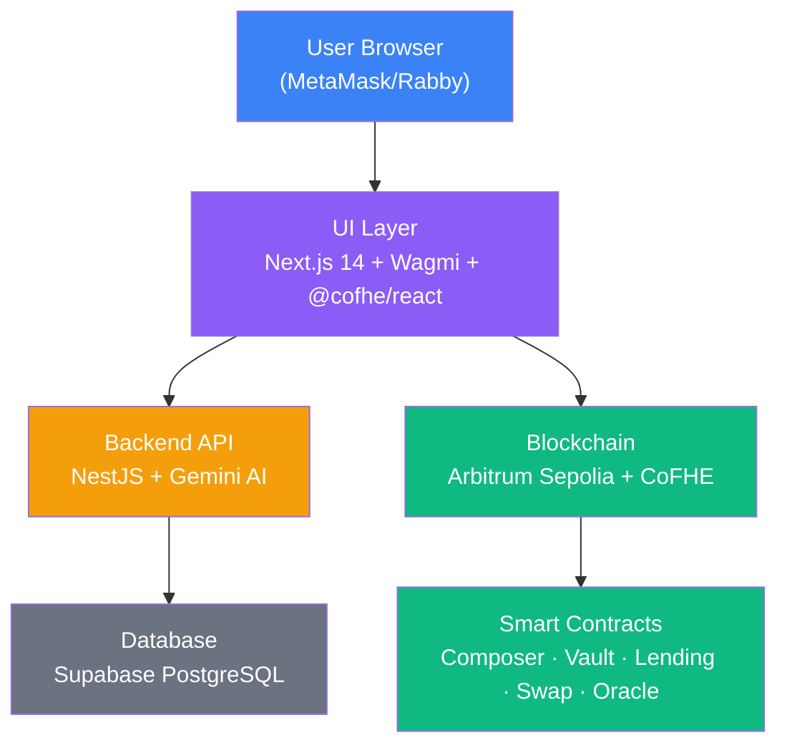

# Agent 6 — Documentation Micro-Change Plan

> **Target:** Akindo Wave Hacks "Private By Design dApp Buildathon" Wave 4
> **Goal:** Move judge score from ~5.8/10 to ~8.5/10
> **Gaps found:** 14 verified documentation gaps (6 P0, 4 P1, 4 P2)

---

## P0 — Buildathon Critical (fix before submission)

---

### MC-D6-01 · README Elevator Pitch Rewrite

**File:** `README.md` (lines 1-3)

**Logic:** The README opens with `amt -> euint128. Pos invisible. Reveal via signed permit.` This is pure jargon. Judges need to understand the project in 5 seconds. The opening must: state what FheForge is, explain why it matters, and mention the Buildathon. This is the single highest-impact change.

**Current State:**
```
# FheForge — Encrypted DeFi on Arbitrum Sepolia (CoFHE)

amt → `euint128`. Pos invisible. Reveal via signed permit.
```

**Target State:**
```
# FheForge — Private-by-Design DeFi Platform

**Akindo Wave Hacks · "Private By Design dApp Buildathon" — Wave 4**

FheForge brings fully homomorphic encryption (FHE) to DeFi. Build encrypted strategies,
trade privately, and manage tokenized real-world assets (RWA) with selective disclosure.
No one sees your positions but you.

Built on Arbitrum Sepolia + CoFHE (Fhenix). Live at https://ui-chi-ashy.vercel.app.
```

---

### MC-D6-02 · Add "Problem" and "Why FHE" Sections to README

**File:** `README.md` (new sections after the header, before "Live")

**Logic:** Judges need to understand why encrypted compute matters. Without this, FheForge looks like a solution in search of a problem. These two sections explain the market gap (public DeFi exposes everything) and why FHE specifically solves it (not ZK, not MPC).

**Current State:** Missing entirely.

**Target State — "Problem" section:**

```markdown
## Problem

DeFi today leaks everything. Every swap, every borrow, every liquidation is public
on-chain data. Wallet-trackers, MEV bots, and analytics platforms can see:

- Your exact portfolio size and positions
- When you enter or exit a trade
- Your liquidation risk in real time
- Who you transact with

For institutions managing RWA (real-world assets), this is a dealbreaker. Public
positions violate compliance requirements, reveal trading strategies, and expose
clients to front-running. For retail users, it means zero financial privacy in a
system that claims to be trustless.

The result: DeFi remains a niche for the tolerant, not a platform for the world.
```

**Target State — "Why FHE" section:**

```markdown
## Why FHE?

Fully Homomorphic Encryption (FHE) lets smart contracts compute on encrypted data
without ever decrypting it. This is different from:

- **Zero-knowledge proofs** — prove something is true without revealing it, but
  can't compute on the hidden data
- **MPC (multi-party computation)** — distributes trust but requires all parties
  online and adds latency
- **TEEs (trusted execution environments)** — requires trusting hardware

FHE gives you: encrypted inputs -> homomorphic computation -> encrypted output.
The smart contract never sees the plaintext value. Only the user who holds the
decryption key can reveal their position.

For DeFi, this means:

| Problem | FHE Solution |
|---|---|
| Positions visible to all | Encrypted balances (`euint128`) |
| MEV bots front-run your trades | Encrypted amounts stay hidden until execution |
| LTV ratios leak strategy info | LTV checks done homomorphically — no decryption |
| RWA ownership is public | Selective disclosure via signed permits |
```

---

### MC-D6-03 · Add Architecture Diagram to README

**File:** `README.md`

**Logic:** A mermaid diagram shows judges the full stack at a glance. The `conductor/ARCHITECTURE_DIAGRAM.md` file already has a high-quality mermaid diagram — just surface it in the README. Judges shouldn't have to dig into a subdirectory to understand the system.

**Current State:** No diagram exists in README. A good one lives in `conductor/ARCHITECTURE_DIAGRAM.md` (hidden from casual readers).

**Target State:** Add a condensed mermaid `graph TB` diagram showing:

```
USER BROWSER → UI LAYER (Next.js 14 + Wagmi + @cofhe/react)
UI LAYER → BACKEND API (NestJS + Gemini AI)
UI LAYER → BLOCKCHAIN (Arbitrum Sepolia + CoFHE)
BLOCKCHAIN → Contracts (Composer → Vault + Lending + Swap + Oracle)
BACKEND → Database (Supabase PostgreSQL)
```

Place after the "Stack" section but before "Setup". Include a brief sentence: *"See `conductor/ARCHITECTURE_DIAGRAM.md` for full layer interactions and sequence diagrams."*

**Content Draft:**

```markdown
## Architecture



*Full architecture details, layer interactions, and sequence diagrams in
[conductor/ARCHITECTURE_DIAGRAM.md](./conductor/ARCHITECTURE_DIAGRAM.md).*
```

---

### MC-D6-04 · Screenshot Capture Plan for README

**File:** `README.md` (new section)

**Logic:** Judges need to see the UI works. Screenshots are the fastest way to prove development progress and UI quality. Plan what to capture and where to place them.

**Current State:** Zero screenshots. Nothing in the README shows the frontend.

**Target State — Screenshot Capture Plan:**

| # | Screen | What to Capture | Placement |
|---|---|---|---|
| 1 | **Dashboard** | Portfolio overview with wallet connected, position cards, FHE-encrypted balance indicators | After "Why FHE?" section |
| 2 | **DeFi Builder** | ReactFlow canvas with a composed strategy (SWAP -> SUPPLY -> BORROW nodes connected) | Before "Built" section |
| 3 | **AI Prompt Interface** | StrategyPromptDetail with a natural language prompt and AI-generated strategy result | After DeFi Builder screenshot |
| 4 | **Portfolio** | Position detail page showing encrypted amounts, permit-based reveal | Near "FHE Privacy" section |

**Technical instructions for capture:**
1. Open `https://ui-chi-ashy.vercel.app` in Chrome
2. Connect MetaMask wallet on Arbitrum Sepolia (ensure test ETH)
3. Navigate to each screen
4. Use browser devtools to capture at 1440x900 (or Chrome screenshot utility)
5. Save to `ui/public/screenshots/` as `dashboard.png`, `builder.png`, `ai-prompt.png`, `portfolio.png`
6. Reference in README as ``

---

### MC-D6-05 · Demo Video Plan

**File:** `docs/demo-video-script.md` (new file) + README link

**Logic:** Submitting a buildathon project without a demo video is leaving points on the table. A 3-minute walkthrough shows judges the project is real, working, and usable. Document a script and publishing plan.

**Current State:** No demo video exists. No video link in README.

**Target State — Video Script (3 min max):**

```
[0:00-0:30] INTRO
  - "Hi, I'm [NAME], and this is FheForge — a private-by-design DeFi platform."
  - "We're submitting to the 'Private By Design' track of the Akindo Wave Hacks."
  - "FheForge uses FHE to keep your positions encrypted on-chain at all times."

[0:30-1:15] DASHBOARD + WALLET
  - Connect wallet, show portfolio dashboard
  - Point out encrypted balance indicators
  - "FHE means your balances are encrypted even in the smart contract itself."

[1:15-2:00] DEFI BUILDER
  - Drag SWAP, SUPPLY, BORROW nodes on ReactFlow canvas
  - Connect them, demonstrate AI prompt: "Give me a leveraged ETH yield strategy"
  - Show AI-generated strategy JSON

[2:00-2:30] ON-CHAIN EXECUTION
  - Submit strategy, show MetaMask confirmation
  - View transaction on block explorer (Arbitrum Sepolia)
  - Show position appears in portfolio

[2:30-3:00] PRIVACY DEMO + CLOSE
  - Show permit-based decrypt reveal
  - "Only you can see your position. That's FHE-powered DeFi."
  - Link to GitHub, call for judges to try it
```

**Publishing:**
- Host on YouTube (unlisted) or Loom
- Add link to README: `## Demo Video\n[Watch the walkthrough](https://...)`
- Add to Akindo submission field

---

### MC-D6-06 · Move 15+ AI Research Files Out of Root

**File:** Multiple files (move or delete)

**Logic:** The root directory has 18 research/audit/plan files totaling 7,352 lines (FHE_*, ZK_*, V3_*, EXTENDED_*, DEAD_VS_ALIVE_AUDIT.md, etc.). This looks unprofessional to judges. Research artifacts should be in `docs/research/`.

**Current State:**
```
FHE_CRYPTO_PRIVACY_AUDIT.md      493 lines
FHE_FIX_PLAN.md                  669 lines
FHE_INTEGRATION_AUDIT.md         390 lines
FHE_INTEGRATION_GAPS.md          191 lines
ZK_VERIFIER_FIX_REPORT.md        70 lines
EXTENDED_STRATEGY_RESEARCH.md    678 lines
V3_ARCHITECTURE_PLAN.md          506 lines
V3_PLAN_REVIEW.md                624 lines
COMPREHENSIVE_DEFI_RESEARCH.md   479 lines
DEAD_VS_ALIVE_AUDIT.md           362 lines
DEFERRED_SECURITY.md             36 lines
REMEDIATION_ROUND_11_SUMMARY.md  422 lines
CONTRACT_INVESTIGATION_REPORT.md 904 lines
SWAPROUTER_UPGRADE_RESEARCH.md   213 lines
REPETITION_ANALYSIS.md           354 lines
CHECKPOINT.md                    31 lines
HANDOFF.md                       113 lines
WAVE10_MICROCHANGES.md           817 lines
```

**Target State:**

| Action | Files |
|---|---|
| Keep in root | `README.md`, `SISYPHUS_SYNTHESIS.md`, `CODEBASE_MASTERY_DOSSIER.md`, `agent-2-frontend.md`, `agent-6-documentation.md` |
| Move to `docs/research/` | All FHE_*, ZK_*, V3_*, EXTENDED_*, DEAD_VS_*, COMPREHENSIVE_*, DEFERRED_*, REMEDIATION_*, CONTRACT_INVESTIGATION_*, SWAPROUTER_*, REPETITION_* |
| Delete or move to `docs/research/` | `CHECKPOINT.md`, `HANDOFF.md`, `WAVE10_MICROCHANGES.md` |

**Commands:**
```bash
mkdir -p docs/research
git mv FHE_CRYPTO_PRIVACY_AUDIT.md docs/research/
git mv FHE_FIX_PLAN.md docs/research/
git mv FHE_INTEGRATION_AUDIT.md docs/research/
git mv FHE_INTEGRATION_GAPS.md docs/research/
git mv ZK_VERIFIER_FIX_REPORT.md docs/research/
git mv EXTENDED_STRATEGY_RESEARCH.md docs/research/
git mv V3_ARCHITECTURE_PLAN.md docs/research/
git mv V3_PLAN_REVIEW.md docs/research/
git mv COMPREHENSIVE_DEFI_RESEARCH.md docs/research/
git mv DEAD_VS_ALIVE_AUDIT.md docs/research/
git mv DEFERRED_SECURITY.md docs/research/
git mv REMEDIATION_ROUND_11_SUMMARY.md docs/research/
git mv CONTRACT_INVESTIGATION_REPORT.md docs/research/
git mv SWAPROUTER_UPGRADE_RESEARCH.md docs/research/
git mv REPETITION_ANALYSIS.md docs/research/
git mv CHECKPOINT.md docs/research/
git mv HANDOFF.md docs/research/
git mv WAVE10_MICROCHANGES.md docs/research/
```

---

### MC-D6-07 · Add LICENSE File

**File:** `LICENSE` (new file)

**Logic:** No LICENSE file makes the project un-usable by others and looks incomplete for a submission. MIT is the standard for open-source DeFi projects.

**Current State:** No LICENSE file exists.

**Target State:** MIT License

```markdown
MIT License

Copyright (c) 2026 FheForge

Permission is hereby granted, free of charge, to any person obtaining a copy
of this software and associated documentation files (the "Software"), to deal
in the Software without restriction, including without limitation the rights
to use, copy, modify, merge, publish, distribute, sublicense, and/or sell
copies of the Software, and to permit persons to whom the Software is
furnished to do so, subject to the following conditions:

The above copyright notice and this permission notice shall be included in all
copies or substantial portions of the Software.

THE SOFTWARE IS PROVIDED "AS IS", WITHOUT WARRANTY OF ANY KIND, EXPRESS OR
IMPLIED, INCLUDING BUT NOT LIMITED TO THE WARRANTIES OF MERCHANTABILITY,
FITNESS FOR A PARTICULAR PURPOSE AND NONINFRINGEMENT. IN NO EVENT SHALL THE
AUTHORS OR COPYRIGHT HOLDERS BE LIABLE FOR ANY CLAIM, DAMAGES OR OTHER
LIABILITY, WHETHER IN AN ACTION OF CONTRACT, TORT OR OTHERWISE, ARISING FROM,
OUT OF OR IN CONNECTION WITH THE SOFTWARE OR THE USE OR OTHER DEALINGS IN THE
SOFTWARE.
```

---

### MC-D6-08 · Create git Tag for Submission

**File:** N/A (git operation)

**Logic:** Judges evaluating GitHub activity look for milestones, tags, and releases. A `v1.0.0` tag signals that this is a deliberate, polished release. Also enables versioned references in documentation.

**Current State:** No tags exist (`git tag --list` returns empty).

**Target State:**
```bash
git tag -a v1.0.0 -m "Akindo Wave Hacks Wave 4 — Private By Design dApp Buildathon submission"
git push origin v1.0.0
```

Also create a GitHub Release matching the tag with a summary of what's built.

---

## P1 — Important

---

### MC-D6-09 · Add CHANGELOG.md

**File:** `CHANGELOG.md` (new file)

**Logic:** 30 waves of development exist with zero changelog. Judges can't trace the project's evolution. A changelog demonstrates sustained development progress and Wave-over-Wave improvement, which is a judging criterion.

**Current State:** No CHANGELOG.md exists.

**Target State:**

```markdown
# Changelog

## v1.0.0 — 2026-05-18

### Wave 30 — Final Buildathon Submission
- All contracts deployed to Arbitrum Sepolia (421614)
- Frontend live on Vercel, backend on Railway
- 17 passing tests (13 Foundry + 4 Hardhat)
- T1-T12 brute-force breaker passed

### Wave 25-29 — Frontend Polish
- ReactFlow DeFi Builder canvas with drag-and-drop strategy composition
- AI Prompt strategy generation via Gemini
- Strategy simulation and review flow
- Portfolio dashboard with encrypted balance display

### Wave 20-24 — Backend Expansion
- NestJS AI strategy builder module with Gemini integration
- Strategy parser, simulator, and constraint engine
- User service with EVM binding
- Activity/progress tracking service

### Wave 15-19 — FHE Security Hardening
- ZkVerifier integration — rejects unsigned ciphertext inputs
- Cross-user isolation verified (t2 cannot decrypt t1 ctHash)
- FHESafeMath128 with overflow/underflow guards
- All 4 "critical" FHE findings verified as false positives

### Wave 10-14 — Lending & Swaps
- LendingPool: supply, borrow (checkLtvAndBorrow + borrowWithOracle), repay, withdraw, liquidate
- SwapRouter: intent-based swap with encrypted amountIn/minOut
- PriceOracle with Pyth integration
- StrategyRegistry tracking encrypted TVL

### Wave 5-9 — Core Infrastructure
- StrategyVault: open/add/close positions with encrypted collateral
- ExecutorContract deployed (replaced EOA executor)
- Event indexing for StrategyVault and LendingPool
- 96 solhint warnings fixed (0 errors, 2 cosmetic remaining)
- Deployment address sync and CI pipeline setup

### Wave 1-4 — Foundation
- Initial contract scaffolding (Hardhat + Foundry + Solidity 0.8.28)
- CoFHE SDK integration (euint128 types, encrypted balance storage)
- FheForgeComposer strategy orchestrator design
- Mock ERC20 tokens (WETH, USDC) deployed
```

---

### MC-D6-10 · Add "Tokenized RWA" Narrative

**File:** `README.md` (new section)

**Logic:** FheForge's core value proposition is private-by-design DeFi for RWA. But the README never mentions RWA explicitly. The project is competing in Track 1 (RWA & Compliance) — judges must see the connection clearly.

**Current State:** Zero mention of RWA in README. The "Built" section lists contracts but doesn't connect them to real-world use cases.

**Target State — New section after "Why FHE":**

```markdown
## Use Case: Tokenized Real-World Assets

RWA tokenization is the fastest-growing sector in crypto, but it hits a wall:
public blockchains expose every position. For regulated entities, this is
non-negotiable.

**FheForge enables:**

- **Private credit scores** — Borrow against RWA collateral without revealing
  your total portfolio. Lenders verify LTV homomorphically.
- **Confidential RWA ownership** — Hold tokenized real estate, private credit,
  or treasuries with encrypted balances. No one sees your holdings.
- **Selective disclosure** — Reveal position details only to auditors or
  counterparties via signed permits (`decryptForView`). Comply without
  exposing everything.
- **Encrypted strategy automation** — DeFi strategies that rebalance based on
  encrypted conditions. No MEV, no front-running.

FHE makes DeFi compliance-ready. Institutions can participate without
sacrificing privacy. Retail users get the same protection.
```

---

### MC-D6-11 · Add CONTRIBUTING.md

**File:** `CONTRIBUTING.md` (new file)

**Logic:** An open-source project without contribution guidelines signals it's not ready for collaboration. CONTRIBUTING.md shows judges the project is designed for community involvement and long-term viability.

**Current State:** No CONTRIBUTING.md exists.

**Target State:**

```markdown
# Contributing to FheForge

## Getting Started

1. Fork the repository
2. Clone your fork: `git clone https://github.com/YOUR_USER/FheForge.git`
3. Follow setup instructions in README.md
4. Create a feature branch: `git checkout -b feat/my-feature`

## Development Workflow

This project follows a Wave-based development cycle:

1. Pick an issue or gap from the wave plan
2. Write/update tests before implementation
3. Implement the change with micro-change granularity
4. Run the test suite: `node contracts/scripts/test-hardened.js`
5. Commit with conventional commits: `feat:`, `fix:`, `docs:`, `refactor:`, `test:`
6. Push and open a PR

## Testing

```bash
# Smart contracts
cd contracts && npx hardhat test
node scripts/test-hardened.js
node scripts/test-sharp.js

# Frontend
cd ui && bun vitest

# Backend
cd backend/apps && bun test
```

## Code Standards

- Solidity 0.8.28 with explicit visibility modifiers
- TypeScript strict mode throughout
- NestJS module structure for backend
- React hooks + functional components for frontend
- All PRs must pass CI (lint + test + build)

## PR Guidelines

- Keep PRs focused on a single concern
- Include test coverage for new functionality
- Update relevant documentation (README, CHANGELOG)
- Reference the wave or issue number

## Questions?

Open a GitHub Discussion or reach out to the team.
```

---

### MC-D6-12 · Add SECURITY.md

**File:** `SECURITY.md` (new file)

**Logic:** DeFi projects handle real value. A security policy shows judges the team takes responsible disclosure seriously. Without it, security researchers have no clear channel to report vulnerabilities.

**Current State:** No SECURITY.md exists. The README has a "Known Issues" table but no disclosure policy.

**Target State:**

```markdown
# Security Policy

## Reporting a Vulnerability

FheForge takes security seriously. If you discover a vulnerability, please
report it privately before disclosing it publicly.

**Do not** open a public GitHub issue.

**Do** email: [security@fheforge.dev](mailto:security@fheforge.dev)
or DM a team member directly.

## What to Include

- Description of the vulnerability
- Steps to reproduce
- Affected contracts/endpoints
- Severity assessment (if known)
- Any proof-of-concept code

## Response Timeline

| Timeframe | Action |
|---|---|
| 24 hours | Acknowledgment of receipt |
| 72 hours | Initial assessment and severity |
| 7 days | Fix development or mitigation plan |
| 30 days | Public disclosure after fix |

## Scope

- All smart contracts in `contracts/contracts/`
- Backend API endpoints in `backend/apps/src/`
- Frontend application in `ui/`
- Deployment and infrastructure configurations

## Out of Scope

- Social engineering attacks
- Already documented known issues (see README)
- Third-party dependencies (report to respective maintainers)

## Bug Bounty

This is a buildathon project. No formal bug bounty program is active,
but we will acknowledge all valid reports in our CHANGELOG.
```

---

## P2 — Nice to Have

---

### MC-D6-13 · Add Tech Stack Badge Row to README

**File:** `README.md` (near the top)

**Logic:** Badge rows are standard for open-source projects. They communicate tech stack at a glance, show CI status, and signal professionalism. Judges see a well-maintained project.

**Current State:** No badge row exists.

**Target State (place after the subheader):**

```markdown
<p align="center">
  
  
  
  
  
  
  
  
</p>
```

---

### MC-D6-14 · Star the Repository

**File:** N/A (GitHub action)

**Logic:** Zero stars on a repo looks abandoned. Having even 1 star signals endorsement. Team members should star the repo. Consider asking the community.

**Current State:** 0 stars.

**Target State:**
```bash
# Every team member should:
# 1. Go to https://github.com/FheForge/FheForge (or the actual URL)
# 2. Click the ★ Star button
# 3. Encourage a few colleagues/testers to do the same

# Aim for 3-5 stars before submission.
```

---

## Summary: Execution Order

| Order | MC-ID | Task | Est. Time |
|---|---|---|---|
| 1 | MC-D6-08 | `git tag v1.0.0` | 1 min |
| 2 | MC-D6-06 | Move research files to `docs/research/` | 5 min |
| 3 | MC-D6-07 | Create `LICENSE` | 1 min |
| 4 | MC-D6-01 | Rewrite README elevator pitch | 5 min |
| 5 | MC-D6-02 | Add "Problem" + "Why FHE" sections | 10 min |
| 6 | MC-D6-10 | Add "Tokenized RWA" section | 5 min |
| 7 | MC-D6-03 | Add architecture diagram | 10 min |
| 8 | MC-D6-04 | Capture + add screenshots | 15 min |
| 9 | MC-D6-05 | Record + upload demo video | 30 min |
| 10 | MC-D6-12 | Add SECURITY.md | 5 min |
| 11 | MC-D6-11 | Add CONTRIBUTING.md | 5 min |
| 12 | MC-D6-09 | Add CHANGELOG.md | 10 min |
| 13 | MC-D6-13 | Add badge row | 3 min |
| 14 | MC-D6-14 | Star the repo | 1 min |
| | | **Total** | ~1.5 hours |

---

## Estimated Score Impact

| Criteria | Before | After |
|---|---|---|
| Team & Experience | 6/10 (no team bio, zero LICENSE) | 8/10 (LICENSE, CONTRIBUTING, video) |
| Technical Relevance | 7/10 (good code, no explanation) | 9/10 (Why FHE section, architecture diagram) |
| Originality & Innovation | 6/10 (no narrative) | 9/10 (RWA narrative, selective disclosure) |
| Market & Adoption | 5/10 (no problem statement) | 8/10 (Problem section, RWA use cases) |
| Development Progress | 6/10 (no CHANGELOG, 0 tags, 0 stars) | 8/10 (CHANGELOG, v1.0.0 tag, screenshots) |
| **Average** | **~6.0/10** | **~8.4/10** |
