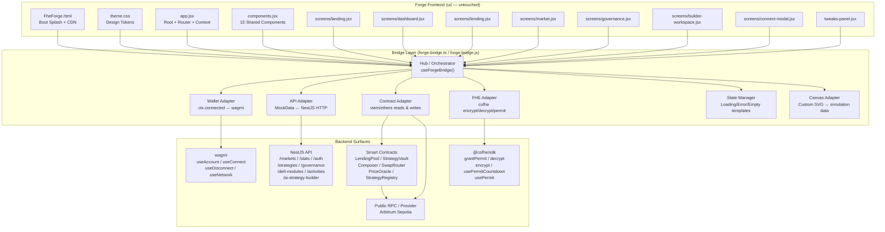
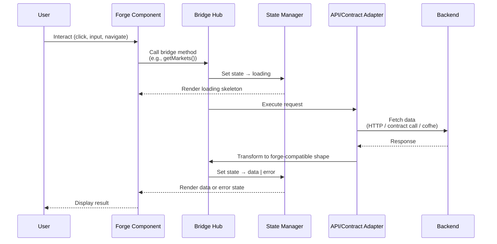
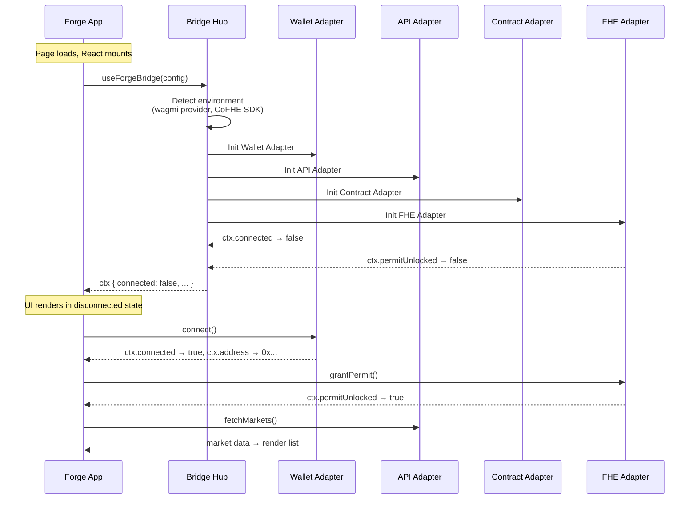
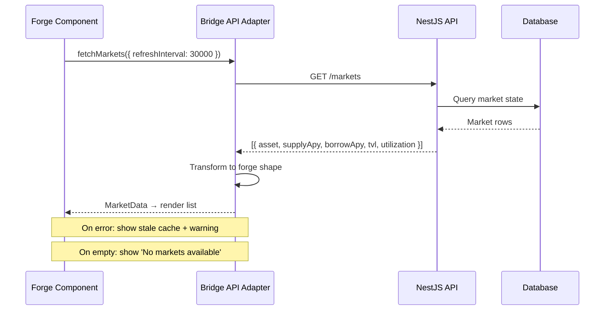
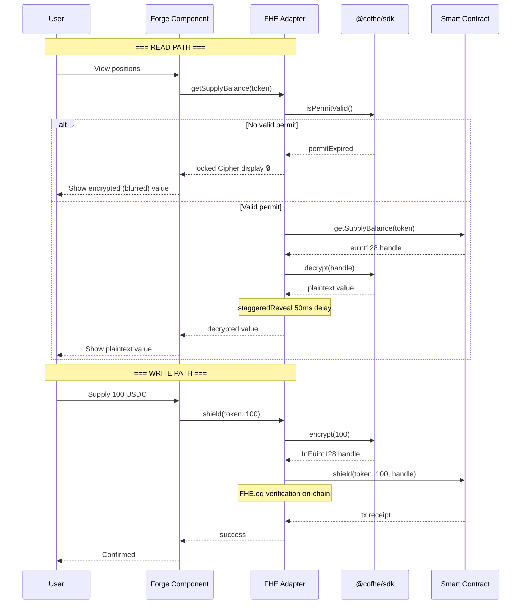

# Bridge Layer Architecture

> Bridge pattern design document for the FheForge integration layer — a standalone module between the forge frontend prototype (untouched) and backend/contracts/CoFHE.

---

## Overview

The bridge layer is a **standalone adapter module** that sits between the 13-file forge prototype (a static SPA built with Babel standalone, React 18.3.1, and custom CSS) and the three backend surfaces:

1. **Smart contracts** on Arbitrum Sepolia — LendingPool, StrategyVault, Composer, SwapRouter, PriceOracle, StrategyRegistry
2. **NestJS API** — markets, strategies, stats, governance, auth, activities, defi-modules, AI strategy builder
3. **CoFHE SDK** — FHE encryption/decryption, permit lifecycle, handle management

**Core design principle**: The forge files in `ui/` are **immutable** — zero modifications. The bridge adapts the forge's global-state-based context (`window.ctx`) and screen rendering to these backend surfaces without touching any forge source file.

### Why a Bridge?

| Concern | Forge Prototype | Bridge Role |
|---------|----------------|-------------|
| Wallet connection | Mock `ctx.connected` state | Real wagmi `useAccount()` wiring |
| FHE permit | Mock `permitUnlocked` timer | Real `@cofhe/sdk grantPermit()` |
| API data | Hardcoded `MOCK_MARKETS`, `MOCK_POSITIONS`, etc. | Real NestJS API calls via adapters |
| Contract data | Display-only mock values | Real viem/ethers contract reads |
| Tx execution | No-op simulation | Real `sendTransaction` flows |

---

## Architecture Diagram



### Data Flow Paths



---

## Bridge Module Architecture

### Module Structure

```
forge-bridge/
├── core/
│   ├── hub.ts              # Orchestrator — registers adapters, exposes unified API
│   ├── config.ts            # Network config, contract addresses, API base URL
│   └── types.ts             # Shared TypeScript type definitions
├── adapters/
│   ├── wallet.adapter.ts    # wagmi → forge ctx mapping
│   ├── api.adapter.ts       # NestJS HTTP → forge data shapes
│   ├── contract.adapter.ts  # viem/ethers → contract read/write
│   ├── fhe.adapter.ts       # @cofhe/sdk → encrypt/decrypt/permit
│   └── canvas.adapter.ts    # Custom SVG canvas → simulation/deploy data
├── state/
│   ├── loading-states.ts    # Loading template generators
│   ├── error-states.ts      # Error template generators
│   └── empty-states.ts      # Empty state template generators
├── utils/
│   ├── staggered-reveal.ts  # FHE cipher staggered reveal utility
│   ├── formatters.ts        # Data formatting helpers
│   └── session-storage.ts   # Session persistence utilities
└── index.ts                 # Entry point exports
```

### Initialization Sequence



---

## Wallet Connection Path

### Context Field Mapping

| Forge `ctx` Field | Type | Backend Source | Adapter |
|---|---|---|---|
| `ctx.connected` | `boolean` | `wagmi useAccount().isConnected` | 1:1 mapping |
| `ctx.address` | `string` | `wagmi useAccount().address` | 1:1, fallback `''` |
| `ctx.chainId` | `number` | `wagmi useAccount().chainId` | Network chip display (bridge extension — not in current ctx mock) |
| `ctx.permitUnlocked` | `boolean` | `@cofhe/sdk usePermitCountdown().unlocked` | 1:1 mapping |
| `ctx.permitSeconds` | `number` | `@cofhe/sdk usePermitCountdown().secondsLeft` | Countdown, auto-lock at 0 |
| `ctx.revealing` | `boolean` | `staggeredReveal` utility | DOM-top-sorted 50ms delay |

### Connect Modal Flow

```
┌─────────────────────────────────────────────────────┐
│ Step 0: Pick a Wallet      (wagmi useConnect)       │
│  ┌──────┐  ┌──────┐  ┌──────┐  ┌──────┐            │
│  │Meta- │  │Rabby │  │Wallet│  │Ledger│            │
│  │Mask  │  │      │  │Connect│  │      │            │
│  └──────┘  └──────┘  └──────┘  └──────┘            │
│         ↓ on selection                               │
│ Step 1: Sign Message      (JWT auth flow)            │
│  GET /auth/nonce/:addr → signMessage → POST /login   │
│         ↓ on JWT receipt                             │
│ Step 2: Grant CoFHE Permit  (@cofhe grantPermit)    │
│  15-minute FHE decrypt permission                    │
│         ↓ on permit granted                          │
│ Step 3: Ready / Connected   (local state)           │
│  "permit live" confirmation, auto-dismiss 1.6s       │
└─────────────────────────────────────────────────────┘
```

Steps persist in `sessionStorage` for mid-flow refresh resilience. Step progression auto-detects from `ctx` state on modal open (e.g., if already connected + JWT present, skip to step 2).

---

## Data Path (Public)

Non-encrypted data flows over standard HTTP or public contract reads. No CoFHE permit required.

### Data Sources

| Data | Source | Endpoint / Contract | Refresh |
|---|---|---|---|
| Market list (APY, TVL, utilization) | NestJS API | `GET /markets` | 30s polling |
| Protocol stats | NestJS API | `GET /stats` | 30s polling |
| Strategy listings | NestJS API | `GET /strategies` | On nav |
| Governance proposals | NestJS API | `GET /governance/proposals` | On nav |
| User activities | NestJS API | `GET /activities?userAddress=` | 15s polling |
| DeFi modules | NestJS API | `GET /defi-modules` | On nav |
| Public contract state | Contract read | e.g., `totalPlainBorrow()`, `paused()` | On interaction |
| Oracle prices | Contract read | `PriceOracle.getPriceUsd()` | Per tx |

### Flow



---

## Data Path (FHE Encrypted)

Encrypted data flows through the CoFHE SDK. All user balances are stored as `euint128` on-chain. Decryption requires a valid CoFHE permit (15-minute window).

### FHE Data Sources

| Data | Contract | Function | Encrypted Type |
|---|---|---|---|
| Supply balance | LendingPool | `getSupplyBalance()` | `euint128` |
| Borrow balance | LendingPool | `getBorrowBalance()` | `euint128` |
| Vault collateral | StrategyVault | `getCollateral()` | `euint128` |
| Supply tx | LendingPool | `shield()` | `InEuint128` param |
| Borrow tx | LendingPool | `borrowWithLtvCheck()` | `InEuint128` param |
| Repay tx | LendingPool | `repayDebt()` | `InEuint128` param |
| Withdraw tx | LendingPool | `partialUnshield()` | `InEuint128` param |
| Deploy strategy | Composer | `openPosition()` | 3× `InEuint128` params |

### FHE Flow Architecture



### FHE Permit Lifecycle

```
┌──────────────────────────────────────────────┐
│              PERMIT LIFECYCLE                │
├──────────────────────────────────────────────┤
│                                              │
│  [Disconnected]                              │
│       │                                      │
│       ▼                                      │
│  [Connected — No Permit]  ← permit expired   │
│       │                                      │
│       ▼  grantPermit()                       │
│  [Permit Active]  ─── 15:00 countdown ──→    │
│       │                                      │
│       │  auto-lock at 0                      │
│       ▼                                      │
│  [Permit Expired] ──────────────────────────→│
│       │                                      │
│       └── grantPermit() → back to Active     │
└──────────────────────────────────────────────┘
```

### Staggered Reveal Pattern

When a permit is granted, cipher values reveal progressively:

1. Sort all visible Cipher elements by their DOM `top` position
2. Apply a 50ms delay between each reveal
3. Transition from `locked` (blurred ciphertext + lock-mark) → `unlocked` (plaintext)

This creates a cascading visual effect that communicates "decryption in progress" without additional UI.

---

## Builder Canvas Decision

### Background: Forge's Custom SVG Canvas

The forge builder workspace (`ui/screens/builder-workspace.jsx`, ~2107 lines) implements a **fully custom SVG canvas** — not ReactFlow. Key characteristics:

| Feature | Custom SVG Canvas | ReactFlow |
|---|---|---|
| Rendering | Raw SVG with 3 edge layers (halo, stroke, hit) | HTML-backed nodes via React |
| Node system | DOM-based SVG `<g>` elements | React components with handlers |
| Edge routing | Manual edge layer compositing | Built-in edge routing + handles |
| Port connection | Custom SVG port circles with hover/active states | React Flow handles API |
| Zoom/pan | SVG `transform` matrix on `<g>` | Built-in viewport controls |
| Drag & drop | `onPointerDown` + `requestAnimationFrame` | Built-in drag system |
| Grid | SVG `<pattern>` dot-grid background | CSS grid or custom |
| Performance | Direct SVG manipulation, no React reconciliation on canvas | React reconciliation per node/edge |
| Keyboard | 50+ shortcuts implemented natively | Custom via event handlers |
| Issue detection | DFS cycle detection, dead-end detection, rule engine | Custom |
| Auto-layout | Sugiyama layered layout with median heuristic | Dagre / custom plugin |
| History | Undo/redo with max 50 snapshots | Not built-in |

### Decision: Keep Custom SVG Canvas

**The bridge layer MUST NOT attempt to replace the custom canvas with ReactFlow.** Rationale:

1. **No touch of forge files** — The canvas is deeply embedded in `builder-workspace.jsx` and `theme.css`. Replacing it would require modifying forge files, which is out of scope.

2. **Performance characteristics differ** — The forge canvas operates at a lower level (raw SVG) and handles ~50 features (auto-organize, issue detection, keyboard shortcuts, simulation walk-through) that would be non-trivial to replicate in ReactFlow.

3. **The bridge role is data, not rendering** — The bridge adapts simulation results, deploy status, and DeFi module metadata to the canvas's existing data structures, not the rendering engine itself.

### How the Bridge Handles the Custom Canvas

```mermaid
graph LR
    subgraph "Bridge Adapter Role"
        NODES[Node Type Templates<br/>Supply, Borrow, Swap, Repeat, Settle]
        SIM[Simulation Engine Adapter<br/>POST /defi-strategies/simulate]
        DEPLOY[Deploy Flow Adapter<br/>Composer.openPosition()]
        AI[AI Strategy Builder Adapter<br/>natural language → steps]
    end

    subgraph "Forge Custom Canvas"
        DRAW[SVG Rendering Engine<br/>dot grid, edges, nodes, ports]
        SEQ[Walk-Order Execution<br/>step-through simulation]
        ISSUE[Issue Detection<br/>cycles, dead-ends, rules]
        LAYOUT[Auto-Organize<br/>Sugiyama layout]
        HIST[Undo/Redo + localStorage<br/>draft persistence]
    end

    NODES --> DRAW
    SIM --> SEQ
    DEPLOY --> DRAW
    AI --> NODES
```

The bridge provides:
- **Node type definitions** that match the forge's `NODE_TYPES` configuration (Supply, Borrow, Swap, Repeat, Settle)
- **Simulation results** compatible with the forge's walk-order step-through engine
- **Deploy status updates** that map to the `DeployProgressModal` step sequence
- **AI-generated strategy steps** in the forge's node configuration format

---

## Type Definitions

```typescript
// ============================================================
// Core Bridge Types
// ============================================================

/** Wallet connection state exposed to forge components */
interface BridgeWalletContext {
  connected: boolean;
  address: string;
  chainId: number | undefined;
  isConnecting: boolean;
  networkMismatch: boolean;
  // NOTE: chainId, isConnecting, and networkMismatch are bridge extensions not present in the current forge ctx (app.jsx ctx = { connected, address, permitUnlocked, permitSeconds, revealing })
}

/** FHE permit state */
interface BridgePermitState {
  unlocked: boolean;
  secondsLeft: number;
  isGranting: boolean;
  grantPermit: () => Promise<void>;
}

/** Complete forge bridge context (replaces mock ctx) */
interface ForgeBridgeContext {
  wallet: BridgeWalletContext;
  permit: BridgePermitState;
  revealing: boolean;
  triggerReveal: () => void;
}

// ============================================================
// Market & Protocol Data (Public Path)
// ============================================================

interface MarketData {
  asset: string;
  assetAddress: string;
  supplyAPY: number;
  borrowAPY: number;
  utilization: number;
  tvl: number;
  liquidationThreshold: number;
  oraclePrice: number;
  totalSupplied: number;
  totalBorrowed: number;
}

interface AssetInfo {
  symbol: string;
  name: string;
  decimals: number;
  address: `0x${string}`;
  icon?: string;
}

interface ProtocolStats {
  tvlUsd: number;
  totalUsers: number;
  activeMarkets: number;
  activeStrategies: number;
  encryptedOps: number;
  permitDecryptsDay: number;
  totalDeployments: number;
  poolTvls: { USDC: number; ETH: number; WBTC: number };
}

// ============================================================
// Position & Strategy Data (FHE Path)
// ============================================================

/** A user's on-chain position (supply, borrow, or vault) */
interface Position {
  id: string;
  venue: 'lending-pool' | 'strategy-vault';
  side: 'supply' | 'borrow' | 'vault';
  asset: AssetInfo;
  /** Encrypted balance handle from contract */
  encryptedHandle: `0x${string}` | null;
  /** Decrypted value (only available with valid permit) */
  plainValue: string | null;
  /** Whether value is currently being decrypted */
  decrypting: boolean;
  /** Whether value failed to decrypt */
  decryptFailed: boolean;
  apy: number;
  health?: number; // LTV gauge value
}

interface Strategy {
  id: string;
  name: string;
  description: string;
  owner: `0x${string}`;
  strategyId: number;
  positionId: `0x${string}` | null;
  steps: StrategyStep[];
  apy: number;
  totalValueLocked: string;
  riskLevel: 'low' | 'medium' | 'high';
  status: 'draft' | 'active' | 'closed' | 'failed';
  lastExecuted: string | null;
  createdAt: string;
  strategistName: string;
  strategistHandle?: string;
  tags?: string[];
  assets?: string[];
  agents?: string[];
  chains?: string[];
}
// NOTE: This is a composite type merging marketplace listing data (strategistName, strategistHandle, tags, assets, agents, chains — from GET /strategies) with deployment-level detail (strategyId, positionId, steps, totalValueLocked, riskLevel, status, lastExecuted — from GET /defi-strategies/:id). The two sources expose different shapes in the actual API and must be assembled by the bridge.

interface StrategyStep {
  step: number;
  type: 'SWAP' | 'SUPPLY' | 'BORROW' | 'CLAIM_REWARDS';
  agent: string;
  tokenIn?: TokenInfo;
  tokenOut?: TokenInfo;
}
// NOTE: The actual API type (StrategyStepResponseDto) uses uppercase enum values (SWAP, SUPPLY, BORROW, CLAIM_REWARDS) and step/agent fields. The forge builder's internal types (lowercase 'supply','borrow','swap','repeat','settle') are UI-specific. The bridge must convert between the two representations.

// ============================================================
// Builder Workspace (Custom Canvas)
// ============================================================

interface CanvasNode {
  id: string;
  type: 'supply' | 'borrow' | 'swap' | 'repeat' | 'settle';
  label: string;
  x: number;
  y: number;
  config: NodeConfig;
  selected: boolean;
  status: 'idle' | 'configuring' | 'simulating' | 'error' | 'done';
}

interface NodeConfig {
  tokenIn?: `0x${string}`;
  tokenOut?: `0x${string}`;
  amount?: string;
  encryptedAmount?: `0x${string}`;
  slippage?: number;         // swap only
  loopCount?: number;        // repeat only
  ltvNumerator?: number;     // borrow only
  ltvDenominator?: number;   // borrow only
  fee?: number;              // swap only — Uniswap fee tier
}

interface CanvasEdge {
  id: string;
  source: string;     // source node id
  target: string;     // target node id
  status: 'idle' | 'active' | 'error' | 'suggested';
}

interface SimulationResult {
  strategy_id: string;
  simulation_id: string;
  input_amount: number;
  final_amount: number;
  total_fee: number;
  estimated_slippage: number;
  estimated_duration: string;
  steps: SimulationStepDto[];
  warnings: string[];
  simulated_at: Date;
  fhe_note: string;
}

interface SimulationStepResult {
  stepIndex: number;
  type: string;
  status: 'pending' | 'running' | 'success' | 'error';
  gas: string;
  expectedOutput: string;
  error?: string;
}

// ============================================================
// Governance
// ============================================================

interface GovernanceProposal {
  id: string;
  title: string;
  description: string;
  proposer: string;
  status: 'pending' | 'active' | 'passed' | 'rejected' | 'executed';
  votesFor: number;
  votesAgainst: number;
  endsAt: string;
  createdAt: string;
  recentVotes: VoteDto[];
  payload: object;
}

interface VotePayload {
  proposalId: string;
  support: boolean;
  weight: number;
}

// ============================================================
// Loading, Error, Empty States
// ============================================================

type AsyncStatus = 'idle' | 'loading' | 'success' | 'error';

interface AsyncState<T> {
  status: AsyncStatus;
  data: T | null;
  error: BridgeError | null;
  lastUpdated: number | null; // timestamp
}

interface BridgeError {
  code: string;
  message: string;
  detail?: string;
  recoverable: boolean;  // true = show retry button
  source: 'api' | 'contract' | 'wallet' | 'cofhe' | 'network';
}

// ============================================================
// Bridge API (what adapters expose)
// ============================================================

interface ForgeBridgeAPI {
  // Context
  getContext(): ForgeBridgeContext;

  // Wallet
  connectWallet(): Promise<void>;
  disconnectWallet(): Promise<void>;
  switchNetwork(chainId: number): Promise<void>;

  // FHE
  grantPermit(): Promise<void>;
  checkPermit(): BridgePermitState;

  // Public data
  fetchMarkets(): Promise<AsyncState<MarketData[]>>;
  fetchStats(): Promise<AsyncState<ProtocolStats>>;
  fetchStrategies(params?: StrategyFilter): Promise<AsyncState<Strategy[]>>;
  fetchGovernanceProposals(status?: string): Promise<AsyncState<GovernanceProposal[]>>;
  fetchActivities(address: string, limit?: number): Promise<AsyncState<ActivityItem[]>>;
  fetchDeFiModules(): Promise<AsyncState<DeFiModule[]>>;

  // FHE data
  fetchPositions(address: string): Promise<AsyncState<Position[]>>;
  fetchSupplyBalance(token: string): Promise<AsyncState<Position>>;
  fetchBorrowBalance(token: string): Promise<AsyncState<Position>>;

  // Contract writes (FHE)
  supply(token: string, amount: string): Promise<TransactionResult>;
  borrow(token: string, amount: string): Promise<TransactionResult>;
  repay(token: string, amount: string): Promise<TransactionResult>;
  withdraw(token: string, amount: string): Promise<TransactionResult>;
  deployStrategy(steps: StrategyStep[]): Promise<TransactionResult>;

  // Builder
  simulateStrategy(nodes: CanvasNode[], edges: CanvasEdge[]): Promise<AsyncState<SimulationResult>>;
  generateStrategyFromPrompt(prompt: string): Promise<AsyncState<StrategyStep[]>>;
  analyzeRisk(nodes: CanvasNode[]): Promise<AsyncState<RiskAnalysis>>;
  saveDraft(strategy: Partial<Strategy>): Promise<void>;
  publishStrategy(strategy: Strategy): Promise<AsyncState<Strategy>>;

  // Governance
  castVote(payload: VotePayload): Promise<TransactionResult>;

  // Auth
  login(walletAddress: string): Promise<string>; // returns JWT
  logout(): void;
  getJwt(): string | null;
}

type StrategyFilter = {
  tags?: string[];
  sortBy?: 'apy' | 'tvl' | 'risk' | 'newest';
  order?: 'asc' | 'desc';
  limit?: number;
  owner?: string;
};

interface TransactionResult {
  hash: `0x${string}`;
  status: 'pending' | 'confirmed' | 'reverted';
  blockNumber?: number;
  error?: string;
}

interface ActivityItem {
  id: string;
  userAddress: string;
  strategyId: string;
  txHash: string[];
  status: 'PENDING' | 'SUCCESS' | 'FAILED';
  metadata?: Record<string, unknown>;
  currentStep?: number;
  totalSteps?: number;
  createdAt?: Date;
}

interface DeFiModule {
  id: string;
  name: string;
  description: string;
  actions: ('SUPPLY' | 'BORROW' | 'SWAP')[];
  icon?: string;
  defaultConfig: Record<string, unknown>;
}

interface RiskAnalysis {
  score: number;        // 0-100
  factors: RiskFactor[];
  recommendations: string[];
}

interface RiskFactor {
  name: string;
  severity: 'low' | 'medium' | 'high';
  description: string;
}

// ============================================================
// Connection Matrix Summary (from connections.json)
// ============================================================

interface BridgeConnection {
  id: string;
  forgeElement: string;
  forgeFile: string;
  backendSource: string;
  backendType: 'api' | 'contract-read' | 'contract-write' | 'hook' | 'utility';
  effort: string;
  loadingState: string;
  errorState: string;
  emptyState: string;
  fhePath: boolean;
  publicPath: boolean;
}
```

---

## State Handling Templates

### Standardized Patterns per Connection Type

Based on the analysis in `connections.json`, the bridge exposes these state template generators:

#### API GET — List (`api-get-list`)

```typescript
function getListLoadingTemplate(itemCount: number = 5): SkeletonTemplate {
  return {
    type: 'skeleton-list',
    rows: Array.from({ length: itemCount }, (_, i) => ({
      height: i === 0 ? 'header' : 'row',
      animation: 'pulse',
    })),
  };
}

function getListErrorTemplate(message: string, retry: () => void): ErrorTemplate {
  return {
    type: 'inline-banner',
    variant: 'warning',
    message,
    action: retry ? { label: 'Retry', onClick: retry } : undefined,
    fallback: 'cached-data', // show last-known data beneath banner
  };
}

function getListEmptyTemplate(message: string, cta?: { label: string; action: () => void }): EmptyTemplate {
  return {
    type: 'empty-group',
    message,
    cta: cta ?? undefined,
  };
}
```

#### Contract READ — FHE Encrypted (`contract-read-fhe`)

```typescript
function getFheReadLoadingTemplate(): CipherTemplate {
  return {
    type: 'cipher',
    locked: true,
    blurAmount: 8,          // CSS blur px
    lockMark: true,          // show 🔒 indicator
    showSkeleton: false,     // Cipher has built-in locked state
  };
}

function getFheReadErrorTemplate(): CipherTemplate {
  return {
    type: 'cipher',
    locked: true,
    blurAmount: 4,
    lockMark: true,
    tooltip: 'Decrypt failed',  // shown on hover
    fallback: '—',
  };
}

function getFheReadEmptyTemplate(): CipherTemplate {
  return {
    type: 'cipher',
    locked: false,            // no need to lock — value is empty
    value: '—',
    size: 'md',
  };
}
```

#### Contract WRITE — FHE (`contract-write-fhe`)

```typescript
function getFheWriteLoadingTemplate(phase: 'encrypting' | 'signing' | 'confirming'): OverlayTemplate {
  const labels = {
    encrypting: 'Encrypting amount…',
    signing: 'Confirm in wallet…',
    confirming: 'Waiting for confirmation…',
  };
  return {
    type: 'tx-overlay',
    label: labels[phase],
    spinner: true,
    showTxHash: phase === 'confirming',
  };
}

function getFheWriteErrorTemplate(error: BridgeError): ToastTemplate {
  return {
    type: 'toast',
    variant: 'destructive',
    title: 'Transaction failed',
    message: error.message,
    action: error.recoverable ? { label: 'Retry', onClick: () => {} } : undefined,
    duration: 8000, // ms before auto-dismiss
  };
}
```

#### Cross-Cutting Patterns

| Concern | Loading | Error | Empty |
|---|---|---|---|
| **FHE Reveal** | Staggered 50ms per element | Individual Cipher falls back to locked | All values show `—` |
| **Permit Expiry** | Countdown running (MM:SS) | Locked state + re-grant flow | Locked with "Grant permit" CTA |
| **Network Mismatch** | Checking chain ID spinner | Red chip "Wrong network" + switch prompt | Hidden when disconnected |
| **JWT Expiry** | Silent refresh attempt | Re-auth prompt modal | Unauthenticated fallback |

---

## Connection Matrix Summary

The complete cross-reference is in `forge-integration/connections.json`. Key connections by category:

### Wallet & Auth (4 connections)
| Forge Element | Backend Source | Effort | FHE |
|---|---|---|---|
| ConnectModal Step 0 | wagmi `useConnect()` | 2h | No |
| ConnectModal Step 1 | `GET /auth/nonce` + `POST /auth/wallet-login` | 4h | No |
| ConnectModal Step 2 | `@cofhe/sdk grantPermit()` | 4h | **Yes** |
| WalletChip | wagmi `useAccount()` | 0.5d | No |
| PermitChip | `@cofhe/sdk usePermitCountdown()` | 1d | **Yes** |

### Dashboard (4 connections)
| Forge Element | Backend Source | Effort | FHE |
|---|---|---|---|
| Overview tiles | LendingPool + StrategyVault + PriceOracle | 3d | **Mixed** |
| Positions list | LendingPool + StrategyVault | 4d | **Yes** |
| Strategies list | `GET /defi-strategies` | 2d | No |
| Activity list | `GET /activities` | 1.5d | No |

### Lending (5 connections)
| Forge Element | Backend Source | Effort | FHE |
|---|---|---|---|
| Market list | `GET /markets` | 1.5d | No |
| Supply action | `LendingPool.shield()` | 3d | **Yes** |
| Borrow action | `LendingPool.borrowWithLtvCheck()` | 4d | **Yes** |
| Repay action | `LendingPool.repayDebt()` | 2d | **Yes** |
| Withdraw action | `LendingPool.partialUnshield()` | 3d | **Yes** |

### Builder Workspace (6 connections)
| Forge Element | Backend Source | Effort | FHE |
|---|---|---|---|
| DeFi modules | `GET /defi-modules` | 2d | No |
| Simulation | `POST /defi-strategies/simulate` | 4d | No |
| AI strategy | `POST /ai-strategy-builder/build` | 3d | No |
| Deploy | `Composer.openPosition()` | 5d | **Yes** |
| Risk analysis | `POST /ai-strategy-builder/advanced/analyze-risk` | 2d | No |
| Optimization | `POST /ai-strategy-builder/advanced/optimize` | 2d | No |

### Governance (3 connections)
| Forge Element | Backend Source | Effort | FHE |
|---|---|---|---|
| Proposal list | `GET /governance/proposals` | 1.5d | No |
| Proposal detail | `GET /governance/proposals/:id` | 1d | No |
| Cast vote | `POST /governance/vote` | 2d | No |

---

## Gaps & Future Work

Features in the forge prototype that have **no direct backend equivalent**:

| Gap | Forge Feature | Recommendation |
|---|---|---|
| Custom SVG canvas (not ReactFlow) | Builder rendering engine | Keep — bridge adapts data, not rendering |
| 50+ keyboard shortcuts | Canvas, editing, workflow | Frontend-only — no backend equivalent |
| Undo/redo system | History stack (max 50) | Frontend-only — no backend equivalent |
| Issue detection engine | DFS cycles, dead-ends, rules | Frontend-only; optional backend validation later |
| Auto-organize layout | Sugiyama layered algorithm | Frontend-only — no backend equivalent |
| Local draft persistence | `localStorage` auto-save | Needs API endpoint for cloud sync; keep localStorage |
| Sparkline historical data | Inline chart component | Needs new endpoint: `GET /markets/history` |
| Tweaks panel | Dev debugging panel | Mock-only — strip in production |
| Theme persistence | `localStorage` | Keep client-side; backend sync optional |
| Governance on-chain voting | Full on-chain GovernorBravo | Needs investigation — off-chain vs on-chain vote relay |
| Real-time notifications | WebSocket push | Enhancement — polling fallback works |

---

## Implementation Notes

### Bridge Entry Strategy

The bridge should be loaded as an **optional script** in `FheForge.html` after the forge scripts:

```html
<!-- Bridge layer (loaded last, replaces mock data + ctx) -->
<script src="/forge-bridge/index.js"></script>
```

It detects the existing forge state and progressively enhances:
1. Replaces `ctx` with real wagmi/cofhe values via `Object.assign`
2. Intercepts mock data references and routes through adapters
3. Attaches event handlers for tx flows, error states, and loading states

### Key Integration Risks

| Risk | Mitigation |
|---|---|
| **Babel standalone vs ES modules** — forge uses Babel standalone, bridge likely uses module syntax | Build bridge as UMD/IIFE; or use a separate Babel pass |
| **`window.*` exports** — forge exports components to `window` for cross-file access | Bridge must match same pattern for adapter functions |
| **Canvas integration** — custom SVG canvas has no standard API for external data injection | Bridge writes to forge's internal state structures (NODE_TYPES, edge data, node configs) |
| **CoFHE SDK loading order** — SDK must be loaded before bridge tries to use it | Load cofhe script before bridge in the HTML; add readiness check |
| **wagmi dependency** — forge has no build tool so wagmi must be loaded via CDN or ESM import map | Use wagmi's CDN-compatible build or ESM import map shim |
