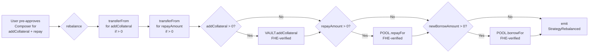

# FheForgeComposer — Composed Strategy Pipeline Analysis

**File:** `contracts/contracts/FheForgeComposer.sol` (252 lines, Solidity ^0.8.28)

## What Is a Composed Strategy?

A **composed strategy** is a multi-step, single-transaction position that chains together three core DeFi primitives — a **collateral vault**, a **lending pool**, and a **swap router** — under a unified workflow orchestrated by the FheForgeComposer contract. The user pre-approves the Composer for tokens, then the Composer handles all internal approvals and calls to the sub-protocols, getting around the problem of each sub-protocol needing its own approval and token-transfer flow.

The entire pipeline is encrypted via **coFHE** (Confidential Computing on FHE): collateral amounts, supply amounts, and borrow amounts are submitted as FHE ciphertexts (`InEuint128`), and the Composer proves equality between the user-supplied encrypted values and the unencrypted params (via `_verifyEquality`) before forwarding FHE handles to downstream contracts.

## Architecture — Core Components

```
            FheForgeComposer (orchestrator)
           /         |           |          \
     Registry    Vault      LendingPool   SwapRouter
                    │            │             │
                collateral   supply/borrow   token swap
                management                  (intent or
                                            direct V3)
```

### Immutable References

| Contract   | Variable   | Role |
|------------|------------|------|
| Registry   | `REGISTRY` | On-chain strategy metadata — name, workflow hash, APY target, loop count |
| Vault      | `VAULT`    | Collateral management per user position — open, add, close |
| Pool       | `POOL`     | Supply (deposit) and borrow (debt) with encrypted balances |
| Router     | `ROUTER`   | Token swapping via intent model or direct Uniswap V3 calls |

## Multi-Step Pipeline — `openPosition()`

```mermaid
flowchart LR
    A[User\npre-approves\nComposer] --> B{openPosition}
    B --> C[transferFrom: pull\ncollateral to Composer]
    C --> D[REGISTRY.registerStrategy\nor reuse existing strategyId]
    D --> E[VAULT.openPosition\ncollateral deposits,\nFHE-verified]
    E --> F[POOL.depositFor\nsupply remainder,\nFHE-verified]
    F --> G[POOL.borrowFor\nborrow against\ncollateral, FHE-verified]
    G --> H{swapTokenOut\n== address(0)?}
    H -->|No swap| I[forward borrowed\ntokens to user]
    H -->|Swap needed| J[ROUTER.submitSwapIntent\nborrowToken → swapTokenOut]
    I --> K[emit\nLeveragedStrategyOpened]
    J --> K
```

### Step-by-step

1. **Token Pull** (lines 75–78):  
   `safeTransferFrom` pulls `max(collateralAmount, poolSupplyAmount)` of `collateralToken` from user into Composer. User must pre-approve the Composer address.

2. **Strategy Resolution** — `_resolveStrategyId()` (lines 90–96):  
   If `p.strategyId == 0`, registers a new strategy on-chain via `REGISTRY.registerStrategy(name, workflowHash, apyTarget, loopCount)`.  
   Otherwise reuses the provided `p.strategyId`.

3. **Vault Collateral** — `_openVaultPosition()` (lines 98–116):  
   Encrypted `e.collateral` is verified against plaintext `p.collateralAmount` via `_verifyEquality`.  
   If they match, the FHE handle + plaintext amount are forwarded to `VAULT.openPosition(...)`, which creates a collateral position in the vault.  
   The FHE handle is made transiently accessible to the Vault contract.

4. **Pool Supply** — `_depositToPool()` (lines 118–129):  
   The remainder `totalNeeded - vaultCovered` (if any) is deposited into the lending pool.  
   Encrypted `e.supplyEnc` is verified against the computed `supplyAmount`.  
   Calls `POOL.depositFor(token, supplyAmount, verifiedSupply, user)` — supply is credited to the user.

5. **Pool Borrow** — `_borrowFromPool()` (lines 131–140):  
   Encrypted `e.borrowEnc` is verified against `p.poolBorrowAmount`.  
   Calls `POOL.borrowFor(p.borrowToken, p.poolBorrowAmount, verifiedBorrow, user)` — debt is opened for the user.

6. **Swap Intent or Forward** — `_submitSwap()` (lines 142–166):  
   If `p.swapTokenOut == address(0)` → no swap: any borrowed tokens sitting in the Composer are forwarded to the user via `safeTransfer`.  
   If swap is required → approves the Router for `p.swapAmountIn` and submits a swap intent via `ROUTER.submitSwapIntent(tokenIn, tokenOut, amountIn, minAmountOut, deadlineOffset)`. Returns an `intentId` that the user or a relayer can later redeem via `ROUTER.executeIntent(intentId, outputAmount)`.

7. **Event** — Emits `LeveragedStrategyOpened(user, strategyId, intentId)`.

## Rebalance Pipeline — `rebalance()`



Each step is individually gated (`> 0` check) so a rebalance can adjust only what's needed.

Ordering is **add-collateral → repay → borrow**, which avoids temporary under-collateralization: adding collateral before borrowing extra is safe even in the same transaction.

## FHE Integrity — `_verifyEquality`

The pattern used throughout (lines 166–176 of `FheForgeBase.sol`):

```solidity
euint128 incoming = FHE.asEuint128(encryptedInput);
euint128 claimedEnc = FHE.asEuint128(plaintextAmount);
ebool match_ = FHE.eq(incoming, claimedEnc);
euint128 result = FHE.select(match_, incoming, _ZERO);
```

This proves the user's encrypted value decrypts to the declared plaintext value. If ciphertext and plaintext disagree, `FHE.select` returns `_ZERO` (encrypted zero), which downstream contracts will see as a zero deposit/borrow/collateral — effectively a silent denial of service rather than a revert. Whether that's acceptable depends on downstream behaviour.

## Security & Design Observations

| Aspect | Finding |
|--------|---------|
| **Reentrancy** | `nonReentrant` (bit-in-guardword pattern from `FheForgeBase`) protects both `openPosition` and `rebalance`. The guard is in the same storage slot as the pause flag to save a slot. |
| **Pausability** | Owner can pause/unpause via `FheForgeBase`. Both public functions check `whenNotPaused`. |
| **Token Pull** | User pre-approves the Composer (not each sub-protocol). Composer then internally approves Vault, Pool, Router — clean UX with a single approval. |
| **Sweep** | `sweepToken` (onlyOwner) rescues accidental balances without `nonReentrant` guard — safe because it's owner-only. |
| **Zero-address checks** | Constructor reverts on `address(0)` for all four dependencies. `sweepToken` also checks. |
| **Unused params** | `OpenStrategyParams` contains `useOracleBorrow`, `ltvNum`, `ltvDen` that are never read by the Composer. These are forwarded implicitly through — actually, they are **not forwarded** by `openPosition`. The `POOL.borrowFor` call (line 139) does not use oracle or LTV params. These params exist for down-stream use in `POOL.borrowWithLtvCheck` or `POOL.borrowWithOracle`, but the Composer's `_borrowFromPool` calls the simpler `borrowFor` which does not take them. **Potential gap**: the LTV/oracle fields are dead code in the Composer; the caller's intent to use LTV-gated or oracle-based borrowing is silently ignored. |
| **Verification = zero on mismatch** | `_verifyEquality` returns encrypted zero on plaintext/ciphertext mismatch instead of reverting. The downstream (Vault, Pool) sees an encrypted zero — silent failure rather than explicit revert. Relies on downstream to reject zero amounts meaningfully. |
| **Swap forwarding** | When `swapTokenOut == address(0)` and `borrowToken != address(0)`, borrowed funds are forwarded to `_msgSender()` via balance-of check. Any residual dust in the Composer (e.g. from prior ops) is also forwarded — harmless but surprising. |
| **Transient ACL** | `FHE.allowTransient(handle, address)` is used, meaning the downstream contract gets access only for the current transaction — good FHE security practice. |

## Data Flow — `OpenStrategyParams` / `OpenStrategyEncrypted`

```
OpenStrategyParams:
  ┌─ strategyName / workflowHash / apyTarget / loopCount ──→ Registry metadata
  ├─ collateralAmount (plain)                                ──→ Vault.openPosition
  ├─ collateralToken                                         ──→ Vault, Pool
  ├─ poolSupplyAmount (plain)                                ──→ Pool.depositFor
  ├─ poolBorrowAmount (plain)                                ──→ Pool.borrowFor
  ├─ borrowToken                                             ──→ Pool, Router
  ├─ swapTokenOut / swapAmountIn / swapMinOut / deadlineOffset ──→ Router
  └─ [useOracleBorrow / ltvNum / ltvDen]  ← dead in Composer

OpenStrategyEncrypted:
  ├─ collateral (InEuint128)   → verified against collateralAmount
  ├─ supplyEnc (InEuint128)    → verified against (totalNeeded - vaultCovered)
  └─ borrowEnc (InEuint128)    → verified against poolBorrowAmount
```

## Inheritance

```
FheForgeBase
  └─ FheForgeComposer
```

`FheForgeBase` provides:
- Ownership (2-step transfer: `owner` / `pendingOwner` / `acceptOwnership`)
- Pause/unpause + `nonReentrant` guard
- FHE helpers: `_verifyEquality`, `_validateCiphertext`, `_ensureInitialized`, `_grantAcl`, `_safeIncrease`, `_safeDecrease`
- Constants: `BPS_DEN = 1e4`, `WAD = 1e18`
- Immutable encrypted-zero (`_ZERO`) for fallback
